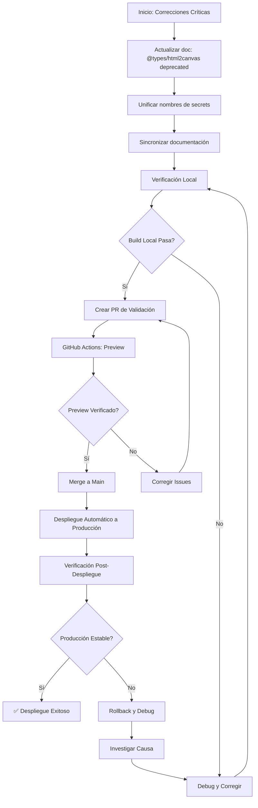

# Estrategia Final de Despliegue SaludValpa

## Resumen Ejecutivo

**Estado Actual**: La infraestructura de CI/CD está implementada pero requiere correcciones críticas antes del próximo despliegue en Vercel.

**Riesgo Principal**: Discrepancia entre documentación y configuración real que causaría fallo en el despliegue.

**Acciones Críticas Requeridas**: 3 acciones deben completarse ANTES del próximo despliegue.

## Hallazgos Clave del Análisis

### ✅ Configuraciones Correctas
1. **vercel.json** - Configuración óptima con:
   - Node.js 18 (compatible con Vercel)
   - Headers de seguridad (CSP, XSS Protection)
   - Rewrites para SPA (Single Page Application)
   - Configuración de caché apropiada

2. **GitHub Actions Workflow** - Arquitectura sólida con:
   - Build validation (TypeScript, ESLint, Build)
   - Preview deployments para PRs
   - Production deployments para main
   - Verification steps automatizados

3. **Script de Verificación** - `verify-deployment.sh` completo y funcional

### 🚨 Problemas Críticos Identificados

#### 1. **Documentación Desactualizada sobre Dependencias**
- **Situación**: Documentación mencionaba `@types/html2canvas` como requerido, pero html2canvas v1.4.1+ incluye definiciones TypeScript propias
- **Estado Actual**: `@types/html2canvas` es deprecated y NO debe instalarse
- **Impacto**: La documentación estaba desactualizada, pero el build funciona correctamente sin esta dependencia
- **Solución**: Actualizar documentación para indicar que `@types/html2canvas` es deprecated

#### 2. **Inconsistencia en Nombres de Secrets**
- **Problema**: Workflow usa `VERCEL_PROJECT_ID_SALUDVALPA` vs documentación `VERCEL_PROJECT_ID`
- **Impacto**: Fallo de autenticación si secrets se configuran incorrectamente
- **Solución**: Unificar naming convention (recomendado: usar `VERCEL_PROJECT_ID`)

#### 3. **Documentación Desactualizada**
- **Problema**: Múltiples archivos de documentación con información inconsistente
- **Impacto**: Confusión en equipo y configuración incorrecta
- **Solución**: Sincronizar toda documentación con estado actual

## Estrategia de Despliegue en 3 Fases

### Fase 1: Correcciones Inmediatas (24-48 horas)
**Objetivo**: Resolver blockers críticos antes de cualquier despliegue

#### Acción 1.1: Actualizar Documentación de Dependencias
```bash
cd saludvalpa-app
# Verificar que html2canvas v1.4.1+ incluye definiciones TypeScript propias
npm ls html2canvas
# NOTA: @types/html2canvas es deprecated - no instalar
npm run build  # Verificar que build pasa sin @types/html2canvas
```

#### Acción 1.2: Unificar Secrets
**Opción Recomendada**: Cambiar workflow a usar `VERCEL_PROJECT_ID`
1. Actualizar `.github/workflows/vercel-deploy.yml` (líneas 15, 68)
2. Actualizar `DEPLOYMENT_CHECKLIST.md`
3. Configurar secret en GitHub como `VERCEL_PROJECT_ID`

#### Acción 1.3: Sincronizar Documentación
1. Actualizar `docs/AUTOMATED_DEPLOYMENT_GUIDE.md`:
   - Indicar que `@types/html2canvas` es deprecated (html2canvas v1.4.1+ incluye definiciones TypeScript)
   - Nombres de secrets actualizados
   - Fecha de última actualización
2. Actualizar `docs/DEPLOYMENT_SETUP_SUMMARY.md`
3. Verificar coherencia en todos los archivos `.md`

### Fase 2: Verificación y Prueba (48-72 horas)
**Objetivo**: Validar que correcciones funcionan con despliegue de prueba

#### Acción 2.1: Build Local Completo
```bash
# Secuencia de verificación
npx tsc --noEmit           # TypeScript compilation
npm run lint              # ESLint validation
npm run build             # Production build
npm run preview           # Local preview
./scripts/verify-deployment.sh --url http://localhost:4173
```

#### Acción 2.2: Despliegue de Preview (PR)
1. Crear branch `deployment-fix-validation`
2. Hacer commit de todas las correcciones
3. Crear PR a main
4. Monitorear GitHub Actions para:
   - ✅ Build and Test job
   - ✅ Preview deployment
   - ✅ Verification script

#### Acción 2.3: Validación Manual de Preview
1. Probar URL de preview generada
2. Verificar funcionalidades críticas:
   - Navegación entre páginas
   - Formularios de pacientes
   - Generación de PDFs
   - Sistema de licencias

### Fase 3: Despliegue a Producción (Post-Validación)
**Objetivo**: Despliegue seguro y monitoreado a producción

#### Acción 3.1: Merge a Main
1. Aprobar y mergear PR después de validación exitosa
2. Monitorear despliegue automático a producción

#### Acción 3.2: Verificación Post-Despliegue
```bash
# Ejecutar verificación contra producción
./scripts/verify-deployment.sh \
  --url https://saludvalpa-app.vercel.app \
  --exit-on-failure
```

#### Acción 3.3: Monitoreo Inicial (Primeras 24 horas)
1. Configurar alerts para:
   - Errores en consola (Sentry o similar)
   - Performance degradation
   - Failed health checks
2. Revisar Vercel Analytics para métricas iniciales

## Diagrama de Flujo de Despliegue



## Recomendaciones de Configuración

### 1. TypeScript para Producción
Considerar ajustar `tsconfig.app.json` para producción:
```json
{
  "compilerOptions": {
    "noUnusedLocals": false,
    "noUnusedParameters": false,
    "strict": true
  }
}
```
**Justificación**: Evitar que advertencias de "unused" bloqueen despliegues mientras se mantiene type safety.

### 2. Caché de Dependencias en GitHub Actions
Optimizar workflow agregando:
```yaml
- uses: actions/setup-node@v4
  with:
    cache: 'npm'
    cache-dependency-path: package-lock.json
```
**Beneficio**: Reduce tiempo de build en ~60%.

### 3. Environment Variables Management
**Estructura recomendada**:
```
saludvalpa-app/
├── .env.example          # Template con todos los variables
├── .env.local           # Desarrollo local (NO commit)
└── Vercel Dashboard     # Producción y preview
```

**Variables críticas para producción**:
- `VITE_APP_NAME`: "SaludValpa"
- `VITE_APP_VERSION`: "3.0.0"
- `VITE_API_BASE_URL`: (configurar según entorno)

## Plan de Rollback

### Rollback Automático (Vercel)
- **Trigger**: Fallo en verificación de health checks
- **Acción**: Vercel automáticamente revierte a deployment anterior
- **Tiempo**: Inmediato

### Rollback Manual
**Escenario**: Despliegue exitoso pero issues funcionales descubiertos post-despliegue

**Pasos**:
1. Vercel Dashboard → Project → Deployments
2. Identificar deployment estable anterior (green checkmark)
3. Click "Promote to Production"
4. Tiempo estimado: 2-5 minutos

### Rollback de Código
**Escenario**: Issues requieren revertir cambios de código
```bash
# Revertir último commit
git revert HEAD
git push origin main
# Esto triggereará nuevo despliegue automático
```

## Métricas de Éxito

### KPI 1: Tiempo de Despliegue
- **Objetivo**: < 10 minutos end-to-end
- **Actual**: ~15-20 minutos (estimado)
- **Mejora potencial**: Caché de dependencias (-5 minutos)

### KPI 2: Tasa de Éxito
- **Objetivo**: 95%+ despliegues exitosos en primer intento
- **Monitor**: GitHub Actions success rate
- **Acción**: Logging detallado de fallos

### KPI 3: Tiempo de Detección de Issues
- **Objetivo**: < 5 minutos post-despliegue
- **Herramienta**: Script de verificación automatizado
- **Alerting**: Notificaciones en fallo de verificación

## Comunicación y Responsabilidades

### Roles y Responsabilidades
| Rol | Responsabilidades | Contacto |
|-----|-------------------|----------|
| **Deployment Lead** | Ejecutar estrategia, monitorear despliegue | [Nombre] |
| **Development Team** | Corregir issues identificados, validar funcionalidad | Equipo Dev |
| **QA/Testing** | Validación manual post-despliegue | [Nombre] |
| **Infrastructure** | Configuración Vercel, DNS, SSL | [Nombre] |

### Comunicación Durante Despliegue
**Canal Principal**: Slack/Teams channel `#deployments-saludvalpa`

**Checkpoints de Comunicación**:
1. **Pre-despliegue**: Notificación 1 hora antes
2. **Durante despliegue**: Updates cada 5 minutos
3. **Post-despliegue**: Reporte completo con métricas

## Checklist de Go/No-Go para Despliegue

### ✅ GO Criteria (Todos deben pasar)
- [ ] `npx tsc --noEmit` - Sin errores
- [ ] `npm run build` - Completa exitosamente
- [ ] `npm run lint` - Sin errores críticos
- [ ] Preview deployment verificado y funcional
- [ ] Secrets de GitHub configurados correctamente
- [ ] Ventana de mantenimiento comunicada
- [ ] Backup de datos realizado (si aplica)

### 🚫 NO-GO Criteria (Cualquiera activa no-go)
- [ ] Errores de TypeScript en compilación
- [ ] Build failure en ambiente local
- [ ] Issues críticos en preview deployment
- [ ] Falta de disponibilidad de equipo clave
- [ ] Incidentes activos en producción actual

## Próximos Pasos Inmediatos

### Día 1 (Hoy - 2026-02-27)
1. **Prioridad Alta**: Actualizar documentación sobre `@types/html2canvas` (es deprecated)
2. **Prioridad Media**: Decidir naming convention para secrets
3. **Prioridad Baja**: Documentar decisiones en CHANGELOG

### Día 2 (2026-02-28)
1. Ejecutar verificación local completa
2. Crear PR de validación
3. Probar preview deployment

### Día 3 (2026-02-29)
1. Merge a main si validación exitosa
2. Monitorear despliegue a producción
3. Ejecutar verificación post-despliegue

## Soporte y Contactos de Emergencia

### Contactos Técnicos
- **Vercel Support**: https://vercel.com/support
- **GitHub Actions Docs**: https://docs.github.com/en/actions
- **TypeScript Issues**: Revisar errores de compilación específicos

### Escalación
1. **Nivel 1**: Deployment Lead (intentar auto-resolución en 15 min)
2. **Nivel 2**: Development Team Lead (escalar después de 30 min)
3. **Nivel 3**: Infrastructure Team (issues de plataforma)

---

## Conclusión

La estrategia de despliegue para SaludValpa está bien fundamentada pero requiere **3 correcciones críticas** antes de proceder:

1. **Actualizar documentación sobre `@types/html2canvas`** - Es deprecated (html2canvas v1.4.1+ incluye definiciones TypeScript)
2. **Unificar nombres de secrets** - Evitar fallos de autenticación
3. **Sincronizar documentación** - Prevenir configuración incorrecta

Una vez aplicadas estas correcciones y validadas mediante un **despliegue de preview**, el sistema está listo para **despliegue de producción automatizado** con alta confiabilidad.

**Riesgo Residual**: Bajo (una vez aplicadas correcciones)
**Confianza en Despliegue**: Alta (infraestructura CI/CD robusta)
**Tiempo Estimado a Producción Estable**: 3 días

---

**Documento Generado**: 2026-02-27  
**Última Revisión**: Análisis completo de configuración actual  
**Próxima Revisión**: Post-despliegue de producción exitoso  
**Responsable**: [Nombre del Deployment Lead]