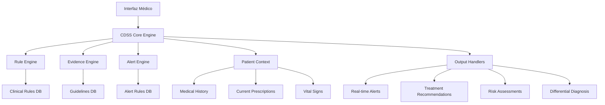

# 📋 Plan de Implementación Fase 3 - Sistema de Soporte a Decisiones Clínicas Avanzado

## 📊 Información del Proyecto

**Proyecto:** saludvalpa 3.0 - Sistema de Gestión Clínica  
**Módulo:** Medicina General  
**Fase:** 3 - "Sistema de Soporte a Decisiones Clínicas Avanzado"  
**Fecha de Planificación:** 2026-03-02  
**Estado:** 🏗️ PLANIFICACIÓN COMPLETA  
**Versión de Base de Datos:** 5 (Propuesta)  
**Dependencias:** Fase 1 (COMPLETADA), Fase 2 (COMPLETADA)

---

## 🎯 Visión General de la Fase 3

La **Fase 3 del módulo medicina** implementará un Sistema de Soporte a Decisiones Clínicas (CDSS) avanzado que proporcionará asistencia inteligente a médicos generales durante el proceso de consulta. Este sistema se construye sobre los cimientos establecidos en las Fases 1 y 2, agregando capacidades de inteligencia clínica, verificación automatizada y recomendaciones basadas en evidencia.

### 🎯 Objetivos Principales
1. **Sistema de Soporte a Decisiones Clínicas (CDSS)**: Implementar reglas clínicas y algoritmos basados en evidencia
2. **Alertas de Interacciones Medicamentosas**: Verificación en tiempo real con niveles de severidad
3. **Integración de Guías Clínicas**: Protocolos basados en evidencia contextualizados
4. **Herramientas de Evaluación de Riesgo**: Calculadoras automatizadas para condiciones comunes
5. **Soporte Diagnóstico**: Generador de diagnósticos diferenciales basado en síntomas
6. **Recomendaciones de Tratamiento**: Sugerencias basadas en evidencia científica
7. **Sistema de Alertas**: Notificaciones contextuales para contraindicaciones y mejores prácticas
8. **Sistema de Aprendizaje**: Mecanismos básicos de aprendizaje automático a partir de resultados clínicos

---

## 🏗️ Arquitectura del Sistema CDSS

### Diagrama de Arquitectura


### Componentes Principales del CDSS

#### 1. **CDSS Core Engine** (`CDSSEngine.ts`)
- Motor central que coordina todos los subsistemas
- Evaluación de reglas clínicas en tiempo real
- Integración con contexto del paciente
- Priorización de alertas y recomendaciones

#### 2. **Rule Engine** (`ClinicalRuleEngine.ts`)
- Sistema de reglas clínicas basado en condiciones
- Evaluación de reglas de negocio médicas
- Soporte para reglas complejas con múltiples condiciones
- Caché de resultados para optimización

#### 3. **Evidence Engine** (`EvidenceBasedEngine.ts`)
- Integración con guías de práctica clínica
- Acceso a bases de conocimiento médico
- Evaluación de nivel de evidencia (A, B, C, D)
- Contextualización según características del paciente

#### 4. **Alert Engine** (`ClinicalAlertEngine.ts`)
- Generación de alertas en tiempo real
- Sistema de priorización (Crítico, Alto, Medio, Bajo)
- Gestión de alertas duplicadas y relacionadas
- Historial de alertas generadas

---

## 💊 Sistema de Alertas de Interacciones Medicamentosas

### Base de Datos de Interacciones
```typescript
// Estructura propuesta para la base de datos de interacciones
interface DrugInteraction {
  id: string;
  medicamentoA: string;
  medicamentoB: string;
  tipoInteraccion: 'farmacodinamica' | 'farmacocinetica' | 'fisicoquimica';
  mecanismo: string;
  efectoClinico: string;
  severidad: 'contraindicado' | 'grave' | 'moderado' | 'leve';
  recomendacion: string;
  alternativas: string[];
  evidencia: {
    nivel: 'A' | 'B' | 'C' | 'D';
    referencias: string[];
  };
  poblacionesEspeciales?: {
    embarazo: boolean;
    lactancia: boolean;
    insuficienciaRenal: boolean;
    insuficienciaHepatica: boolean;
    pediatrico: boolean;
    geriatrico: boolean;
  };
}
```

### Componentes de Verificación
1. **`DrugInteractionCheckerEnhanced.tsx`** - Verificador avanzado de interacciones
   - Base de datos de 500+ interacciones medicamentosas
   - Verificación en tiempo real durante prescripción
   - Niveles de severidad con colores y iconos
   - Recomendaciones de alternativas seguras

2. **`InteractionSeverityIndicator.tsx`** - Indicador visual de severidad
   - Sistema de semáforo (rojo/amarillo/verde)
   - Iconos intuitivos para diferentes tipos de interacciones
   - Tooltips con información detallada

3. **`AlternativeDrugSuggester.tsx`** - Sugeridor de alternativas
   - Base de datos de medicamentos por categoría terapéutica
   - Sugerencias basadas en perfil de seguridad
   - Consideración de costo y disponibilidad

---

## 📚 Integración de Guías Clínicas Basadas en Evidencia

### Estructura de Guías Clínicas
```typescript
interface ClinicalGuideline {
  id: string;
  titulo: string;
  condicion: string;
  codigosCIE10: string[];
  organizacion: string; // Ej: "OMS", "NICE", "Sociedad Mexicana"
  añoPublicacion: number;
  nivelEvidencia: 'A' | 'B' | 'C' | 'D';
  recomendaciones: ClinicalRecommendation[];
  algoritmos: ClinicalAlgorithm[];
  referencias: Reference[];
  poblacionAplicable: {
    edadMin?: number;
    edadMax?: number;
    genero?: 'masculino' | 'femenino' | 'ambos';
    comorbilidades?: string[];
    exclusiones?: string[];
  };
}

interface ClinicalRecommendation {
  id: string;
  descripcion: string;
  fuerza: 'fuerte' | 'debil' | 'contraindicado';
  nivelEvidencia: 'A' | 'B' | 'C' | 'D';
  consideraciones: string[];
  monitoreoRequerido?: MonitoringProtocol[];
}
```

### Componentes de Guías Clínicas
1. **`GuidelineIntegrationEngine.ts`** - Motor de integración de guías
   - Carga y parseo de guías en formato estructurado
   - Contextualización según paciente y diagnóstico
   - Evaluación de aplicabilidad

2. **`InteractiveGuidelineViewer.tsx`** - Visor interactivo de guías
   - Navegación por condiciones y diagnósticos
   - Visualización de algoritmos de decisión
   - Marcado de recomendaciones aplicadas

3. **`GuidelineAdherenceTracker.tsx`** - Rastreador de adherencia
   - Monitoreo de cumplimiento de guías
   - Reportes de adherencia por diagnóstico
   - Identificación de oportunidades de mejora

---

## 🧮 Herramientas de Evaluación de Riesgo

### Calculadoras Clínicas Implementadas
1. **`CardiovascularRiskCalculator.tsx`** - Riesgo cardiovascular
   - Score de Framingham
   - ASCVD Risk Calculator
   - QRISK3 (adaptado para población mexicana)

2. **`RenalFunctionCalculator.tsx`** - Función renal
   - CKD-EPI (TFGe)
   - Cockcroft-Gault (CrCl)
   - MDRD

3. **`DiabetesRiskCalculator.tsx`** - Riesgo de diabetes
   - FINDRISC
   - ADA Risk Test

4. **`ThrombosisRiskCalculator.tsx`** - Riesgo trombótico
   - Score de Padua (TVP)
   - CHA₂DS₂-VASc (FA)
   - HAS-BLED (riesgo sangrado)

5. **`NutritionalRiskCalculator.tsx`** - Riesgo nutricional
   - MUST (Malnutrition Universal Screening Tool)
   - NRS-2002 (Nutritional Risk Screening)

### Estructura de Calculadoras
```typescript
interface ClinicalCalculator {
  id: string;
  nombre: string;
  categoria: 'cardiovascular' | 'renal' | 'metabolico' | 'nutricional' | 'otros';
  inputs: CalculatorInput[];
  formula: (inputs: Record<string, any>) => CalculatorResult;
  interpretacion: (result: number) => RiskInterpretation;
  referencias: string[];
}

interface CalculatorInput {
  id: string;
  label: string;
  tipo: 'number' | 'select' | 'boolean' | 'date';
  unidad?: string;
  opciones?: { valor: any; label: string }[];
  validacion?: {
    min?: number;
    max?: number;
    requerido: boolean;
  };
}

interface CalculatorResult {
  valor: number;
  unidad: string;
  interpretacion: 'bajo' | 'moderado' | 'alto' | 'muy_alto';
  recomendaciones: string[];
  seguimientoRecomendado: {
    frecuencia: string;
    acciones: string[];
  };
}
```

---

## 🔍 Sistema de Soporte Diagnóstico

### Generador de Diagnósticos Diferenciales
```typescript
interface SymptomBasedDiagnosis {
  sintomaPrincipal: string;
  sintomasAsociados: string[];
  hallazgosFisicos: string[];
  resultadosLaboratorio: string[];
  diagnósticosDiferenciales: DifferentialDiagnosis[];
  algoritmosDiagnosticos: DiagnosticAlgorithm[];
}

interface DifferentialDiagnosis {
  diagnostico: string;
  codigoCIE10: string;
  probabilidad: 'alta' | 'media' | 'baja';
  criteriosMayores: string[];
  criteriosMenores: string[];
  estudiosConfirmatorios: string[];
  tratamientosSugeridos: string[];
}
```

### Componentes de Soporte Diagnóstico
1. **`DifferentialDiagnosisGenerator.tsx`** - Generador de diagnósticos diferenciales
   - Base de conocimiento de 200+ presentaciones clínicas
   - Algoritmos de matching de síntomas
   - Priorización por probabilidad y urgencia

2. **`DiagnosticDecisionTree.tsx`** - Árboles de decisión diagnóstica
   - Flujos paso a paso para diagnósticos complejos
   - Integración con criterios diagnósticos estandarizados
   - Guía para estudios complementarios

3. **`RedFlagDetector.tsx`** - Detector de banderas rojas
   - Identificación de signos de alarma
   - Alertas para condiciones que requieren referencia urgente
   - Guías para manejo inicial

---

## 💡 Sistema de Recomendaciones de Tratamiento

### Motor de Recomendaciones
```typescript
interface TreatmentRecommendation {
  id: string;
  diagnostico: string;
  codigoCIE10: string;
  recomendaciones: TreatmentOption[];
  consideracionesEspeciales: SpecialConsideration[];
  monitoreoRequerido: MonitoringProtocol[];
  criteriosReferencia: ReferralCriteria[];
}

interface TreatmentOption {
  linea: 'primera' | 'segunda' | 'tercera';
  medicamento: string;
  dosis: string;
  duracion: string;
  nivelEvidencia: 'A' | 'B' | 'C' | 'D';
  costoAproximado: number;
  contraindicaciones: string[];
  interaccionesImportantes: string[];
}
```

### Componentes de Recomendaciones
1. **`EvidenceBasedTreatmentAdvisor.tsx`** - Asesor de tratamientos basados en evidencia
   - Base de datos de tratamientos por diagnóstico
   - Consideración de comorbilidades y alergias
   - Personalización según características del paciente

2. **`CostEffectivenessAnalyzer.tsx`** - Analizador de costo-efectividad
   - Comparación de opciones de tratamiento
   - Consideración de costo y efectividad
   - Recomendaciones basadas en recursos disponibles

3. **`TreatmentPathwayVisualizer.tsx`** - Visualizador de vías de tratamiento
   - Diagramas de flujo de opciones terapéuticas
   - Puntos de decisión y criterios de cambio
   - Integración con guías de práctica clínica

---

## 🚨 Sistema de Alertas Clínicas

### Arquitectura de Alertas
```typescript
interface ClinicalAlert {
  id: string;
  tipo: 'interaccion' | 'alergia' | 'contraindicacion' | 'dosis' | 'monitoreo' | 'seguimiento';
  severidad: 'critica' | 'alta' | 'media' | 'baja';
  titulo: string;
  descripcion: string;
  contexto: AlertContext;
  accionRequerida: AlertAction;
  timestamp: Date;
  estado: 'nueva' | 'vista' | 'aceptada' | 'rechazada' | 'resuelta';
  metadata: AlertMetadata;
}

interface AlertContext {
  pacienteId: string;
  consultaId?: string;
  prescripcionId?: string;
  diagnosticoId?: string;
  datosRelevantes: Record<string, any>;
}

interface AlertAction {
  tipo: 'confirmar' | 'modificar' | 'cancelar' | 'referir' | 'monitorear';
  opciones: ActionOption[];
  plazo: 'inmediato' | 'urgente' | 'pronto' | 'programado';
}
```

### Componentes del Sistema de Alertas
1. **`ClinicalAlertDashboard.tsx`** - Dashboard de alertas clínicas
   - Vista consolidada de todas las alertas activas
   - Filtros por severidad, tipo y estado
   - Sistema de priorización inteligente

2. **`RealTimeAlertMonitor.tsx`** - Monitor de alertas en tiempo real
   - Detección de nuevas alertas durante la consulta
   - Notificaciones no intrusivas
   - Historial de alertas por paciente

3. **`AlertResponseTracker.tsx`** - Rastreador de respuestas a alertas
   - Registro de acciones tomadas
   - Análisis de patrones de respuesta
   - Reportes de efectividad del sistema

---

## 🧠 Sistema de Aprendizaje (ML Básico)

### Componentes de Aprendizaje Automático
1. **`OutcomePredictionEngine.ts`** - Motor de predicción de resultados
   - Modelos simples de regresión para resultados clínicos
   - Predicción de respuesta a tratamiento
   - Identificación de factores de riesgo

2. **`TreatmentEffectivenessAnalyzer.tsx`** - Analizador de efectividad de tratamientos
   - Seguimiento de resultados por tratamiento
   - Identificación de patrones de efectividad
   - Recomendaciones basadas en datos históricos

3. **`ClinicalPatternDetector.tsx`** - Detector de patrones clínicos
   - Análisis de correlaciones entre variables clínicas
   - Identificación de subpoblaciones con respuestas similares
   - Alertas para patrones inusuales

### Estructura de Datos para Aprendizaje
```typescript
interface ClinicalOutcomeData {
  pacienteId: string;
  diagnostico: string;
  tratamiento: string;
  variablesBasales: Record<string, any>;
  variablesProceso: Record<string, any>[];
  resultado: ClinicalOutcome;
  satisfaccionPaciente?: number;
  complicaciones?: string[];
  costoTotal?: number;
}

interface ClinicalOutcome {
  tipo: 'curacion' | 'mejoria' | 'estable' | 'empeoramiento' | 'muerte';
  tiempo: number; // días desde inicio tratamiento
  metricas: OutcomeMetrics;
}

interface OutcomeMetrics {
  escalaDolor?: number; // 0-10
  funcion?: number; // 0-100%
  calidadVida?: number; // 0-100
  parametrosLaboratorio?: Record<string, any>;
}
```

---

## 🗄️ Cambios en el Esquema de Base de Datos (Versión 5)

### Nuevas Tablas Propuestas
```typescript
// Tablas para CDSS
clinicalRules: 'id, tipo, condicion, severidad, activa, fechaCreacion'
drugInteractions: 'id, medicamentoA, medicamentoB, tipo, severidad, evidencia'
clinicalGuidelines: 'id, condicion, organizacion, año, nivelEvidencia, activa'
riskCalculators: 'id, nombre, categoria, formula, parametros, validacion'
diagnosticAlgorithms: 'id, sintomaPrincipal, algoritmo, version, activo'
treatmentRecommendations: 'id, diagnostico, linea, medicamento, evidencia'
clinicalAlerts: 'id, pacienteId, tipo, severidad, estado, fechaCreacion, fechaResolucion'
clinicalOutcomes: 'id, pacienteId