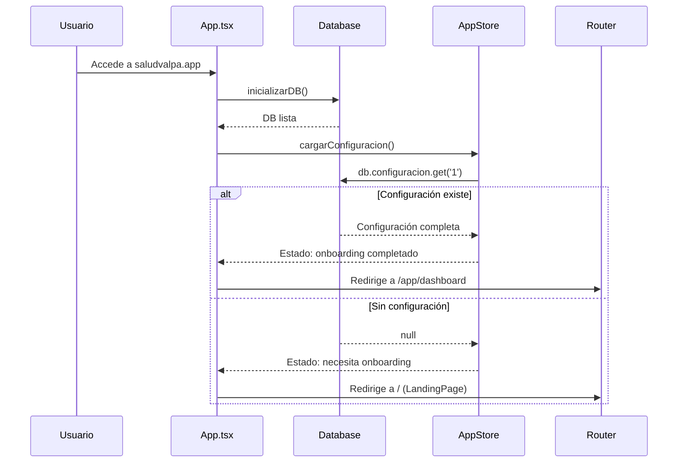
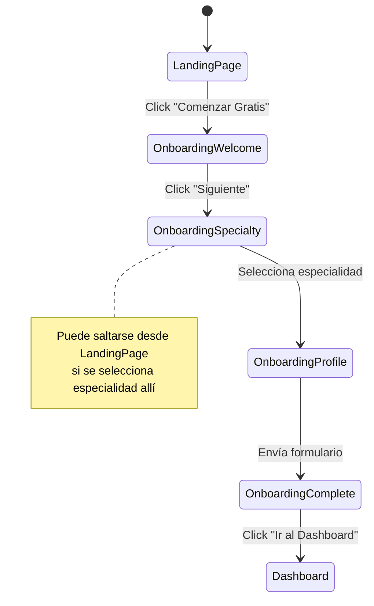

# SaludValpa.app - Guía de Implementación para Desarrolladores

## Visión Técnica
Documentación técnica del flujo de usuario implementado en SaludValpa 3.0. Esta guía cubre la arquitectura, componentes, estado y flujos de datos para que los desarrolladores entiendan y mantengan el sistema.

## 1. Arquitectura del Sistema

### Stack Tecnológico
- **Frontend**: React 18 + TypeScript + Vite
- **Estado**: Zustand (gestión global) + React Query (datos async)
- **Base de datos**: Dexie.js (IndexedDB wrapper)
- **Estilos**: Tailwind CSS + CSS Modules
- **Enrutamiento**: React Router DOM v6
- **Build tool**: Vite
- **Testing**: Vitest + React Testing Library

### Estructura de Directorios
```
saludvalpa-app/src/
├── components/           # Componentes reutilizables
│   ├── shared/          # Componentes UI básicos
│   ├── common/          # Componentes de dominio compartido
│   └── [especialidad]/  # Componentes por profesión
├── pages/               # Páginas/rutas principales
├── modules/             # Módulos por especialidad
│   ├── fisioterapia/
│   ├── medicina/
│   ├── psicologia/
│   ├── odontologia/
│   └── nutricion/
├── stores/              # Estado global (Zustand)
├── services/            # Servicios (API, licencias, PDF)
├── hooks/               # Custom hooks
├── utils/               # Utilidades y helpers
├── types/               # TypeScript definitions
└── db/                  # Configuración de base de datos
```

## 2. Flujo de Datos y Estado

### Estado Global (appStore.ts)
```typescript
interface AppState {
  // Estado de configuración
  configuracion: Configuracion | null;
  licencia: Licencia | null;
  
  // Estado de carga
  isLoading: boolean;
  isInitialized: boolean;
  
  // Estado de onboarding
  onboardingStep: 'landing' | 'welcome' | 'specialty' | 'profile' | 'complete';
  onboardingProgress: number;
  
  // Acciones
  cargarConfiguracion: () => Promise<void>;
  actualizarConfiguracion: (config: Partial<Configuracion>) => Promise<void>;
  actualizarLicencia: (licencia: Licencia) => Promise<void>;
  completarOnboarding: (data: OnboardingData) => Promise<void>;
}
```

### Secuencia de Inicialización
1. **App.tsx monta** → `useEffect` llama a `inicializarDB()`
2. **Base de datos inicializada** → `cargarConfiguracion()` desde appStore
3. **Verificación de configuración existente**:
   - Si existe → estado `onboardingStep: 'complete'`, redirige a dashboard
   - Si no existe → estado `onboardingStep: 'landing'`, muestra LandingPage
4. **Carga de licencia** → Verifica estado y aplica restricciones

### Diagrama de Secuencia de Inicialización


## 3. Componentes Clave del Flujo de Usuario

### LandingPage.tsx
**Propósito**: Punto de entrada para usuarios nuevos

**Lógica principal**:
```typescript
const handleGetStarted = () => {
  if (hasCompletedOnboarding && isLicenseActive) {
    navigate('/dashboard');
  } else if (hasCompletedOnboarding) {
    navigate('/onboarding');
  } else {
    navigate('/onboarding');
  }
};

const handleSpecialtySelect = (specialtyId: string) => {
  navigate('/onboarding', { state: { specialty: specialtyId } });
};
```

**Props y estado**:
- `hasCompletedOnboarding`: Derivado de `configuracion?.profesion`
- `isLicenseActive`: Derivado de `licencia?.tipo === 'pagada'`
- `specialties`: Array estático con 6 profesiones

### Onboarding.tsx
**Propósito**: Guiar al usuario a través de la configuración inicial

**Estados del componente**:
```typescript
type Step = 'welcome' | 'specialty' | 'profile' | 'complete';
const [step, setStep] = useState<Step>('welcome');
```

**Flujo condicional**:
- Si viene con `location.state?.specialty` → Salta a paso 'specialty'
- Si no → Comienza en 'welcome'

**Acción de completado**:
```typescript
const handleSubmitProfile = async (e: React.FormEvent) => {
  await completarOnboarding({
    profesion: data.profesion!,
    branding: { ... },
    datosContacto: { ... },
  });
  setStep('complete');
};
```

### App.tsx - Enrutamiento Inteligente
**Lógica de redirección**:
```typescript
// Determinar la ruta inicial basada en el estado de onboarding
const isOnboardingCompleted = configuracion?.profesion !== undefined;

<Route
  path="*"
  element={
    isOnboardingCompleted ? (
      <Navigate to="/app/dashboard" replace />
    ) : (
      <Navigate to="/" replace />
    )
  }
/>
```

**Estructura de rutas**:
- `/` → LandingPage (pública)
- `/onboarding` → Onboarding (pública)
- `/app/*` → Rutas protegidas (requieren onboarding)
  - `/app/dashboard` → Dashboard principal
  - `/app/pacientes` → Gestión de pacientes
  - `/app/agenda` → Agenda de citas
  - `/app/economia` → Módulo económico
  - `/app/biblioteca` → Biblioteca (solo con licencia)
  - `/app/rutinas` → Rutinas (solo con licencia)
  - `/app/activar-licencia` → Activación de licencia

### Layout.tsx
**Propósito**: Layout principal con navegación y estado de licencia

**Cálculo de días restantes**:
```typescript
const calcularDiasRestantes = () => {
  if (!licencia?.fechaExpiracion) return 0;
  const ahora = new Date();
  const expiracion = new Date(licencia.fechaExpiracion);
  const diferencia = expiracion.getTime() - ahora.getTime();
  const dias = Math.ceil(diferencia / (1000 * 60 * 60 * 24));
  return dias > 0 ? dias : 0;
};
```

**Navegación responsive**:
- Desktop: Sidebar completa
- Mobile: Bottom navigation con 4 accesos principales + menú

## 4. Sistema de Licencias

### Service: licenseService.ts
**Funcionalidades**:
- Validación de códigos de licencia
- Carga de códigos válidos desde JSON externo
- Cache de códigos (5 minutos)
- Fallback a códigos hardcodeados

**Validación de formato**:
```typescript
const regexValpa = /^saludvalpa-[A-Z0-9]{5}-[A-Z0-9]{5}-[A-Z0-9]{5}$/;
const regexBeta = /^BETA-PRO-\d{4}-[A-Z0-9]{5}$/;
```

**Integración con appStore**:
```typescript
// En appStore.ts
actualizarLicencia: async (licencia: Licencia) => {
  await db.configuracion.update('1', { licencia });
  set({ licencia });
}
```

### Restricciones por Estado de Licencia
**En componentes**:
```typescript
// Ejemplo: Limitación de pacientes
const { licencia } = useAppStore();
const maxPacientes = licencia?.tipo === 'pagada' ? Infinity : 5;

// En creación de paciente
if (totalPacientes >= maxPacientes && licencia?.tipo !== 'pagada') {
  showFeatureUnlockModal('pacientes');
  return;
}
```

**Componente FeatureUnlockModal**:
- Muestra modal cuando se intenta acceder a función premium
- Explica beneficios de licencia
- Redirige a `/app/activar-licencia`

## 5. Base de Datos y Esquemas

### Esquema Principal (database.ts)
```typescript
export const db = new Dexie('saludvalpa_db');

db.version(3).stores({
  configuracion: '++id',
  pacientes: '++id, nombre, telefono, fechaCreacion',
  citas: '++id, pacienteId, fechaHora, estado',
  sesiones: '++id, pacienteId, fecha, tipo',
  documentos: '++id, pacienteId, tipo, fecha',
  transacciones: '++id, pacienteId, fecha, monto',
  // Tablas por especialidad
  ejercicios: '++id, categoria, profesion', // Fisioterapia
  rutinas: '++id, pacienteId, fechaCreacion', // Fisioterapia
  diagnosticos: '++id, codigo, descripcion', // Medicina
  // ... otras tablas especializadas
});
```

### Configuración Inicial
**Tabla `configuracion`**:
```typescript
interface Configuracion {
  id: number;
  profesion: TipoProfesion;
  branding: {
    nombreProfesional: string;
    credenciales: string;
    especialidad: string;
    colores: { primario: string; secundario: string; acento: string };
    tema: 'saludvalpa' | 'minimalista' | 'profesional' | 'moderno' | 'personalizado';
    piePagina: string;
    mostrarMarcaDeAgua: boolean;
    formatoDocumentos: 'formal' | 'informal' | 'moderno';
  };
  datosContacto: {
    telefono: string;
    email: string;
  };
  licencia: Licencia | null;
  fechaCreacion: Date;
  fechaActualizacion: Date;
}
```

## 6. Módulos por Especialidad

### Sistema de Carga Dinámica
**moduleLoader.ts**:
```typescript
export async function cargarModuloEspecialidad(profesion: TipoProfesion) {
  switch (profesion) {
    case 'fisioterapia':
      return await import('../modules/fisioterapia');
    case 'medicina_general':
      return await import('../modules/medicina');
    case 'psicologia':
      return await import('../modules/psicologia');
    case 'odontologia':
      return await import('../modules/odontologia');
    case 'nutricion':
      return await import('../modules/nutricion');
    default:
      throw new Error(`Profesión no soportada: ${profesion}`);
  }
}
```

### Estructura de Módulo Ejemplo (Fisioterapia)
```
modules/fisioterapia/
├── index.ts              # Exportaciones principales
├── components/           # Componentes específicos
│   ├── CamposFisioterapia.tsx
│   ├── GenerarEvaluacionFisioterapeutica.tsx
│   ├── GenerarPlanTratamiento.tsx
│   └── GenerarNotaEvolucion.tsx
├── hooks/                # Hooks específicos
│   ├── useBiblioteca.ts
│   └── useRutinas.ts
├── rutinas/              # Sistema de rutinas
│   ├── GestionRutinas.tsx
│   ├── EditorRutina.tsx
│   ├── RutinasPaciente.tsx
│   └── generadorPDFRutina.ts
└── biblioteca/           # Biblioteca de ejercicios
    ├── Biblioteca.tsx
    ├── CatalogoEjercicios.tsx
    ├── DetalleEjercicio.tsx
    └── FormularioEjercicio.tsx
```

### Integración en Componentes
**ProfessionRouter.tsx**:
```typescript
const ProfessionRouter = () => {
  const { configuracion } = useAppStore();
  const [modulo, setModulo] = useState<any>(null);

  useEffect(() => {
    if (configuracion?.profesion) {
      cargarModuloEspecialidad(configuracion.profesion)
        .then(mod => setModulo(mod))
        .catch(console.error);
    }
  }, [configuracion?.profesion]);

  if (!modulo) return <Cargando />;
  
  // Renderizar componentes específicos de la profesión
  return <modulo.ComponentePrincipal />;
};
```

## 7. Flujos de Estado y Transiciones

### Diagrama de Estados de Onboarding


### Estados de Licencia y Acceso
```typescript
type LicenseState = 
  | { tipo: 'gratuita'; estado: 'activa' | 'expirada' }
  | { tipo: 'pagada'; estado: 'activa' | 'expirada' }
  | { tipo: null; estado: 'invalida' };
```

**Efectos en UI**:
- `tipo: 'gratuita'` → Muestra contador de días, restricciones aplicadas
- `tipo: 'pagada'` → Sin restricciones, todas las funciones disponibles
- `tipo: null` → Solo onboarding básico, sin acceso a app

## 8. Gestión de Restricciones y Límites

### Implementación de Límites
**Hook personalizado**: `useLicenseRestrictions`
```typescript
export function useLicenseRestrictions() {
  const { licencia } = useAppStore();
  
  return {
    maxPacientes: licencia?.tipo === 'pagada' ? Infinity : 5,
    canDeletePatients: licencia?.tipo === 'pagada',
    hasBiblioteca: licencia?.tipo === 'pagada',
    hasRutinas: licencia?.tipo === 'pagada',
    hasCloudSync: licencia?.tipo === 'pagada',
    canCustomizeBranding: licencia?.tipo === 'pagada',
  };
}
```

**Uso en componentes**:
```typescript
const ComponenteConRestricciones = () => {
  const restrictions = useLicenseRestrictions();
  
  if (!restrictions.hasBiblioteca) {
    return <FeatureUnlockModal feature="biblioteca" />;
  }
  
  return <Biblioteca />;
};
```

### Validación en Punto de Entrada
**Componente RequireSetup.tsx**:
```typescript
const RequireSetup = () => {
  const { configuracion, isLoading } = useAppStore();
  
  if (isLoading) return <Cargando />;
  if (!configuracion?.profesion) return <Navigate to="/" replace />;
  
  return <Outlet />;
};
```

## 9. Manejo de Errores y Fallbacks

### Estrategias de Error
1. **Error de carga de configuración**: Fallback a estado "sin configuración"
2. **Error de base de datos**: Reintento automático + modal de error
3. **Error de validación de licencia**: Degradación a versión gratuita
4. **Error de red**: Modo offline con datos locales

### Componente ErrorBoundary
```typescript
class ErrorBoundary extends React.Component {
  state = { hasError: false };
  
  static getDerivedStateFromError() {
    return { hasError: true };
  }
  
  render() {
    if (this.state.hasError) {
      return (
        <div className="error-screen">
          <h2>Algo salió mal</h2>
          <button onClick={() => window.location.reload()}>
            Recargar aplicación
          </button>
        </div>
      );
    }
    return this.props.children;
  }
}
```

## 10. Optimizaciones de Rendimiento

### Lazy Loading de Módulos
```typescript
// En App.tsx
const Dashboard = React.lazy(() => import('./pages/Dashboard'));
const Pacientes = React.lazy(() => import('./pages/Pacientes'));
// ... otros imports lazy

// Uso con Suspense
<Suspense fallback={<Cargando />}>
  <Dashboard />
</Suspense>
```

### Code Splitting por Especialidad
```typescript
//