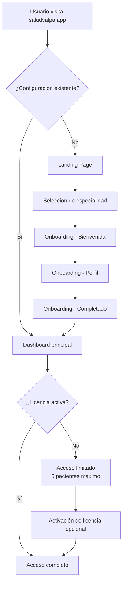

# SaludValpa.app - Guía Completa del Flujo de Usuario

## Visión General
SaludValpa.app es una plataforma profesional todo-en-uno diseñada específicamente para profesionales de la salud. Esta guía documenta el flujo completo de experiencia del usuario desde la primera visita hasta el uso diario de la aplicación.

## 1. Mapa del Viaje del Usuario

### Fase 1: Descubrimiento y Primer Contacto
```
Usuario visita saludvalpa.app → Landing Page → Exploración de beneficios → Selección de especialidad
```

### Fase 2: Configuración Inicial
```
Onboarding → Bienvenida → Selección de profesión → Perfil profesional → Configuración completa
```

### Fase 3: Uso Diario
```
Dashboard principal → Gestión de pacientes → Agenda de citas → Economía → Documentación
```

### Fase 4: Funcionalidades Avanzadas (con licencia)
```
Biblioteca de contenidos → Rutinas de ejercicios → Sincronización en nube → Funcionalidades premium
```

## 2. Desglose Pantalla por Pantalla

### Pantalla 1: Landing Page (`/`)
**Objetivo**: Presentar SaludValpa y captar interés del profesional

**Elementos visuales**:
- Logo y eslogan "Tu movimiento, nuestra ciencia"
- Sección hero con beneficios principales
- Grid de 6 beneficios con iconos
- Selección de especialidades (6 profesiones)
- Estadísticas de adopción
- Llamadas a acción "Comenzar Gratis" y "Ver Tour Interactivo"

**Interacciones clave**:
- Click en "Comenzar Gratis" → Redirige a onboarding
- Click en especialidad → Redirige a onboarding con especialidad preseleccionada
- Click en "Ver Tour Interactivo" → Muestra tour modal

### Pantalla 2: Onboarding - Bienvenida (`/onboarding`)
**Objetivo**: Dar la bienvenida y explicar el valor de SaludValpa

**Elementos visuales**:
- Indicador de progreso (4 pasos)
- Mensaje de bienvenida con logo
- Tres tarjetas de beneficios
- Botón "Comenzar Configuración"

**Flujo condicional**:
- Si viene de selección de especialidad → Salta directamente al paso 2
- Si es primera visita → Muestra bienvenida completa

### Pantalla 3: Onboarding - Selección de Especialidad
**Objetivo**: Identificar la profesión del usuario para personalizar la experiencia

**Elementos visuales**:
- 5 opciones de especialidad con iconos:
  1. 🩺 Medicina General
  2. 💪 Fisioterapia
  3. 🧠 Psicología
  4. 🦷 Odontología
  5. 🥗 Nutrición
- Descripción breve de cada especialidad
- Botones de navegación

**Comportamiento**:
- Selección automática de especialidad predeterminada
- Al seleccionar → Avanza al perfil profesional

### Pantalla 4: Onboarding - Perfil Profesional
**Objetivo**: Recopilar información básica del profesional

**Formulario con campos**:
- Nombre profesional (requerido)
- Credenciales (títulos, especializaciones)
- Especialidad específica (autocompletado según profesión)
- Teléfono de contacto
- Email profesional

**Validaciones**:
- Nombre profesional obligatorio
- Email con formato válido
- Teléfono opcional

### Pantalla 5: Onboarding - Completado
**Objetivo**: Confirmar configuración exitosa y redirigir al dashboard

**Elementos visuales**:
- Mensaje de éxito
- Resumen de configuración
- Botón "Ir al Dashboard"

**Acciones del sistema**:
- Guarda configuración en base de datos local
- Establece estado de onboarding como completado
- Inicializa estructuras de datos para la profesión seleccionada

### Pantalla 6: Dashboard Principal (`/app/dashboard`)
**Objetivo**: Vista central con resumen de actividad y acceso rápido

**Secciones principales**:
1. **Barra superior**: Logo, nombre profesional, estado de licencia
2. **Estadísticas en tiempo real**:
   - Total de pacientes
   - Citas para hoy
   - Sesiones este mes
   - Ingresos del mes
   - Pendientes de cobro
3. **Accesos rápidos**: Iconos grandes a módulos principales
4. **Bienvenida por especialidad**: Mensaje personalizado según profesión
5. **Seguimiento de progreso**: Indicador de uso de la plataforma

**Componentes dinámicos**:
- `SpecialtyWelcome`: Mensaje de bienvenida especializado (solo primera visita)
- `ProgressTracker`: Seguimiento de completitud de perfil
- `ContextualHelp`: Ayuda contextual según página
- `LicenseAlert`: Alertas de estado de licencia (si aplica)

### Pantalla 7: Módulo de Pacientes (`/app/pacientes`)
**Objetivo**: Gestión completa de la base de pacientes

**Funcionalidades**:
- Listado de pacientes con búsqueda y filtros
- Tarjeta por paciente con información resumida
- Botón "Nuevo Paciente" con formulario modal
- Acciones rápidas: Ver perfil, Nueva cita, Generar documento
- Límite de 5 pacientes en versión gratuita

**Restricciones versión gratuita**:
- Máximo 5 pacientes
- No se pueden eliminar pacientes
- Campos básicos de información

### Pantalla 8: Agenda (`/app/agenda`)
**Objetivo**: Gestión de citas y horarios

**Vistas disponibles**:
- Vista semanal (predeterminada)
- Vista mensual
- Vista diaria
- Listado de citas

**Funcionalidades**:
- Creación de citas con modal rápido
- Arrastrar y soltar para reprogramar
- Recordatorios automáticos
- Integración con perfil de paciente

### Pantalla 9: Economía (`/app/economia`)
**Objetivo**: Gestión financiera y seguimiento de ingresos

**Módulos**:
- **Resumen financiero**: Ingresos vs gastos
- **Pagos pendientes**: Listado de cobros por realizar
- **Historial de transacciones**: Registro completo
- **Generación de recibos**: Creación automática de documentos de pago
- **Reportes**: Exportación de datos financieros

### Pantalla 10: Documentos (`/app/documentos`)
**Objetivo**: Generación y gestión de documentos profesionales

**Tipos de documentos por especialidad**:

**Medicina General**:
- Historia clínica médica
- Receta médica
- Certificado médico
- Nota de evolución

**Fisioterapia**:
- Evaluación fisioterapéutica
- Plan de tratamiento
- Nota de sesión

**Psicología**:
- Historia clínica psicológica
- Nota de sesión psicológica
- Plan terapéutico

**Odontología**:
- Historia clínica odontológica
- Odontograma
- Plan de tratamiento odontológico
- Presupuesto odontológico

**Nutrición**:
- Plan nutricional
- Valoración nutricional
- Seguimiento nutricional

**Funcionalidades comunes**:
- Plantillas predefinidas
- Campos automáticos (fecha, profesional, paciente)
- Firma digital integrada
- Exportación a PDF
- Almacenamiento local

## 3. Flujos Especializados por Profesión

### Medicina General
- **Documentos específicos**: Recetas médicas, certificados, historias clínicas médicas
- **Campos adicionales**: Diagnósticos CIE-10, medicamentos, estudios de laboratorio
- **Flujos de trabajo**: Seguimiento de tratamientos, prescripciones renovables

### Fisioterapia
- **Módulos exclusivos**: Biblioteca de ejercicios, rutinas personalizadas
- **Documentos**: Evaluaciones fisioterapéuticas, planes de tratamiento
- **Funcionalidades**: Diagramas corporales, progresión de ejercicios

### Psicología
- **Herramientas**: Escalas psicológicas, evaluaciones DSM-5
- **Documentos**: Notas de sesión, planes terapéuticos
- **Privacidad reforzada**: Encriptación adicional para notas sensibles

### Odontología
- **Herramientas visuales**: Odontograma interactivo
- **Documentos**: Presupuestos detallados, planes de tratamiento
- **Catálogos**: Procedimientos dentales, materiales dentales

### Nutrición
- **Calculadoras**: Requerimientos nutricionales, IMC, porcentaje graso
- **Documentos**: Planes nutricionales personalizados
- **Base de datos**: Alimentos, valores nutricionales, planes predefinidos

## 4. Sistema de Licencias y Restricciones

### Versión Gratuita (Siempre disponible)
**Características incluidas**:
- Gestión de hasta 5 pacientes (sin eliminación)
- Agenda ilimitada de citas
- Módulo de economía básico
- Generación de documentos básicos
- 1 especialidad configurada

**Limitaciones**:
- ❌ Biblioteca de contenidos
- ❌ Rutinas de ejercicios
- ❌ Sincronización en nube
- ❌ Eliminación de pacientes
- ❌ Múltiples especialidades
- ❌ Branding personalizado avanzado

### Versión con Licencia (Pagada)
**Características desbloqueadas**:
- ✅ Pacientes ilimitados
- ✅ Todas las especialidades disponibles
- ✅ Biblioteca completa de contenidos
- ✅ Rutinas de ejercicios personalizadas
- ✅ Sincronización en nube
- ✅ Branding personalizado completo
- ✅ Eliminación y gestión avanzada
- ✅ Exportación de datos
- ✅ Soporte prioritario

### Activación de Licencia
**Flujo de activación**:
1. Acceder a `/app/activar-licencia` desde el menú
2. Ingresar código de licencia (formato: saludvalpa-XXXXX-XXXXX-XXXXX)
3. Validación en tiempo real
4. Activación automática de características premium

**Integración en la UI**:
- Barra superior muestra estado de licencia
- Alertas contextuales para funciones bloqueadas
- Modal `FeatureUnlockModal` para intentos de acceso a funciones premium

## 5. Estados del Sistema y Transiciones

### Estados Principales
1. **No inicializado**: App cargando configuración
2. **Sin onboarding**: Usuario nuevo, debe completar configuración
3. **Onboarding en progreso**: Usuario en proceso de configuración
4. **Onboarding completado**: Usuario configurado, acceso a app
5. **Licencia gratuita**: Acceso a funciones básicas
6. **Licencia premium**: Acceso completo a todas las funciones

### Transiciones de Estado


## 6. Métricas de Éxito y Medición

### Métricas de Experiencia de Usuario
1. **Tasa de completitud de onboarding**: % de usuarios que completan los 4 pasos
2. **Tiempo hasta primer valor**: Minutos desde inicio hasta creación de primer paciente/cita
3. **Adopción de características**: % de usuarios que usan cada módulo principal
4. **Retención a 7 días**: % de usuarios que regresan después de 7 días
5. **Conversión a licencia**: % de usuarios que activan licencia pagada

### Puntos de Medición Clave
- **Onboarding exitoso**: Guardado de configuración en base de datos
- **Primer paciente creado**: Creación de registro en tabla `pacientes`
- **Primera cita agendada**: Creación de registro en tabla `citas`
- **Primer documento generado**: Exportación exitosa a PDF
- **Activación de licencia**: Validación exitosa de código

### Métricas Técnicas
- **Tiempo de carga inicial**: < 3 segundos
- **Tiempo de respuesta de interacciones**: < 100ms
- **Disponibilidad de offline**: 100% de funcionalidades básicas
- **Tamaño de bundle**: < 2MB inicial

## 7. Consideraciones de Diseño y UX

### Principios de Diseño
1. **Mobile-first**: Interfaz optimizada para dispositivos móviles
2. **Accesibilidad**: Contraste adecuado, soporte para lectores de pantalla
3. **Consistencia**: Patrones de diseño uniformes en toda la aplicación
4. **Feedback inmediato**: Confirmaciones visuales para todas las acciones
5. **Progresiva revelación**: Funcionalidades avanzadas se muestran según competencia del usuario

### Patrones de Navegación
- **Barra inferior móvil**: 4 accesos principales + menú desplegable
- **Sidebar desktop**: Navegación completa siempre visible
- **Breadcrumbs**: Ruta de navegación en páginas profundas
- **Accesos rápidos**: Atajos desde dashboard a funciones frecuentes

### Estados de Interfaz
- **Cargando**: Spinner con mensaje contextual
- **Vacío**: Ilustraciones y llamadas a acción
- **Error**: Mensajes claros con soluciones sugeridas
- **Éxito**: Confirmaciones con opciones de siguiente paso

## 8. Flujos de Error y Recuperación

### Errores Comunes y Soluciones
1. **Sin conexión a internet**:
   - Modo offline automático
   - Sincronización cuando se restablece conexión
   - Indicador visual de estado de conexión

2. **Base de datos corrupta**:
   - Backup automático diario
   - Restauración desde última copia válida
   - Herramientas de reparación integradas

3. **Licencia inválida o expirada**:
   - Degradación elegante a versión gratuita
   - Mantenimiento de datos existentes
   - Recordatorios para renovación

4. **Storage lleno**:
   - Limpieza automática de caché
   - Exportación de datos antiguos
   - Recomendaciones de gestión

## 9. Consideraciones de Privacidad y Seguridad

### Protección de Datos
- **Encriptación local**: Todos los datos sensibles encriptados en dispositivo
- **Sin datos en servidor**: Aplicación 100% cliente (excepto sincronización opcional)
- **Consentimiento explícito**: Confirmación para compartir cualquier dato

### Cumplimiento Normativo
- **HIPAA/LOPD compatible**: Estructura de datos diseñada para cumplimiento
- **Registro de accesos**: Auditoría de quién accede a qué datos
- **Eliminación segura**: Borrado completo de datos al eliminar

## 10. Roadmap y Evolución

### Próximas Mejoras de Experiencia
1. **Tour interactivo**: Guía paso a paso para nuevos usuarios
2. **Plantillas personalizables**: Editor de plantillas de documentos
3. **Integración con calendarios**: Google Calendar, Outlook, Apple Calendar
4. **Recordatorios automáticos**: SMS/Email para citas y seguimientos
5. **Analytics avanzado**: Reportes personalizados por especialidad

### Expansión de Especialidades
- **Fase 2**: Medicina especializada (pediatría, ginecología, etc.)
- **Fase 3**: Terapias alternativas (acupuntura, osteopatía)
- **Fase 4**: Veterinaria
- **Fase 5**: Coaching y bienestar

---

**Última actualización**: Febrero 2026  
**Versión documento**: 3.0  
**Audiencia**: Usuarios finales, equipo de soporte, nuevos profesionales