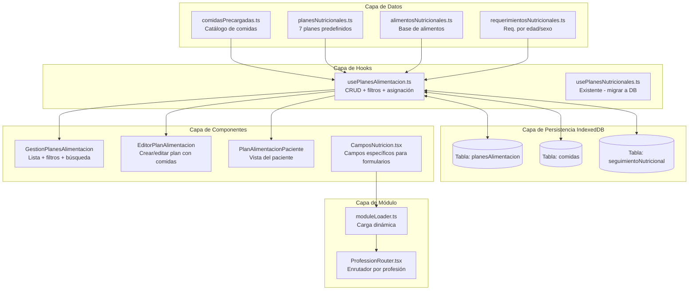
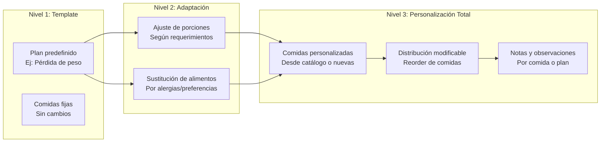
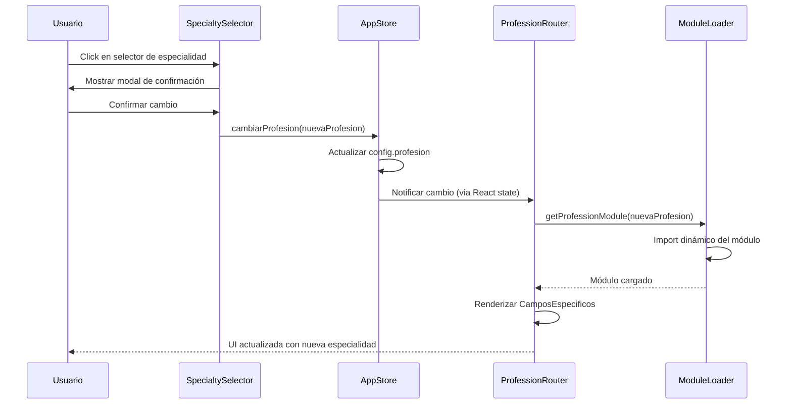

# Plan de Arquitectura/Diseño: Módulo de Nutrición y Regreso a Especialidades

## Resumen Ejecutivo

Este plan detalla la arquitectura necesaria para:
1. **Implementar el módulo de nutrición** (desayunos, colaciones, comidas, cenas) siguiendo el mismo patrón de las rutinas de ejercicios
2. **Habilitar personalización** de planes alimenticios
3. **Permitir el regreso a todas las especialidades** disponibles

---

## Parte 1: Diagnóstico del Estado Actual

### 1.1 Lo que YA existe (no requiere construcción)

| Componente | Archivo | Estado |
|---|---|---|
| Tipos `DatosNutricion` con `planNutricional.distribucionComidas` | [`types/index.ts:519-559`](../src/types/index.ts#519) | ✅ Completo |
| Hook `usePlanesNutricionales` (in-memory) | [`modules/nutricion/hooks/usePlanesNutricionales.ts`](../src/modules/nutricion/hooks/usePlanesNutricionales.ts) | ⚠️ Existe pero usa estado local, no IndexedDB |
| Componente `PlanNutricional` | [`modules/nutricion/components/PlanNutricional.tsx`](../src/modules/nutricion/components/PlanNutricional.tsx) | ✅ Completo |
| Datos de alimentos (`alimentosNutricionales.ts`) | [`modules/nutricion/data/alimentosNutricionales.ts`](../src/modules/nutricion/data/alimentosNutricionales.ts) | ✅ 493 líneas con categorías completas |
| Planes predefinidos (`planesNutricionales.ts`) | [`modules/nutricion/data/planesNutricionales.ts`](../src/modules/nutricion/data/planesNutricionales.ts) | ✅ 7 planes (pérdida peso, ganancia muscular, diabetes, etc.) |
| Requerimientos nutricionales | [`modules/nutricion/data/requerimientosNutricionales.ts`](../src/modules/nutricion/data/requerimientosNutricionales.ts) | ✅ Por edad/sexo con micronutrientes |
| Módulo registrado en `moduleLoader.ts` | [`utils/moduleLoader.ts:56-73`](../src/utils/moduleLoader.ts#56) | ✅ Ya carga hooks y componentes |
| Función `cambiarProfesion` en appStore | [`stores/appStore.ts:165-222`](../src/stores/appStore.ts#165) | ✅ Ya implementada |
| `ProfessionRouter` para carga dinámica | [`components/ProfessionRouter.tsx`](../src/components/ProfessionRouter.tsx) | ✅ Ya implementado |

### 1.2 Lo que NO existe (requiere construcción)

| Componente | Estado | Prioridad |
|---|---|---|
| **Hook `usePlanesAlimentacion`** con persistencia IndexedDB (análogo a `useRutinas.ts`) | ❌ No existe | **ALTA** |
| **Tablas en DB** para `planesAlimentacion`, `comidas`, `alimentosPaciente` | ❌ No existen | **ALTA** |
| **Componentes de gestión** (GestionPlanes, EditorPlan, PlanPaciente) | ❌ No existen | **ALTA** |
| **Datos precargados de comidas** (`comidasPrecargadas.ts` análogo a `ejerciciosPrecargados.ts`) | ❌ No existen | **ALTA** |
| **`CamposNutricion.tsx`** (el archivo referenciado en VSCode no existe en disco) | ❌ No existe | **ALTA** |
| **Contenidos de nutrición** en `contenidosPrecargados.ts` | ❌ Bug: usa contenido de manicurista | **ALTA** |
| **UI para cambiar de especialidad** (selector visible) | ❌ No evidente | **MEDIA** |

### 1.3 Bug Crítico Identificado

En [`data/contenidosPrecargados.ts:408,462,511,563`](../src/data/contenidosPrecargados.ts#408), el array `contenidosManicurista` (contenido de manicure/pedicure) está mapeado a `TipoProfesion.NUTRICION`. La línea 580 tiene un TODO explícito:

```typescript
case TipoProfesion.NUTRICION:
  return contenidosManicurista; // TODO: Cambiar a contenidosNutricion cuando estén listos
```

---

## Parte 2: Arquitectura Propuesta

### 2.1 Patrón a Seguir (Ejercicios → Nutrición)

El patrón de rutinas de ejercicios tiene esta arquitectura:

```
📁 data/ejerciciosPrecargados.ts    → Catálogo de ejercicios (4304 líneas, 200+ ejercicios)
📁 types/biblioteca.ts              → Interfaces: Ejercicio, RutinaEjercicios, SeguimientoRutina, Filtros
📁 db/database.ts                   → Tablas: ejercicios, rutinas, seguimientoRutinas
📁 hooks/useRutinas.ts              → CRUD + filtros + estadísticas + adherencia (con IndexedDB)
📁 components/                      → EditorRutina, GestionRutinas, RutinasPaciente, TarjetaRutina
```

El módulo de nutrición debe seguir el mismo patrón:

```
📁 modules/nutricion/data/comidasPrecargadas.ts    → Catálogo de comidas (NUEVO)
📁 types/nutricion.ts                              → Interfaces específicas (NUEVO)
📁 db/database.ts                                  → Tablas: planesAlimentacion, comidas (MODIFICAR)
📁 modules/nutricion/hooks/usePlanesAlimentacion.ts → CRUD + filtros + estadísticas (NUEVO)
📁 modules/nutricion/components/                   → GestionPlanes, EditorPlan, PlanPaciente (NUEVO)
```

### 2.2 Diagrama de Arquitectura



### 2.3 Nuevas Tablas en IndexedDB

Se debe agregar **versión 5** en [`db/database.ts:48-170`](../src/db/database.ts#48) con las siguientes tablas:

```typescript
// Versión 5: Agregar tablas de nutrición (planes de alimentación)
this.version(5).stores({
  // ... todas las tablas existentes se mantienen igual ...
  
  // Nuevas tablas
  planesAlimentacion: 'id, nombre, objetivo, pacienteId, activo, esPlantilla, usuarioCreadorId, fechaCreacion, fechaActualizacion, profesion',
  comidas: 'id, planId, nombre, horario, orden, fechaCreacion',
  seguimientoNutricional: 'id, planId, pacienteId, fecha, cumplimiento, profesion',
});
```

### 2.4 Nuevos Tipos (types/nutricion.ts)

Crear archivo [`types/nutricion.ts`](../src/types/nutricion.ts) con interfaces análogas a [`types/biblioteca.ts`](../src/types/biblioteca.ts):

```typescript
export interface ComidaPrecargada {
  id: string;
  nombre: string;
  categoria: 'desayuno' | 'colacion' | 'comida' | 'cena';
  descripcion: string;
  ingredientes: string[];
  preparacion?: string[];
  tiempoPreparacion?: number; // minutos
  dificultad: 'facil' | 'media' | 'avanzada';
  nutrientes: {
    calorias: number;
    proteinas: number;
    carbohidratos: number;
    grasas: number;
    fibra?: number;
  };
  porciones: number;
  alergenos?: string[];
  etiquetas?: string[];
  aptoPara?: string[]; // ['diabetico', 'vegano', 'celiaco', ...]
}

export interface ComidaEnPlan {
  id: string;
  comidaPrecargadaId?: string;
  nombre: string;
  tipo: 'desayuno' | 'colacion1' | 'comida' | 'colacion2' | 'cena';
  horario: string;
  ingredientes: string[];
  preparacion?: string;
  porcion: string;
  nutrientes: {
    calorias: number;
    proteinas: number;
    carbohidratos: number;
    grasas: number;
  };
  personalizaciones?: {
    ingredienteOriginal: string;
    sustituto: string;
    motivo: string; // alergia, preferencia, etc.
  }[];
  notas?: string;
}

export interface PlanAlimentacion {
  id: string;
  nombre: string;
  descripcion: string;
  objetivo: 'perder_peso' | 'ganar_musculo' | 'mantener' | 'control_enfermedad' | 'rendimiento';
  pacienteId?: string;
  esPlantilla: boolean;
  activo: boolean;
  requerimientos: {
    calorias: number;
    proteinas: number;
    carbohidratos: number;
    grasas: number;
  };
  distribucionComidas: {
    desayuno: ComidaEnPlan[];
    colacion1: ComidaEnPlan[];
    comida: ComidaEnPlan[];
    colacion2: ComidaEnPlan[];
    cena: ComidaEnPlan[];
  };
  recomendaciones: string[];
  usuarioCreadorId?: string;
  fechaCreacion: Date;
  fechaActualizacion: Date;
  profesion: string;
}

export interface SeguimientoNutricional {
  id: string;
  planId: string;
  pacienteId: string;
  fecha: Date;
  cumplimiento: number; // 0-100%
  comidasRealizadas: string[]; // IDs de comidas
  dificultades: string[];
  peso?: number;
  observaciones?: string;
  profesion: string;
}

export interface FiltrosPlanes {
  busqueda?: string;
  objetivo?: PlanAlimentacion['objetivo'];
  activo?: boolean;
  esPlantilla?: boolean;
  pacienteId?: string;
  ordenarPor?: 'fecha' | 'nombre';
  ordenDireccion?: 'asc' | 'desc';
}
```

### 2.5 Nuevo Hook: usePlanesAlimentacion

Crear [`modules/nutricion/hooks/usePlanesAlimentacion.ts`](../src/modules/nutricion/hooks/usePlanesAlimentacion.ts) siguiendo el patrón de [`hooks/useRutinas.ts`](../src/modules/fisioterapia/hooks/useRutinas.ts):

| Función | Análoga en useRutinas | Descripción |
|---|---|---|
| `planes` / `planesActivos` / `plantillas` | `rutinas` / `rutinasActivas` / `plantillas` | Queries reactivas con `useLiveQuery` |
| `crearPlan(options)` | `crearRutina` | Crear plan con cálculo automático de requerimientos |
| `actualizarPlan(id, datos)` | `actualizarRutina` | Actualizar plan existente |
| `eliminarPlan(id)` | `eliminarRutina` | Eliminar plan |
| `duplicarPlan(id, nuevoNombre)` | `duplicarRutina` | Clonar plan como plantilla |
| `asignarAPaciente(planId, pacienteId)` | `asignarAPaciente` | Asignar plan a paciente |
| `desasignarDePaciente(planId)` | `desasignarDePaciente` | Desasignar plan |
| `toggleActivo(id)` | `toggleActiva` | Activar/desactivar plan |
| `convertirEnPlantilla(id)` | `convertirEnPlantilla` | Convertir en plantilla reutilizable |
| `filtrarPlanes(filtros)` | `filtrarRutinas` | Filtrar por objetivo, paciente, etc. |
| `agregarComida(planId, tipo, comida)` | — | Agregar comida a un plan |
| `eliminarComida(planId, comidaId)` | — | Eliminar comida de un plan |
| `personalizarComida(planId, comidaId, cambios)` | — | Personalizar ingredientes/porciones |
| `calcularNutrientesPlan(planId)` | — | Recalcular totales nutricionales |
| `obtenerEstadisticas()` | `obtenerEstadisticas` | Estadísticas de planes |
| `obtenerAdherencia(planId)` | `obtenerAdherencia` | Seguimiento de cumplimiento |

### 2.6 Nuevos Componentes

#### 2.6.1 GestionPlanesAlimentacion (análogo a GestionRutinas)
- Lista de planes con filtros por objetivo, paciente, activos/plantillas
- Búsqueda por nombre
- Botones: crear, editar, duplicar, eliminar, asignar

#### 2.6.2 EditorPlanAlimentacion (análogo a EditorRutina)
- Configuración de requerimientos calóricos
- Distribución de comidas (desayuno, colacion1, comida, colacion2, cena)
- Selector de comidas precargadas del catálogo
- Personalización de porciones e ingredientes
- Vista previa de nutrientes totales

#### 2.6.3 PlanAlimentacionPaciente (análogo a RutinasPaciente)
- Vista del plan asignado al paciente
- Check de cumplimiento por comida
- Registro de dificultades
- Historial de seguimiento

#### 2.6.4 TarjetaPlan (análogo a TarjetaRutina)
- Resumen visual del plan
- Indicadores calóricos
- Etiquetas de objetivo

### 2.7 Datos Precargados: comidasPrecargadas.ts

Crear [`modules/nutricion/data/comidasPrecargadas.ts`](../src/modules/nutricion/data/comidasPrecargadas.ts) con un catálogo de comidas organizadas por tipo:

```typescript
export const comidasPrecargadas: ComidaPrecargada[] = [
  // DESAYUNOS (~20-30 opciones)
  { id: 'des-001', nombre: 'Omelette de claras con espinacas', categoria: 'desayuno', ... },
  { id: 'des-002', nombre: 'Avena con frutas y nueces', categoria: 'desayuno', ... },
  // COLACIONES (~15-20 opciones)
  { id: 'col-001', nombre: 'Yogurt griego con berries', categoria: 'colacion', ... },
  // COMIDAS (~25-35 opciones)
  { id: 'com-001', nombre: 'Pechuga de pollo a la plancha con verduras', categoria: 'comida', ... },
  // CENAS (~15-20 opciones)
  { id: 'cen-001', nombre: 'Salmón al horno con espárragos', categoria: 'cena', ... },
];
```

**Total estimado: 75-105 comidas precargadas**, similar a los 200+ ejercicios pero con menos variedad por ser más específico.

### 2.8 Corrección de contenidosPrecargados.ts

Crear array `contenidosNutricion` con contenido real de nutrición (recetas, guías alimentarias, tips nutricionales) y reemplazar en la línea 580:

```typescript
case TipoProfesion.NUTRICION:
  return contenidosNutricion; // Antes: return contenidosManicurista;
```

---

## Parte 3: Personalización de Planes Alimenticios

### 3.1 Niveles de Personalización



### 3.2 Mecanismo de Personalización

Cada `ComidaEnPlan` tendrá un array de `personalizaciones`:

```typescript
personalizaciones?: {
  ingredienteOriginal: string;
  sustituto: string;
  motivo: 'alergia' | 'preferencia' | 'intolerancia' | 'disponibilidad' | 'otro';
  fechaModificacion: Date;
}[];
```

**Flujo de personalización:**
1. Usuario selecciona un plan template
2. Sistema calcula requerimientos base (calorías, macros)
3. Usuario puede:
   - Ajustar porciones (deslizador de porcentaje)
   - Sustituir ingredientes (selector de alternativas)
   - Reordenar comidas (drag & drop)
   - Agregar/eliminar comidas individuales
4. Sistema recalcula automáticamente los nutrientes totales
5. Cambios se guardan como "personalización" con trazabilidad

### 3.3 Integración con Datos del Paciente

La personalización debe considerar:
- **Alergias alimentarias** (del `DatosNutricion.evaluacionNutricional.alergiasAlimentarias`)
- **Preferencias alimentarias** (del `DatosNutricion.evaluacionNutricional.preferenciasAlimentarias`)
- **Requerimientos calculados** (edad, sexo, peso, actividad)

---

## Parte 4: Regreso a Todas las Especialidades

### 4.1 Estado Actual

La función [`cambiarProfesion()`](../src/stores/appStore.ts#165) ya existe y:
- Actualiza la configuración con la nueva profesión
- Opcionalmente migra datos entre tablas
- Recarga feature flags
- Dispara la recarga del módulo via `ProfessionRouter`

El [`ProfessionRouter`](../src/components/ProfessionRouter.tsx) ya:
- Escucha cambios en `configuracion.profesion`
- Carga dinámicamente el módulo via `getProfessionModule()`
- Renderiza `CamposEspecificos` del módulo cargado

### 4.2 Lo que Falta

| Componente | Descripción | Prioridad |
|---|---|---|
| **Selector de especialidad en UI** | Menú/dropdown visible para cambiar entre las 5 especialidades | **ALTA** |
| **Confirmación al cambiar** | Modal que advierta sobre cambio de contexto | **MEDIA** |
| **Persistencia de datos por especialidad** | Asegurar que datos de nutrición no se mezclen con fisioterapia | **ALTA** |
| **Navegación condicional** | Mostrar/ocultar secciones según especialidad activa | **MEDIA** |

### 4.3 Propuesta de UI para Selector de Especialidades

Agregar un componente `SpecialtySelector` en la barra de navegación principal:

```typescript
// Componente a crear
export default function SpecialtySelector() {
  const { configuracion, cambiarProfesion } = useAppStore();
  
  const especialidades = [
    { id: 'fisioterapia', nombre: 'Fisioterapia', icono: '🦴' },
    { id: 'psicologia', nombre: 'Psicología', icono: '🧠' },
    { id: 'nutricion', nombre: 'Nutrición', icono: '🥗' },
    { id: 'medicina_general', nombre: 'Medicina General', icono: '🩺' },
    { id: 'odontologia', nombre: 'Odontología', icono: '🦷' },
  ];
  
  // Renderizar dropdown/menu con confirmación
}
```

### 4.4 Flujo de Cambio de Especialidad



---

## Parte 5: Plan de Implementación

### Fase 1: Base de Datos y Tipos

| # | Tarea | Archivos | Dependencias |
|---|---|---|---|
| 1.1 | Agregar tablas `planesAlimentacion`, `comidas`, `seguimientoNutricional` en DB v5 | [`db/database.ts`](../src/db/database.ts) | Ninguna |
| 1.2 | Crear archivo de tipos `types/nutricion.ts` | Nuevo: `types/nutricion.ts` | Ninguna |
| 1.3 | Actualizar `DatosNutricion` si es necesario | [`types/index.ts`](../src/types/index.ts) | 1.2 |

### Fase 2: Datos Precargados

| # | Tarea | Archivos | Dependencias |
|---|---|---|---|
| 2.1 | Crear catálogo de comidas precargadas (75-100 comidas) | Nuevo: `modules/nutricion/data/comidasPrecargadas.ts` | 1.2 |
| 2.2 | Crear contenido real de nutrición para biblioteca | [`data/contenidosPrecargados.ts`](../src/data/contenidosPrecargados.ts) | Ninguna |
| 2.3 | Corregir bug: reemplazar `contenidosManicurista` por `contenidosNutricion` | [`data/contenidosPrecargados.ts:580`](../src/data/contenidosPrecargados.ts#580) | 2.2 |

### Fase 3: Hook Principal

| # | Tarea | Archivos | Dependencias |
|---|---|---|---|
| 3.1 | Crear `usePlanesAlimentacion` con CRUD + IndexedDB | Nuevo: `modules/nutricion/hooks/usePlanesAlimentacion.ts` | 1.1, 1.2 |
| 3.2 | Migrar `usePlanesNutricionales` a usar IndexedDB (o deprecar) | [`modules/nutricion/hooks/usePlanesNutricionales.ts`](../src/modules/nutricion/hooks/usePlanesNutricionales.ts) | 3.1 |
| 3.3 | Actualizar `moduleLoader.ts` para exportar nuevo hook | [`utils/moduleLoader.ts`](../src/utils/moduleLoader.ts) | 3.1 |

### Fase 4: Componentes de UI

| # | Tarea | Archivos | Dependencias |
|---|---|---|---|
| 4.1 | Crear `CamposNutricion.tsx` (el archivo faltante) | Nuevo: `components/CamposNutricion.tsx` | 1.2 |
| 4.2 | Crear `GestionPlanesAlimentacion` (lista + filtros) | Nuevo: `modules/nutricion/components/GestionPlanesAlimentacion.tsx` | 3.1 |
| 4.3 | Crear `EditorPlanAlimentacion` (crear/editar) | Nuevo: `modules/nutricion/components/EditorPlanAlimentacion.tsx` | 3.1, 2.1 |
| 4.4 | Crear `PlanAlimentacionPaciente` (vista paciente) | Nuevo: `modules/nutricion/components/PlanAlimentacionPaciente.tsx` | 3.1 |
| 4.5 | Crear `TarjetaPlan` (resumen visual) | Nuevo: `modules/nutricion/components/TarjetaPlan.tsx` | 1.2 |
| 4.6 | Integrar componentes en el módulo de nutrición | [`modules/nutricion/index.ts`](../src/modules/nutricion/index.ts) | 4.1-4.5 |

### Fase 5: Personalización

| # | Tarea | Archivos | Dependencias |
|---|---|---|---|
| 5.1 | Implementar ajuste de porciones en `EditorPlanAlimentacion` | `EditorPlanAlimentacion.tsx` | 4.3 |
| 5.2 | Implementar sustitución de ingredientes | `EditorPlanAlimentacion.tsx` | 4.3 |
| 5.3 | Implementar recálculo automático de nutrientes | `usePlanesAlimentacion.ts` | 3.1 |
| 5.4 | Integrar alergias/preferencias del paciente | `EditorPlanAlimentacion.tsx` | 4.3 |

### Fase 6: Selector de Especialidades

| # | Tarea | Archivos | Dependencias |
|---|---|---|---|
| 6.1 | Crear componente `SpecialtySelector` | Nuevo: `components/SpecialtySelector.tsx` | Ninguna |
| 6.2 | Agregar modal de confirmación al cambiar | Nuevo: `components/ConfirmChangeSpecialty.tsx` | 6.1 |
| 6.3 | Integrar selector en navegación principal | Componente de layout principal | 6.1 |
| 6.4 | Verificar que datos se filtren por `profesion` en todas las queries | Múltiples hooks | 6.1 |

---

## Parte 6: Consideraciones Técnicas

### 6.1 Persistencia y Sincronización

- Usar `useLiveQuery` de `dexie-react-hooks` para queries reactivas (mismo patrón que `useRutinas.ts`)
- Los datos de nutrición deben incluir el campo `profesion: 'nutricion'` para aislamiento multi-especialidad
- La función `inicializarDB()` debe poblar las comidas precargadas (análogo a `inicializarEjerciciosPrecargados()`)

### 6.2 Aislamiento por Especialidad

Todas las nuevas tablas y queries deben incluir el filtro `profesion` para garantizar que:
- Los planes de nutrición no aparezcan en fisioterapia
- Al cambiar de especialidad, solo se vean datos relevantes
- La migración de datos (si ocurre) respete el campo profesión

### 6.3 Rendimiento

- El catálogo de comidas precargadas (~100 items) es mucho menor que ejercicios (~200+), por lo que no se esperan problemas de rendimiento
- Usar índices en `profesion`, `pacienteId`, `objetivo` para queries rápidas
- Lazy loading del módulo de nutrición ya está implementado via `moduleLoader.ts`

### 6.4 Compatibilidad hacia atrás

- El hook `usePlanesNutricionales` existente puede coexistir temporalmente
- La versión 5 de DB debe ser compatible con versiones anteriores (Dexie maneja migraciones automáticas)
- Los componentes existentes (`PlanNutricional.tsx`) deben seguir funcionando sin cambios

---

## Resumen de Archivos a Crear/Modificar

### Archivos NUEVOS (8)

| Archivo | Propósito |
|---|---|
| `src/types/nutricion.ts` | Interfaces: ComidaPrecargada, PlanAlimentacion, ComidaEnPlan, etc. |
| `src/modules/nutricion/data/comidasPrecargadas.ts` | Catálogo de 75-100 comidas precargadas |
| `src/modules/nutricion/hooks/usePlanesAlimentacion.ts` | Hook con CRUD + IndexedDB (análogo a useRutinas) |
| `src/modules/nutricion/components/GestionPlanesAlimentacion.tsx` | Lista y gestión de planes |
| `src/modules/nutricion/components/EditorPlanAlimentacion.tsx` | Editor de planes con personalización |
| `src/modules/nutricion/components/PlanAlimentacionPaciente.tsx` | Vista del paciente |
| `src/modules/nutricion/components/TarjetaPlan.tsx` | Tarjeta resumen de plan |
| `src/components/SpecialtySelector.tsx` | Selector de especialidad en UI |

### Archivos a MODIFICAR (6)

| Archivo | Cambio |
|---|---|
| `src/db/database.ts` | Agregar versión 5 con tablas `planesAlimentacion`, `comidas`, `seguimientoNutricional` |
| `src/data/contenidosPrecargados.ts` | Crear `contenidosNutricion` y corregir línea 580 |
| `src/modules/nutricion/index.ts` | Exportar nuevos componentes y hooks |
| `src/utils/moduleLoader.ts` | Agregar nuevos hooks al módulo de nutrición |
| `src/components/CamposNutricion.tsx` | Crear el componente (actualmente no existe en disco) |
| `src/modules/nutricion/hooks/usePlanesNutricionales.ts` | Migrar a IndexedDB o deprecar |

---

## Glosario

| Término | Definición |
|---|---|
| **Plan de alimentación** | Conjunto estructurado de comidas (desayuno, colaciones, comida, cena) con objetivos nutricionales |
| **Comida precargada** | Plato predefinido con información nutricional, usado como building block para planes |
| **Personalización** | Modificación de porciones, ingredientes o distribución dentro de un plan |
| **Template/Plantilla** | Plan reutilizable que puede asignarse a múltiples pacientes |
| **Especialidad** | Cada una de las 5 profesiones: fisioterapia, psicología, nutrición, medicina general, odontología |
