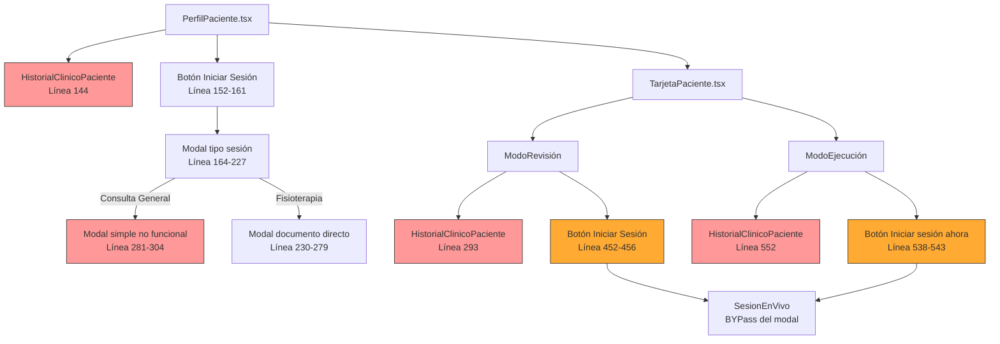
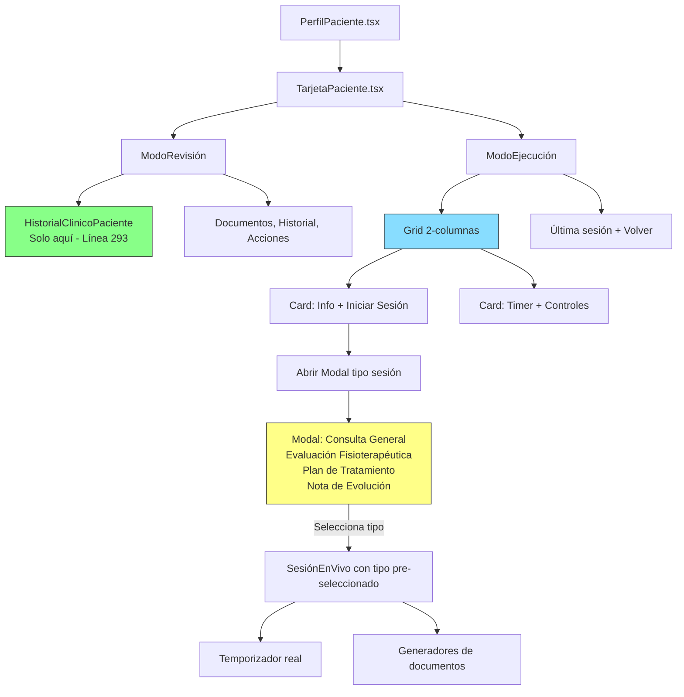
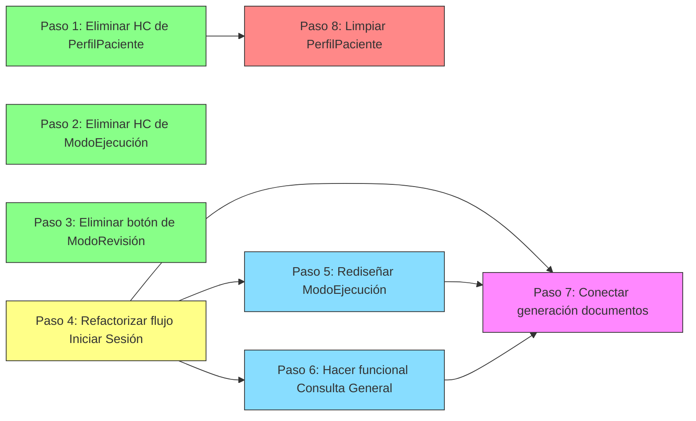

# Plan de Corrección: Interfaz de Perfil de Paciente

## Resumen Ejecutivo

Este plan aborda **5 problemas** identificados en la interfaz del perfil de paciente de SaludValpa, que afectan los componentes [`PerfilPaciente.tsx`](../src/pages/PerfilPaciente.tsx) y [`TarjetaPaciente.tsx`](../src/components/TarjetaPaciente.tsx). Los problemas principales son: renderizado triple del historial clínico, botones "Iniciar Sesión" mal ubicados, diseño incorrecto del ModoEjecución, modal de tipo de sesión con opciones no funcionales, y flujo de generación de documentos desconectado.

---

## 1. Resumen de Cambios Requeridos

| # | Cambio | Archivo(s) | Prioridad |
|---|--------|-----------|-----------|
| A | Eliminar duplicados de `HistorialClinicoPaciente` | [`PerfilPaciente.tsx`](../src/pages/PerfilPaciente.tsx), [`TarjetaPaciente.tsx`](../src/components/TarjetaPaciente.tsx) | Alta |
| B | Corregir ubicación de botones "Iniciar Sesión" | [`TarjetaPaciente.tsx`](../src/components/TarjetaPaciente.tsx) | Alta |
| C | Rediseñar sección superior de ModoEjecución | [`TarjetaPaciente.tsx`](../src/components/TarjetaPaciente.tsx) | Alta |
| D | Hacer funcional el modal de tipo de sesión | [`PerfilPaciente.tsx`](../src/pages/PerfilPaciente.tsx), [`TarjetaPaciente.tsx`](../src/components/TarjetaPaciente.tsx) | Media |
| E | Conectar flujo de generación de documentos post-sesión | [`PerfilPaciente.tsx`](../src/pages/PerfilPaciente.tsx), [`TarjetaPaciente.tsx`](../src/components/TarjetaPaciente.tsx) | Media |

---

## 2. Archivos a Modificar

### 2.1 [`PerfilPaciente.tsx`](../src/pages/PerfilPaciente.tsx) (324 líneas)

| Línea(s) | Cambio |
|----------|--------|
| 13 | Eliminar import de `HistorialClinicoPaciente` |
| 142-149 | Eliminar bloque `<HistorialClinicoPaciente>` (renderizado directo) |
| 152-161 | Mover/refactorizar botón "Iniciar sesión" y modal de tipo de sesión para que sea accesible desde `TarjetaPaciente` |
| 164-227 | Refactorizar modal de tipo de sesión para que funcione correctamente con "Consulta General" |
| 229-304 | Revisar modales de documentos activos para que usen `SesionEnVivo` en lugar de modales directos |

### 2.2 [`TarjetaPaciente.tsx`](../src/components/TarjetaPaciente.tsx) (688 líneas)

| Línea(s) | Cambio |
|----------|--------|
| 21 | Mantener import de `HistorialClinicoPaciente` (se usará solo en ModoRevisión) |
| 42-45 | Modificar `iniciarSesionEnVivo` para que abra el modal de tipo de sesión en lugar de ir directo a `SesionEnVivo` |
| 290-298 | **Mantener** `HistorialClinicoPaciente` en ModoRevisión (única ubicación correcta) |
| 449-463 | Eliminar botón "Iniciar sesión/consulta" de la card "Acciones" en ModoRevisión |
| 484-547 | Rediseñar grid superior de ModoEjecución: integrar botón "Iniciar Sesión" + timer real |
| 549-557 | Eliminar `HistorialClinicoPaciente` duplicado de ModoEjecución |
| 538-543 | Eliminar botón "Iniciar sesión ahora" duplicado del fondo |

### 2.3 [`SesionEnVivo.tsx`](../src/components/SesionEnVivo.tsx) (591 líneas)

| Línea(s) | Cambio |
|----------|--------|
| 36 | Añadir prop `tipoSesionInicial` para recibir el tipo seleccionado desde el modal |
| 312-318 | El formateo de tiempo ya existe y funciona - mantener sin cambios |
| 377-395 | El selector de tipo de sesión puede pre-seleccionarse según el tipo recibido |

---

## 3. Diagrama de Flujo: Estado Actual (Problemas)



## 4. Diagrama de Flujo: Estado Deseado



---

## 5. Implementación Paso a Paso

### Paso 1: Eliminar `HistorialClinicoPaciente` duplicado de [`PerfilPaciente.tsx`](../src/pages/PerfilPaciente.tsx)

**Archivo:** [`saludvalpa-app/src/pages/PerfilPaciente.tsx`](../src/pages/PerfilPaciente.tsx)

**Cambios:**
1. Eliminar la línea 13: `import HistorialClinicoPaciente from '../components/HistorialClinicoPaciente';`
2. Eliminar las líneas 142-149 (el bloque `<div className="mt-6">...</div>` que contiene `<HistorialClinicoPaciente>`)

**Resultado:** El historial clínico ya no se renderiza desde `PerfilPaciente.tsx`.

**Dependencias:** Ninguna. Puede hacerse primero.

---

### Paso 2: Eliminar `HistorialClinicoPaciente` duplicado de ModoEjecución en [`TarjetaPaciente.tsx`](../src/components/TarjetaPaciente.tsx)

**Archivo:** [`saludvalpa-app/src/components/TarjetaPaciente.tsx`](../src/components/TarjetaPaciente.tsx)

**Cambios:**
1. Eliminar las líneas 549-557 (el bloque `Historial clínico - Diagnósticos y signos vitales` que contiene `<HistorialClinicoPaciente>`)

**Resultado:** El historial clínico solo se muestra en ModoRevisión (línea 293).

**Dependencias:** Ninguna. Puede hacerse primero.

---

### Paso 3: Eliminar botón "Iniciar sesión/consulta" de ModoRevisión

**Archivo:** [`saludvalpa-app/src/components/TarjetaPaciente.tsx`](../src/components/TarjetaPaciente.tsx)

**Cambios:**
1. En el componente `ModoRevision`, eliminar las líneas 452-456 (el bloque `<Button variant="primary" onClick={onIniciarSesion}>` dentro de la card "Acciones")

**Resultado:** ModoRevisión ya no muestra botón para iniciar sesión, solo acciones administrativas (eliminar paciente).

**Dependencias:** Ninguna.

---

### Paso 4: Refactorizar flujo de "Iniciar Sesión" en `TarjetaPaciente`

**Archivo:** [`saludvalpa-app/src/components/TarjetaPaciente.tsx`](../src/components/TarjetaPaciente.tsx)

**Cambios:**

1. **Modificar `iniciarSesionEnVivo`** (líneas 42-45): En lugar de llamar directamente a `SesionEnVivo`, debe abrir el modal de selección de tipo de sesión.

2. **Añadir estado para el modal de tipo de sesión** dentro del componente `TarjetaPaciente`:
   ```typescript
   const [modalTipoSesionAbierto, setModalTipoSesionAbierto] = useState(false);
   const [tipoSesionSeleccionado, setTipoSesionSeleccionado] = useState<string | null>(null);
   ```

3. **Añadir función `handleSeleccionarTipoSesion`**:
   ```typescript
   const handleSeleccionarTipoSesion = (tipo: string) => {
     setTipoSesionSeleccionado(tipo);
     setModalTipoSesionAbierto(false);
     setModo('ejecucion');
     setSesionActiva(true);
   };
   ```

4. **Pasar `tipoSesion` a `SesionEnVivo`**: Modificar la llamada en la línea 55-60 para pasar el tipo seleccionado:
   ```tsx
   <SesionEnVivo
     paciente={paciente}
     profesion={configuracion?.profesion || 'fisioterapia'}
     onCerrar={cerrarSesion}
     tipoSesionInicial={tipoSesionSeleccionado || 'consulta_general'}
   />
   ```

5. **Añadir el modal de tipo de sesión** dentro del `return` de `TarjetaPaciente` (antes del cierre del div principal):
   ```tsx
   <Modal
     isOpen={modalTipoSesionAbierto}
     onClose={() => setModalTipoSesionAbierto(false)}
     title="Seleccionar tipo de sesión"
     size="md"
   >
     <div className="space-y-3">
       <button onClick={() => handleSeleccionarTipoSesion('consulta_general')} ...>
         Consulta General
       </button>
       {configuracion?.profesion === 'fisioterapia' && (
         <>
           <button onClick={() => handleSeleccionarTipoSesion('evaluacion')} ...>
             Evaluación Fisioterapéutica
           </button>
           <button onClick={() => handleSeleccionarTipoSesion('plan')} ...>
             Plan de Tratamiento
           </button>
           <button onClick={() => handleSeleccionarTipoSesion('nota')} ...>
             Nota de Evolución
           </button>
         </>
       )}
     </div>
   </Modal>
   ```

**Dependencias:** Requiere que el Paso 3 esté completo.

---

### Paso 5: Rediseñar sección superior de ModoEjecución

**Archivo:** [`saludvalpa-app/src/components/TarjetaPaciente.tsx`](../src/components/TarjetaPaciente.tsx)

**Cambios en el componente `ModoEjecucion` (líneas 472-577):**

1. **Card izquierda: Información del paciente + Botón "Iniciar Sesión"**
   - Mostrar resumen del paciente (nombre, edad, motivo de consulta)
   - Botón "Iniciar Sesión" que abre el modal de tipo de sesión
   - Usar `onIniciarSesion` para abrir el modal

2. **Card derecha: Timer (una vez que la sesión está activa)**
   - Si `sesionActiva === true`, mostrar el temporizador en tiempo real
   - Si `sesionActiva === false`, mostrar un placeholder con instrucciones
   - El timer real se obtiene de `SesionEnVivo` (líneas 44-99, 312-353)

3. **Eliminar el botón "Iniciar sesión ahora" duplicado** (líneas 538-543)

4. **Eliminar la card "Historial clínico" duplicada** (líneas 549-557)

**Estructura propuesta para el grid:**

```tsx
<div className="grid grid-cols-1 md:grid-cols-2 gap-4">
  {/* Card: Iniciar Sesión */}
  <Card className="p-6 ...">
    <div className="flex items-center gap-3 mb-4">
      <span className="text-3xl">▶️</span>
      <div>
        <h3 className="font-bold text-saludvalpa-blue text-lg">Iniciar Sesión</h3>
        <p className="text-sm text-gray-700">Selecciona el tipo de consulta</p>
      </div>
    </div>
    <div className="bg-white rounded-lg p-4 shadow-sm text-center">
      <p className="text-gray-600 text-sm mb-4">
        {paciente.nombre} {paciente.apellidos} - {paciente.edad} años
      </p>
      <button
        onClick={onIniciarSesion}
        className="w-full bg-saludvalpa-blue text-white px-6 py-3 rounded-lg font-bold"
      >
        ▶️ Iniciar sesión ahora
      </button>
    </div>
  </Card>

  {/* Card: Temporizador / Estado */}
  <Card className="p-6 ...">
    <div className="flex items-center gap-3 mb-4">
      <span className="text-3xl">⏱️</span>
      <div>
        <h3 className="font-bold text-saludvalpa-blue text-lg">Sesión en vivo</h3>
        <p className="text-sm text-gray-700">Tiempo y controles de la sesión</p>
      </div>
    </div>
    <div className="bg-white rounded-lg p-4 shadow-sm text-center">
      <p className="text-gray-500 text-sm">
        Inicia una sesión para ver el temporizador aquí
      </p>
    </div>
  </Card>
</div>
```

**Dependencias:** Requiere el Paso 4 (para que `onIniciarSesion` abra el modal correcto).

---

### Paso 6: Hacer funcional "Consulta General" en el modal de tipo de sesión

**Archivo:** [`saludvalpa-app/src/pages/PerfilPaciente.tsx`](../src/pages/PerfilPaciente.tsx)

**Cambios:**

1. **Refactorizar `handleSeleccionarTipoSesion`** (línea 88-91): En lugar de solo establecer el tipo, debe iniciar `SesionEnVivo` con el tipo `consulta_general`.

2. **Eliminar el modal de "Consulta General"** (líneas 281-304) que actualmente solo muestra un placeholder sin funcionalidad real.

3. **Redirigir `tipoSesionActiva === 'general'`** para que use `SesionEnVivo` en lugar del modal placeholder.

**Alternativa recomendada:** Dado que el modal de tipo de sesión se está moviendo a `TarjetaPaciente.tsx` (Paso 4), el código en `PerfilPaciente.tsx` relacionado con `tipoSesionActiva` y los modales de documentos (líneas 229-304) debe ser **eliminado o simplificado**, ya que la lógica ahora residirá en `TarjetaPaciente.tsx`.

**Dependencias:** Requiere el Paso 4.

---

### Paso 7: Conectar flujo de generación de documentos post-sesión

**Archivo:** [`saludvalpa-app/src/components/TarjetaPaciente.tsx`](../src/components/TarjetaPaciente.tsx)

**Cambios:**

1. **Pasar `tipoSesionSeleccionado` a `SesionEnVivo`**: Ya cubierto en el Paso 4.

2. **En `SesionEnVivo`**: Recibir el tipo de sesión inicial y pre-seleccionarlo en el `<select>` de tipo de sesión (línea 382-394).

3. **Después de finalizar la sesión en `SesionEnVivo`**: Mostrar botones de generación de documentos según el tipo:
   - `evaluacion` → Botón "Generar Evaluación Fisioterapéutica"
   - `plan` → Botón "Generar Plan de Tratamiento"
   - `nota` → Botón "Generar Nota de Evolución"
   - `consulta_general` → Botón "Generar Reporte de Sesión"

**Dependencias:** Requiere Pasos 4, 5 y 6.

---

### Paso 8: Limpiar código no utilizado en `PerfilPaciente.tsx`

**Archivo:** [`saludvalpa-app/src/pages/PerfilPaciente.tsx`](../src/pages/PerfilPaciente.tsx)

**Cambios:**
1. Eliminar imports de componentes lazy-load que ya no se usan directamente (líneas 18-20): `GenerarEvaluacionFisioterapeutica`, `GenerarPlanTratamiento`, `GenerarNotaEvolucion`
2. Eliminar el estado `tipoSesionActiva` y `modalSesionAbierto` (líneas 34-35) si ya no se usan
3. Eliminar las funciones `handleSeleccionarTipoSesion` y `cerrarSesion` (líneas 88-95) si ya no se usan
4. Eliminar los modales de documentos activos (líneas 229-304)

**Nota:** Evaluar si `PerfilPaciente.tsx` aún necesita algún estado de sesión o si toda esa lógica se ha movido completamente a `TarjetaPaciente.tsx`.

**Dependencias:** Requiere Pasos 4, 5, 6.

---

## 6. Dependencias entre Cambios



**Orden de implementación recomendado:**

1. **Fase 1 (Independiente, bajo riesgo):** Pasos 1, 2, 3
   - Eliminar duplicados de `HistorialClinicoPaciente`
   - Eliminar botón "Iniciar Sesión" de ModoRevisión
   - No afecta funcionalidad existente

2. **Fase 2 (Cambio estructural, riesgo medio):** Paso 4
   - Refactorizar flujo de inicio de sesión
   - Mover modal de tipo de sesión a `TarjetaPaciente`
   - Afecta cómo se inician las sesiones

3. **Fase 3 (Rediseño visual, riesgo medio):** Pasos 5, 6
   - Rediseñar grid de ModoEjecución
   - Hacer funcional "Consulta General"
   - Afecta la UI de ModoEjecución

4. **Fase 4 (Mejora funcional, riesgo bajo):** Paso 7
   - Conectar generación de documentos post-sesión
   - Depende de que el flujo de sesión funcione correctamente

5. **Fase 5 (Limpieza, riesgo bajo):** Paso 8
   - Eliminar código muerto en `PerfilPaciente.tsx`
   - Hacer después de verificar que todo funciona

---

## 7. Consideraciones de Prueba

### Pruebas Unitarias / Manuales

| Escenario | Pasos | Resultado Esperado |
|-----------|-------|-------------------|
| **Verificar HC único** | Navegar a perfil de paciente en ModoRevisión | Solo 1 instancia de "Historial Clínico" visible |
| **ModoRevisión sin botón sesión** | Cambiar a ModoRevisión | No debe haber botón "Iniciar sesión/consulta" |
| **ModoEjecución sin HC** | Cambiar a ModoEjecución | No debe mostrar "Diagnósticos y signos vitales" |
| **Abrir modal tipo sesión** | Click en "Iniciar sesión" desde ModoEjecución | Debe abrir modal con 4 opciones |
| **Seleccionar Consulta General** | Click en "Consulta General" en modal | Debe abrir `SesionEnVivo` con tipo pre-seleccionado |
| **Seleccionar Evaluación (fisioterapia)** | Click en "Evaluación Fisioterapéutica" | Debe abrir `SesionEnVivo` con tipo `evaluacion` |
| **Timer en ModoEjecución** | Iniciar sesión | El timer debe contar segundos en tiempo real |
| **Botón único "Iniciar sesión"** | Verificar ModoEjecución | Solo 1 botón "Iniciar sesión" en la card izquierda |
| **Profesión no-fisioterapia** | Configurar como medicina | Modal debe mostrar solo "Consulta General" |

### Pruebas de Regresión

| Escenario | Riesgo |
|-----------|--------|
| Editar paciente desde perfil | Bajo - no se modifica lógica de edición |
| Eliminar paciente | Bajo - no se modifica lógica de eliminación |
| Generar documentos (recibo, consentimiento, hoja) | Bajo - no se modifica lógica de documentos |
| Ver historial de sesiones | Bajo - componente `HistorialSesiones` no se modifica |
| Navegación entre modos Revisión/Ejecución | Medio - se modifica el flujo de cambio de modo |
| Iniciar sesión desde cita existente | Medio - verificar que `citaId` se pasa correctamente |

---

## 8. Evaluación de Riesgos

| Riesgo | Probabilidad | Impacto | Mitigación |
|--------|-------------|---------|------------|
| **R1:** Romper el flujo de inicio de sesión existente | Media | Alto | Implementar Fase 2 con cuidado, probar exhaustivamente |
| **R2:** Perder la capacidad de iniciar sesión desde ModoRevisión (deseado) | N/A | N/A | Es un cambio intencional, confirmar con stakeholders |
| **R3:** El modal de tipo de sesión no se abre correctamente desde ModoEjecución | Baja | Alto | Verificar que el estado `modalTipoSesionAbierto` se maneja correctamente |
| **R4:** `SesionEnVivo` no recibe el tipo de sesión correctamente | Baja | Medio | Agregar prop `tipoSesionInicial` con valor por defecto |
| **R5:** Conflictos de estado entre `PerfilPaciente.tsx` y `TarjetaPaciente.tsx` | Media | Medio | Asegurar que la lógica de sesión se migra completamente a `TarjetaPaciente` |
| **R6:** Romper la generación de documentos de especialidad (Evaluación, Plan, Nota) | Media | Alto | Los modales de documentos en `PerfilPaciente.tsx` (líneas 229-279) deben migrarse a `TarjetaPaciente.tsx` o integrarse en `SesionEnVivo` |

---

## 9. Resumen de Archivos y Líneas Afectadas

| Archivo | Líneas a Eliminar | Líneas a Modificar | Líneas a Agregar |
|---------|------------------|-------------------|-----------------|
| [`PerfilPaciente.tsx`](../src/pages/PerfilPaciente.tsx) | 13, 142-149, 152-161, 164-227, 229-304 | 34-35, 88-95 | ~10 (simplificación) |
| [`TarjetaPaciente.tsx`](../src/components/TarjetaPaciente.tsx) | 42-45, 449-463, 538-543, 549-557 | 37-40, 53-61, 472-577 | ~80 (nuevo modal + grid rediseñado) |
| [`SesionEnVivo.tsx`](../src/components/SesionEnVivo.tsx) | - | 17-23 (interface), 36, 382-394 | ~5 (prop `tipoSesionInicial`) |

---

## 10. Criterios de Aceptación

1. ✅ El historial clínico aparece **exactamente 1 vez** en toda la página de perfil
2. ✅ ModoRevisión **no tiene** botón para iniciar sesión
3. ✅ ModoEjecución tiene **exactamente 1 botón** "Iniciar sesión" en la card izquierda del grid superior
4. ✅ El botón "Iniciar sesión" abre un **modal con opciones de tipo de sesión**
5. ✅ "Consulta General" inicia una sesión real (no un placeholder)
6. ✅ El timer en ModoEjecución es **funcional** (no un placeholder estático)
7. ✅ Las opciones de Evaluación/Plan/Nota solo aparecen para profesión fisioterapia
8. ✅ No hay código muerto ni imports no utilizados
9. ✅ La generación de documentos post-sesión está conectada al tipo de sesión seleccionado
