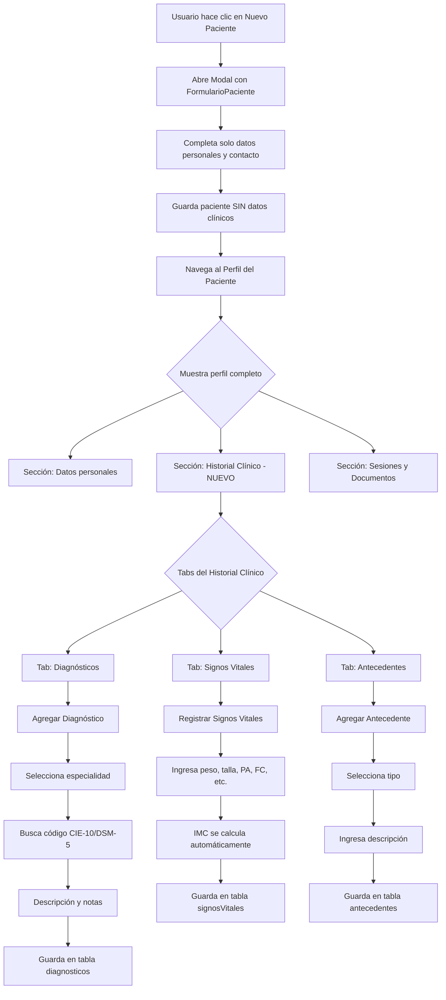

# Plan: Mover Historial Clínico de la Creación del Paciente al Perfil

## Resumen

Actualmente, el formulario de creación de paciente ([`FormularioPaciente.tsx`](../src/components/FormularioPaciente.tsx)) incluye campos de "Información clínica" como `historialMedico`, `motivoConsulta`, `alergias` y `medicamentos`. Estos datos se almacenan directamente en el objeto [`Paciente`](../src/types/index.ts:112). El objetivo es:

1. **Retirar** estos campos del formulario de creación/edición de paciente.
2. **Crear** un nuevo sistema de "Historial Clínico" dentro del perfil del paciente ([`PerfilPaciente.tsx`](../src/pages/PerfilPaciente.tsx)) que permita:
   - Agregar diagnósticos (con código, descripción, fecha, especialidad).
   - Registrar **signos vitales** (peso, talla, IMC, presión arterial, frecuencia cardíaca, temperatura, etc.).
   - Registrar **antecedentes** (patológicos, quirúrgicos, alérgicos, tóxicos, familiares).
   - Ver el historial completo de diagnósticos, signos vitales y antecedentes registrados.
   - Actualizar/editar entradas existentes.
3. **Aplicar para todas las especialidades**: medicina, odontología, psicología, nutrición y fisioterapia.

---

## Análisis del Estado Actual

### 1. Flujo de Creación de Paciente

- [`Pacientes.tsx`](../src/pages/Pacientes.tsx) abre un [`Modal`](../src/components/shared/Modal.tsx) con [`FormularioPaciente`](../src/components/FormularioPaciente.tsx).
- [`FormularioPaciente`](../src/components/FormularioPaciente.tsx) incluye sección "Información clínica" (líneas 204-257) con campos:
  - `motivoConsulta` (textarea)
  - `historialMedico` (textarea)
  - `alergias` (input, separado por comas)
  - `medicamentos` (input, separado por comas)
- Estos campos se envían como parte del objeto [`Paciente`](../src/types/index.ts:112) a [`usePacientes.crearPaciente()`](../src/hooks/usePacientes.ts:67).

### 2. Visualización Actual en Perfil

- [`TarjetaPaciente.tsx`](../src/components/TarjetaPaciente.tsx) en modo "Revisión" (componente [`ModoRevision`](../src/components/TarjetaPaciente.tsx:164)) muestra:
  - Sección "Historial clínico" (líneas 289-305) con `motivoConsulta` e `historialMedico`.
  - Alergias y medicamentos como badges (líneas 245-272).

### 3. Tipos de Datos Existentes

- [`Paciente`](../src/types/index.ts:112) tiene campos: `motivoConsulta`, `historialMedico`, `alergias`, `medicamentos`.
- Cada especialidad tiene su propio tipo de datos específicos:
  - [`DatosMedicinaGeneral`](../src/types/index.ts:533) con `signosVitales`, `diagnostico: string[]`, `cie10?: string[]`, `antecedentesPersonales`, `exploracionFisica`.
  - [`DatosPsicologia`](../src/types/index.ts:415) con `historiaClinica`.
  - [`DatosNutricion`](../src/types/index.ts:460) con `evaluacionNutricional` (incluye peso, talla, IMC).
  - [`DatosOdontologia`](../src/types/index.ts:593) con `diagnostico`.
  - [`DatosFisioterapia`](../src/types/index.ts:392).

### 4. Componentes de Historia Clínica por Especialidad

Ya existen componentes separados para cada especialidad:
- [`HistoriaClinicaMedica.tsx`](../src/modules/medicina/components/HistoriaClinicaMedica.tsx)
- [`HistoriaClinicaPsicologica.tsx`](../src/modules/psicologia/components/HistoriaClinicaPsicologica.tsx)
- [`HistoriaClinicaNutricional.tsx`](../src/modules/nutricion/components/HistoriaClinicaNutricional.tsx)
- [`HistoriaClinicaOdontologica.tsx`](../src/modules/odontologia/components/HistoriaClinicaOdontologica.tsx)

Estos componentes actualmente se usan dentro de flujos de sesión/documentos, no como parte del perfil del paciente.

---

## Arquitectura Propuesta

### Nuevo Modelo de Datos

#### 1. `DiagnosticoEntry` - Entrada de diagnóstico

```typescript
export interface DiagnosticoEntry {
  id: string;
  pacienteId: string;
  profesion: TipoProfesion;
  fecha: Date;
  codigo?: string;          // Código CIE-10, DSM-5, etc.
  descripcion: string;      // Descripción del diagnóstico
  tipo?: string;            // "principal", "secundario", "diferencial"
  notas?: string;           // Notas adicionales
  activo: boolean;          // Si el diagnóstico sigue vigente
  creadoPor?: string;       // ID del profesional
  fechaCreacion: Date;
  fechaActualizacion: Date;
}
```

#### 2. `SignosVitalesEntry` - Registro de signos vitales

```typescript
export interface SignosVitalesEntry {
  id: string;
  pacienteId: string;
  profesion: TipoProfesion;
  fecha: Date;
  // Antropometría
  peso?: number;            // kg
  talla?: number;           // cm
  imc?: number;             // calculado automáticamente peso / (talla/100)^2
  circunferenciaCintura?: number; // cm
  circunferenciaCadera?: number;  // cm
  relacionCinturaCadera?: number; // calculado
  // Signos vitales
  presionArterialSistolica?: number; // mmHg
  presionArterialDiastolica?: number; // mmHg
  frecuenciaCardiaca?: number;       // bpm
  frecuenciaRespiratoria?: number;   // rpm
  temperatura?: number;              // °C
  saturacionOxigeno?: number;        // %
  glucosaCapilar?: number;           // mg/dL
  // Metadata
  notas?: string;
  creadoPor?: string;
  fechaCreacion: Date;
  fechaActualizacion: Date;
}
```

#### 3. `AntecedenteEntry` - Antecedente del paciente

```typescript
export interface AntecedenteEntry {
  id: string;
  pacienteId: string;
  tipo: 'patologico' | 'quirurgico' | 'alergico' | 'toxicos' | 'familiares' | 'farmacologicos' | 'traumaticos' | 'otros';
  descripcion: string;
  fechaRegistro?: Date;
  activo: boolean;
  notas?: string;
  creadoPor?: string;
  fechaCreacion: Date;
  fechaActualizacion: Date;
}
```

#### 4. `HistorialClinicoPaciente` - Vista unificada

El perfil del paciente mostrará una vista unificada con pestañas o secciones:

```
┌─────────────────────────────────────────────────────────────┐
│  Perfil del Paciente                                        │
├─────────────────────────────────────────────────────────────┤
│  [Datos Personales] [Historial Clínico] [Sesiones] [Docs]   │
├─────────────────────────────────────────────────────────────┤
│                                                             │
│  ┌─ Diagnósticos ───────────────────────────────────────┐  │
│  │  + Agregar diagnóstico                               │  │
│  │  [2024-01-15] Hipertensión esencial (I10) - Activo   │  │
│  │  [2023-11-20] Lumbalgia (M54.5) - Inactivo           │  │
│  └──────────────────────────────────────────────────────┘  │
│                                                             │
│  ┌─ Signos Vitales ─────────────────────────────────────┐  │
│  │  + Registrar signos vitales                          │  │
│  │  [2024-01-15] Peso: 72kg | Talla: 170cm | IMC: 24.9 │  │
│  │  PA: 120/80 | FC: 72 | Temp: 36.5°C                 │  │
│  │  [2023-11-20] Peso: 74kg | Talla: 170cm | IMC: 25.6 │  │
│  │  PA: 130/85 | FC: 78 | Temp: 36.8°C                 │  │
│  └──────────────────────────────────────────────────────┘  │
│                                                             │
│  ┌─ Antecedentes ───────────────────────────────────────┐  │
│  │  + Agregar antecedente                               │  │
│  │  🏥 Patológicos: Diabetes tipo 2, Hipertensión       │  │
│  │  🔪 Quirúrgicos: Apendicectomía (2018)               │  │
│  │  💊 Alérgicos: Penicilina                            │  │
│  │  🚬 Tóxicos: Tabaco 10 cig/día                       │  │
│  └──────────────────────────────────────────────────────┘  │
│                                                             │
└─────────────────────────────────────────────────────────────┘
```

### Nueva Tabla en IndexedDB

Agregar tres tablas en [`database.ts`](../src/db/database.ts):

```typescript
diagnosticos!: Table<DiagnosticoEntry, string>;
signosVitales!: Table<SignosVitalesEntry, string>;
antecedentes!: Table<AntecedenteEntry, string>;
```

Con índices:
- `diagnosticos`: `id, pacienteId, profesion, fecha, activo`
- `signosVitales`: `id, pacienteId, profesion, fecha`
- `antecedentes`: `id, pacienteId, tipo, activo`

### Flujo de Datos

```
                    ┌─────────────────────┐
                    │  FormularioPaciente  │
                    │  SIN historial       │
                    │  clínico             │
                    └──────────┬──────────┘
                               │
                               ▼
                    ┌─────────────────────┐
                    │   PerfilPaciente     │
                    │  PerfilPaciente.tsx  │
                    └──────────┬──────────┘
                               │
              ┌────────────────┼──────────────────────────┐
              ▼                ▼                          ▼
    ┌─────────────────┐ ┌──────────────┐       ┌────────────────┐
    │  Sección Info   │ │  Sección     │       │  Sección       │
    │  General        │ │  Historial   │       │  Sesiones/     │
    │  datos básicos  │ │  Clínico     │       │  Documentos    │
    └─────────────────┘ └──────┬───────┘       └────────────────┘
                               │
                    ┌──────────┼──────────┐
                    ▼          ▼          ▼
          ┌────────────┐ ┌────────┐ ┌──────────┐
          │Diagnósticos│ │Signos  │ │Antece-   │
          │            │ │Vitales │ │dentes    │
          └────────────┘ └────────┘ └──────────┘
```

---

## Plan de Implementación Detallado

### Paso 1: Actualizar el Modelo de Datos

**Archivos a modificar:**
- [`src/types/index.ts`](../src/types/index.ts)

**Cambios:**
1. Agregar las interfaces:
   - `DiagnosticoEntry`
   - `SignosVitalesEntry`
   - `AntecedenteEntry`
2. No eliminar aún los campos `motivoConsulta`, `historialMedico`, `alergias`, `medicamentos` de [`Paciente`](../src/types/index.ts:112) para mantener retrocompatibilidad con datos existentes. Se marcarán como `@deprecated`.

### Paso 2: Agregar Nuevas Tablas en la Base de Datos

**Archivos a modificar:**
- [`src/db/database.ts`](../src/db/database.ts)

**Cambios:**
1. Importar `DiagnosticoEntry`, `SignosVitalesEntry`, `AntecedenteEntry` desde types.
2. Agregar propiedades en la clase `SaludValpaDatabase`:
   ```typescript
   diagnosticos!: Table<DiagnosticoEntry, string>;
   signosVitales!: Table<SignosVitalesEntry, string>;
   antecedentes!: Table<AntecedenteEntry, string>;
   ```
3. Crear una **nueva versión (v4)** del esquema:
   ```typescript
   this.version(4).stores({
     pacientes: 'id, nombre, apellidos, fechaNacimiento, fechaCreacion, ultimaConsulta, activo, profesionPrincipal',
     sesiones: 'id, pacienteId, profesionalId, fecha, fechaCreacion, profesion',
     citas: 'id, pacienteId, profesionalId, fechaHora, estado, fechaCreacion, profesion',
     documentos: 'id, tipo, pacienteId, profesionalId, fechaGeneracion, profesion',
     configuracion: 'id',
     usuarios: 'id, email, activo, profesion',
     servicios: 'id, nombre, profesion, activo',
     cotizaciones: 'id, pacienteId, fecha, estado, profesion',
     recibos: 'id, numero, pacienteId, fecha, estadoPago, profesion',
     biblioteca: 'id, profesion, categoria, titulo, favorito',
     ejercicios: 'id, nombre, categoria, precargado, favorito, usuarioCreadorId, fechaCreacion, profesion',
     rutinas: 'id, nombre, pacienteId, esPlantilla, activa, usuarioCreadorId, fechaCreacion, fechaActualizacion, profesion',
     seguimientoRutinas: 'id, rutinaId, pacienteId, fecha, fechaCreacion, profesion',
     // Nuevas tablas
     diagnosticos: 'id, pacienteId, profesion, fecha, activo',
     signosVitales: 'id, pacienteId, profesion, fecha',
     antecedentes: 'id, pacienteId, tipo, activo',
   });
   ```

### Paso 3: Crear Hooks

#### 3a. Hook `useDiagnosticosPaciente`

**Archivos a crear:**
- [`src/hooks/useDiagnosticosPaciente.ts`](../src/hooks/useDiagnosticosPaciente.ts)

**Funcionalidad:**
- `obtenerDiagnosticos(pacienteId: string): Promise<DiagnosticoEntry[]>`
- `agregarDiagnostico(datos: Omit<DiagnosticoEntry, 'id' | 'fechaCreacion' | 'fechaActualizacion'>): Promise<{success, diagnostico}>`
- `actualizarDiagnostico(id: string, datos: Partial<DiagnosticoEntry>): Promise<{success}>`
- `eliminarDiagnostico(id: string): Promise<{success}>`
- `obtenerDiagnosticosActivos(pacienteId: string): Promise<DiagnosticoEntry[]>`

#### 3b. Hook `useSignosVitales`

**Archivos a crear:**
- [`src/hooks/useSignosVitales.ts`](../src/hooks/useSignosVitales.ts)

**Funcionalidad:**
- `obtenerRegistros(pacienteId: string): Promise<SignosVitalesEntry[]>`
- `agregarRegistro(datos: Omit<SignosVitalesEntry, 'id' | 'imc' | 'relacionCinturaCadera' | 'fechaCreacion' | 'fechaActualizacion'>): Promise<{success, registro}>`
  - Calcular IMC automáticamente: `peso / (talla/100)^2`
  - Calcular relación cintura/cadera automáticamente
- `actualizarRegistro(id: string, datos: Partial<SignosVitalesEntry>): Promise<{success}>`
- `eliminarRegistro(id: string): Promise<{success}>`
- `obtenerUltimoRegistro(pacienteId: string): Promise<SignosVitalesEntry | null>`

#### 3c. Hook `useAntecedentesPaciente`

**Archivos a crear:**
- [`src/hooks/useAntecedentesPaciente.ts`](../src/hooks/useAntecedentesPaciente.ts)

**Funcionalidad:**
- `obtenerAntecedentes(pacienteId: string): Promise<AntecedenteEntry[]>`
- `agregarAntecedente(datos: Omit<AntecedenteEntry, 'id' | 'fechaCreacion' | 'fechaActualizacion'>): Promise<{success, antecedente}>`
- `actualizarAntecedente(id: string, datos: Partial<AntecedenteEntry>): Promise<{success}>`
- `eliminarAntecedente(id: string): Promise<{success}>`
- `obtenerAntecedentesPorTipo(pacienteId: string, tipo: string): Promise<AntecedenteEntry[]>`

### Paso 4: Limpiar Formulario de Paciente

**Archivos a modificar:**
- [`src/components/FormularioPaciente.tsx`](../src/components/FormularioPaciente.tsx)

**Cambios:**
1. Eliminar la sección "Información clínica" (líneas 204-257) que incluye:
   - `motivoConsulta`
   - `historialMedico`
   - `alergias`
   - `medicamentos`
2. Eliminar los estados y handlers relacionados con estos campos.
3. Eliminar estos campos del objeto `datos` en `handleSubmit`.
4. Mantener el resto del formulario (datos personales, contacto, contacto de emergencia).

### Paso 5: Actualizar `usePacientes` Hook

**Archivos a modificar:**
- [`src/hooks/usePacientes.ts`](../src/hooks/usePacientes.ts)

**Cambios:**
1. Eliminar los campos clínicos del objeto `nuevoPaciente` en `crearPaciente` (o dejarlos como undefined/empty por compatibilidad).

### Paso 6: Crear Componentes de Historial Clínico

#### 6a. Componente `HistorialClinicoPaciente` (contenedor principal)

**Archivos a crear:**
- [`src/components/HistorialClinicoPaciente.tsx`](../src/components/HistorialClinicoPaciente.tsx)

**Funcionalidad:**
- Componente contenedor con tabs/pestañas:
  1. **Diagnósticos** - Lista cronológica de diagnósticos
  2. **Signos Vitales** - Registros de peso, talla, PA, FC, etc.
  3. **Antecedentes** - Antecedentes agrupados por tipo
- Cada tab tiene su propio subcomponente.
- Uso de `useLiveQuery` para reactividad.

#### 6b. Componente `ListaDiagnosticos`

**Archivos a crear:**
- [`src/components/historial/ListaDiagnosticos.tsx`](../src/components/historial/ListaDiagnosticos.tsx)

**Funcionalidad:**
- Lista cronológica de diagnósticos (más reciente primero).
- Cada entrada muestra: fecha, código, descripción, especialidad, estado (activo/inactivo).
- Botón "Agregar diagnóstico" que abre modal con formulario.
- Botón "Editar" en cada entrada.
- Botón "Desactivar/Activar" para cambiar estado vigente.
- Filtro por especialidad.

**Formulario de nuevo diagnóstico:**
- Selector de especialidad (pre-seleccionado según profesión del profesional).
- Campo de código de diagnóstico con búsqueda y autocompletado:
  - Medicina: CIE-10 (usar datos de [`diagnosticosCIE10.ts`](../src/modules/medicina/data/diagnosticosCIE10.ts))
  - Psicología: DSM-5 (usar datos de [`diagnosticosDSM5.ts`](../src/modules/psicologia/data/diagnosticosDSM5.ts))
  - Odontología: códigos dentales (usar datos de [`codigosDentales.ts`](../src/modules/odontologia/data/codigosDentales.ts))
  - Nutrición: diagnósticos nutricionales
  - Fisioterapia: diagnósticos fisioterapéuticos
- Campo de descripción (textarea).
- Selector de tipo: "Principal", "Secundario", "Diferencial".
- Checkbox "Diagnóstico activo" (default: true).
- Campo de notas adicionales.

#### 6c. Componente `RegistroSignosVitales`

**Archivos a crear:**
- [`src/components/historial/RegistroSignosVitales.tsx`](../src/components/historial/RegistroSignosVitales.tsx)

**Funcionalidad:**
- Lista cronológica de registros de signos vitales.
- Cada entrada muestra en formato compacto:
  - Fecha
  - Peso (kg) | Talla (cm) | IMC
  - PA (sistólica/diastólica) | FC | Temp | SatO2
- Botón "Registrar" que abre modal con formulario.
- Botón "Eliminar" en cada entrada.
- **Gráfica de evolución** (opcional, para seguimiento visual):
  - Evolución de peso en el tiempo
  - Evolución de IMC
  - Evolución de presión arterial

**Formulario de registro:**
- Sección Antropometría:
  - Peso (kg) - input numérico
  - Talla (cm) - input numérico
  - IMC - calculado automáticamente (solo lectura)
  - Circunferencia de cintura (cm) - input numérico
  - Circunferencia de cadera (cm) - input numérico
- Sección Signos Vitales:
  - Presión arterial sistólica (mmHg) - input numérico
  - Presión arterial diastólica (mmHg) - input numérico
  - Frecuencia cardíaca (bpm) - input numérico
  - Frecuencia respiratoria (rpm) - input numérico
  - Temperatura (°C) - input numérico
  - Saturación de oxígeno (%) - input numérico
  - Glucosa capilar (mg/dL) - input numérico
- Campo de notas (textarea).

#### 6d. Componente `ListaAntecedentes`

**Archivos a crear:**
- [`src/components/historial/ListaAntecedentes.tsx`](../src/components/historial/ListaAntecedentes.tsx)

**Funcionalidad:**
- Antecedentes agrupados por tipo en tarjetas expandibles:
  - 🏥 Patológicos
  - 🔪 Quirúrgicos
  - 💊 Alérgicos
  - 🚬 Tóxicos
  - 👨‍👩‍👧‍👦 Familiares
  - 💊 Farmacológicos
  - 🦴 Traumáticos
- Botón "Agregar antecedente" con selector de tipo.
- Cada antecedente se muestra como badge/tag con opción de eliminar.
- Posibilidad de marcar como "activo" o "resuelto".

### Paso 7: Integrar en el Perfil del Paciente

**Archivos a modificar:**
- [`src/pages/PerfilPaciente.tsx`](../src/pages/PerfilPaciente.tsx)

**Cambios:**
1. Agregar el componente [`HistorialClinicoPaciente`](#6a-componente-historialclinicopaciente-contenedor-principal) dentro del perfil, después de la tarjeta de paciente y antes del botón de iniciar sesión.
2. Pasar el paciente como prop.

### Paso 8: Actualizar TarjetaPaciente (Modo Revisión)

**Archivos a modificar:**
- [`src/components/TarjetaPaciente.tsx`](../src/components/TarjetaPaciente.tsx)

**Cambios:**
1. En el componente [`ModoRevision`](../src/components/TarjetaPaciente.tsx:164), reemplazar la sección "Historial clínico" (líneas 289-305) que muestra `motivoConsulta` e `historialMedico` con un resumen del historial clínico que enlace al perfil completo, o simplemente eliminarla ya que ahora se verá desde el perfil.
2. Mantener la visualización de alergias y medicamentos (líneas 245-272) como datos básicos del paciente, pero considerar migrarlos también al nuevo sistema de antecedentes.

### Paso 9: Migración de Datos Existentes

**Archivos a modificar:**
- [`src/db/database.ts`](../src/db/database.ts) - función de migración

**Funcionalidad:**
1. Al actualizar a la nueva versión de la base de datos (v4), migrar los datos existentes:
   - Para cada paciente que tenga `historialMedico` o `motivoConsulta`, crear una entrada en `diagnosticos`.
   - Migrar `alergias` como entradas de `AntecedenteEntry` con tipo `alergico`.
   - Migrar `medicamentos` como entradas de `AntecedenteEntry` con tipo `farmacologicos`.
2. Esta migración debe ejecutarse una sola vez en el `upgrade`.

### Paso 10: Actualizar Componentes de Especialidad (Opcional - Fase 2)

**Archivos a modificar:**
- [`src/modules/medicina/components/HistoriaClinicaMedica.tsx`](../src/modules/medicina/components/HistoriaClinicaMedica.tsx)
- [`src/modules/psicologia/components/HistoriaClinicaPsicologica.tsx`](../src/modules/psicologia/components/HistoriaClinicaPsicologica.tsx)
- [`src/modules/nutricion/components/HistoriaClinicaNutricional.tsx`](../src/modules/nutricion/components/HistoriaClinicaNutricional.tsx)
- [`src/modules/odontologia/components/HistoriaClinicaOdontologica.tsx`](../src/modules/odontologia/components/HistoriaClinicaOdontologica.tsx)

**Cambios:**
- Actualizar estos componentes para que también guarden diagnósticos y signos vitales en las nuevas tablas cuando se usen durante las sesiones, manteniendo así un historial centralizado.

---

## Diagrama de Flujo



---

## Archivos a Modificar/Crear

### Archivos a Modificar:
| Archivo | Cambio |
|---------|--------|
| [`src/types/index.ts`](../src/types/index.ts) | Agregar interfaces `DiagnosticoEntry`, `SignosVitalesEntry`, `AntecedenteEntry` |
| [`src/db/database.ts`](../src/db/database.ts) | Agregar tablas `diagnosticos`, `signosVitales`, `antecedentes` (v4) |
| [`src/components/FormularioPaciente.tsx`](../src/components/FormularioPaciente.tsx) | Eliminar sección "Información clínica" |
| [`src/hooks/usePacientes.ts`](../src/hooks/usePacientes.ts) | Limpiar campos clínicos de creación |
| [`src/pages/PerfilPaciente.tsx`](../src/pages/PerfilPaciente.tsx) | Integrar nuevo componente de historial |
| [`src/components/TarjetaPaciente.tsx`](../src/components/TarjetaPaciente.tsx) | Actualizar sección de historial clínico |

### Archivos a Crear:
| Archivo | Propósito |
|---------|-----------|
| [`src/hooks/useDiagnosticosPaciente.ts`](../src/hooks/useDiagnosticosPaciente.ts) | Hook CRUD para diagnósticos |
| [`src/hooks/useSignosVitales.ts`](../src/hooks/useSignosVitales.ts) | Hook CRUD para signos vitales |
| [`src/hooks/useAntecedentesPaciente.ts`](../src/hooks/useAntecedentesPaciente.ts) | Hook CRUD para antecedentes |
| [`src/components/HistorialClinicoPaciente.tsx`](../src/components/HistorialClinicoPaciente.tsx) | Componente contenedor con tabs |
| [`src/components/historial/ListaDiagnosticos.tsx`](../src/components/historial/ListaDiagnosticos.tsx) | Lista y formulario de diagnósticos |
| [`src/components/historial/RegistroSignosVitales.tsx`](../src/components/historial/RegistroSignosVitales.tsx) | Lista y formulario de signos vitales |
| [`src/components/historial/ListaAntecedentes.tsx`](../src/components/historial/ListaAntecedentes.tsx) | Lista y formulario de antecedentes |

---

## Consideraciones Técnicas

1. **Retrocompatibilidad**: Los pacientes existentes conservarán sus campos `historialMedico`, `motivoConsulta`, `alergias` y `medicamentos`. La migración creará entradas en las nuevas tablas a partir de estos datos.

2. **Reactividad**: Usar `useLiveQuery` de Dexie para que las listas se actualicen automáticamente cuando se agreguen/editen/eliminen entradas.

3. **Cálculo automático de IMC**: Al registrar signos vitales, el IMC se calculará automáticamente con la fórmula `peso / (talla/100)^2` y se redondeará a 1 decimal.

4. **Búsqueda de códigos**: Implementar un buscador con autocompletado para los códigos de diagnóstico (CIE-10, DSM-5, etc.) que filtre mientras el usuario escribe.

5. **Multi-profesión**: Un paciente puede tener diagnósticos de diferentes especialidades. El historial debe mostrar todos y permitir filtrar por especialidad.

6. **Gráficas de evolución**: Para la sección de signos vitales, considerar agregar gráficas simples (usando SVG o canvas) que muestren la evolución de peso, IMC y presión arterial en el tiempo.

7. **Validaciones**:
   - Peso: 1-500 kg
   - Talla: 20-250 cm
   - IMC: cálculo automático
   - PA sistólica: 60-250 mmHg
   - PA diastólica: 30-150 mmHg
   - FC: 20-250 bpm
   - Temperatura: 32-42 °C
   - SatO2: 50-100%

---

## Orden de Implementación Sugerido

1. **Tipos y base de datos** (Pasos 1-2) - Interfaces y esquema v4
2. **Hooks** (Paso 3) - `useDiagnosticosPaciente`, `useSignosVitales`, `useAntecedentesPaciente`
3. **Componentes de historial** (Paso 6) - `HistorialClinicoPaciente`, `ListaDiagnosticos`, `RegistroSignosVitales`, `ListaAntecedentes`
4. **Integración en PerfilPaciente** (Paso 7)
5. **Limpieza de FormularioPaciente** (Pasos 4-5)
6. **Actualización de TarjetaPaciente** (Paso 8)
7. **Migración de datos** (Paso 9)
8. **Actualización de componentes de especialidad** (Paso 10 - opcional, fase 2)
