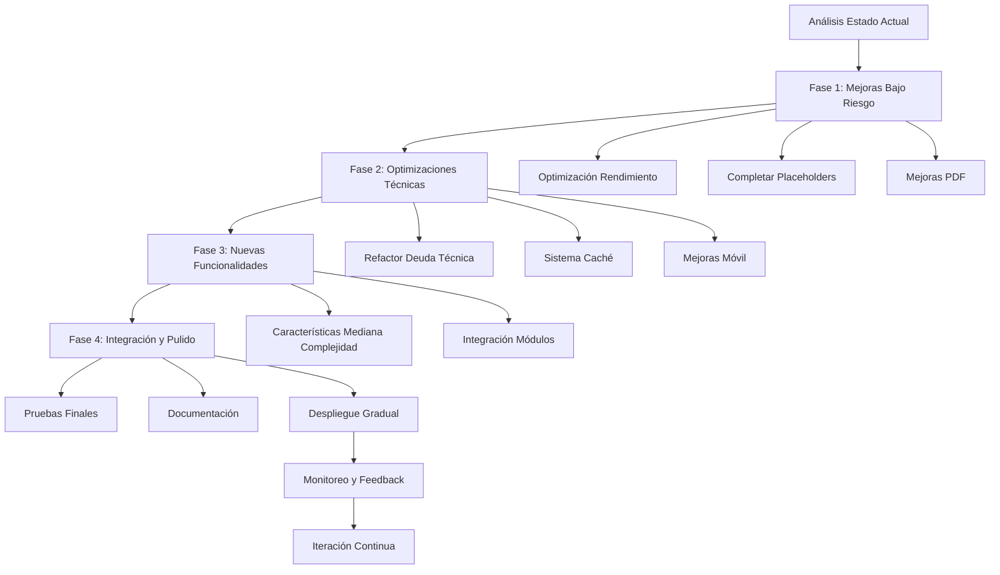

# Plan de Desarrollo para Módulos de Especialidad - SaludValpa App

## Resumen Ejecutivo

Este documento presenta un plan de desarrollo estructurado para mejorar los 5 módulos de especialidad de la aplicación SaludValpa, respetando la restricción clave: **"sin modificar lo que ven los demás"**. El enfoque se centra en mejoras internas, optimizaciones técnicas y nuevas funcionalidades que no afectan la experiencia visual de los usuarios existentes.

## Análisis del Estado Actual

### Compleción por Módulo
- **Fisioterapia**: 85% completo - Sistema de rutinas, biblioteca de ejercicios, generación de documentos
- **Medicina**: 75% completo - Datos CIE10, medicamentos, estudios de laboratorio, componentes básicos
- **Nutrición**: 90% completo - Base de alimentos completa, calculadora nutricional, planes personalizados
- **Odontología**: 70% completo - Odontograma SVG, procedimientos dentales, materiales
- **Psicología**: 80% completo - Escalas psicológicas, intervenciones terapéuticas, diagnósticos DSM-5

### Hallazgos Clave
1. **Fortalezas**: Datos precargados extensos, arquitectura modular sólida, sistema de PDF robusto
2. **Oportunidades**: Optimización móvil, mejora de rendimiento, integración de datos entre módulos
3. **Restricciones**: No modificar interfaces visibles a usuarios existentes

## Estrategia de Desarrollo

### Principios Guía
1. **Cambios no disruptivos**: Todas las mejoras deben ser transparentes para usuarios existentes
2. **Mejora incremental**: Enfoque iterativo con validación continua
3. **Backward compatibility**: Mantener compatibilidad con datos y configuraciones existentes
4. **Pruebas exhaustivas**: Validar que cambios no afecten funcionalidad existente

### Fases de Implementación
```
Fase 1: Mejoras de Bajo Riesgo (2-3 semanas)
Fase 2: Optimizaciones Técnicas (3-4 semanas)  
Fase 3: Nuevas Funcionalidades (4-6 semanas)
Fase 4: Integración y Pulido (2-3 semanas)
```

## Plan por Módulo

### 1. Módulo de Fisioterapia

**Estado Actual**: 85% completo, sistema de rutinas funcional, biblioteca de ejercicios

#### Mejoras Prioritarias (Bajo Riesgo)
- [ ] **Optimización de rendimiento en EditorRutinaSimple**
  - Implementar virtualización para listas largas de ejercicios
  - Agregar caché de componentes para re-renderizados frecuentes
  - Mejorar tiempo de respuesta en dispositivos móviles

- [ ] **Mejora del sistema de PDF de rutinas**
  - Optimizar generación de PDFs con imágenes
  - Implementar sistema de plantillas reutilizables
  - Agregar soporte para múltiples formatos de página

- [ ] **Enriquecimiento de datos de ejercicios**
  - Expandir base de ejercicios precargados
  - Agregar categorización por grupos musculares
  - Incluir variaciones de dificultad

#### Mejoras de Características (Mediana Complejidad)
- [ ] **Sistema de progresión automática**
  - Algoritmo para sugerir incrementos de carga
  - Seguimiento de progreso por ejercicio
  - Alertas para ajustar rutinas

- [ ] **Integración con biblioteca multimedia**
  - Soporte para videos demostrativos
  - Galería de imágenes de técnica correcta
  - Enlaces a recursos educativos

#### Características Avanzadas (Largo Plazo)
- [ ] **Análisis biomecánico básico**
  - Herramientas para evaluación postural
  - Seguimiento de rangos de movimiento
  - Comparativa entre sesiones

- [ ] **Sistema de tele-rehabilitación**
  - Compartir rutinas con pacientes
  - Seguimiento remoto de adherencia
  - Comunicación asíncrona

#### Reducción de Deuda Técnica
- [ ] Refactorizar `generadorPDFRutina.ts` para separar lógica de presentación
- [ ] Implementar tests unitarios para hooks `useBiblioteca` y `useRutinas`
- [ ] Optimizar imports y reducir bundle size

### 2. Módulo de Medicina

**Estado Actual**: 75% completo, datos CIE10 y medicamentos, componentes básicos

#### Mejoras Prioritarias (Bajo Riesgo)
- [ ] **Completar componentes de generación de documentos**
  - Implementar `GenerarRecetaMedica` funcional (actualmente placeholder)
  - Desarrollar `GenerarHistoriaClinicaMedica`
  - Crear `GenerarCertificadoMedico`

- [ ] **Mejora del sistema de búsqueda de diagnósticos**
  - Búsqueda fuzzy por código o descripción CIE10
  - Historial de diagnósticos frecuentes
  - Sugerencias basadas en síntomas

- [ ] **Optimización de `CamposMedicina.tsx`**
  - Dividir componente en subcomponentes más manejables
  - Implementar lazy loading para secciones menos usadas
  - Mejorar validación de datos médicos

#### Mejoras de Características (Mediana Complejidad)
- [ ] **Sistema de interacciones medicamentosas**
  - Base de datos de interacciones comunes
  - Alertas en tiempo real durante prescripción
  - Sugerencias de alternativas

- [ ] **Historial médico longitudinal**
  - Visualización de evolución por paciente
  - Gráficos de signos vitales a lo largo del tiempo
  - Alertas para valores anormales

#### Características Avanzadas (Largo Plazo)
- [ ] **Soporte para recetas electrónicas**
  - Integración con sistemas de farmacia
  - Códigos QR para dispensación
  - Validación de dosis según perfil paciente

- [ ] **Sistema de alertas clínicas**
  - Recordatorios para seguimientos
  - Alertas para vacunas y exámenes periódicos
  - Integración con calendario clínico

#### Reducción de Deuda Técnica
- [ ] Migrar datos de `medicamentosPrecargados.ts` a base de datos IndexedDB
- [ ] Implementar sistema de caché para datos CIE10
- [ ] Refactorizar hooks para usar patrones de react-query

### 3. Módulo de Nutrición

**Estado Actual**: 90% completo, base de alimentos extensa, calculadora avanzada

#### Mejoras Prioritarias (Bajo Riesgo)
- [ ] **Optimización de la calculadora nutricional**
  - Cálculos en tiempo real más eficientes
  - Cache de resultados frecuentes
  - Soporte para unidades de medida alternativas

- [ ] **Mejora del sistema de planes nutricionales**
  - Generación automática de planes basados en objetivos
  - Sistema de sustitución de alimentos por equivalencias
  - Planificación semanal automática

- [ ] **Enriquecimiento de base de alimentos**
  - Agregar más alimentos regionales
  - Incluir información de marcas comerciales
  - Soporte para recetas compuestas

#### Mejoras de Características (Mediana Complejidad)
- [ ] **Sistema de seguimiento de hábitos**
  - Registro de consumo diario
  - Análisis de patrones alimentarios
  - Alertas para desbalances nutricionales

- [ ] **Integración con antropometría**
  - Cálculo automático de requerimientos
  - Seguimiento de medidas corporales
  - Proyecciones de progreso

#### Características Avanzadas (Largo Plazo)
- [ ] **Análisis de composición corporal**
  - Integración con datos de bioimpedancia
  - Seguimiento de masa muscular vs. grasa
  - Recomendaciones específicas por composición

- [ ] **Sistema de planificación de menús**
  - Generación automática de listas de compras
  - Planificación considerando presupuesto
  - Adaptación a preferencias y restricciones

#### Reducción de Deuda Técnica
- [ ] Refactorizar `alimentosNutricionales.ts` para usar base de datos externa
- [ ] Implementar sistema de actualización remota de datos nutricionales
- [ ] Optimizar cálculos de macronutrientes para mejor rendimiento

### 4. Módulo de Odontología

**Estado Actual**: 70% completo, odontograma SVG básico, procedimientos dentales

#### Mejoras Prioritarias (Bajo Riesgo)
- [ ] **Optimización del odontograma SVG**
  - Mejorar rendimiento en dispositivos móviles
  - Agregar interacciones táctiles
  - Implementar sistema de zoom y panorámica

- [ ] **Completar sistema de procedimientos**
  - Integración completa con códigos dentales
  - Sistema de presupuestos automatizado
  - Seguimiento de etapas de tratamiento

- [ ] **Mejora de la historia clínica odontológica**
  - Formularios más comprehensivos
  - Sistema de odontogramas históricos
  - Integración con radiografías (placeholder)

#### Mejoras de Características (Mediana Complejidad)
- [ ] **Sistema de planificación de tratamiento**
  - Diagramas de secuencia de procedimientos
  - Cálculo automático de tiempos y costos
  - Integración con agenda de citas

- [ ] **Gestión de inventario de materiales**
  - Control de stock de materiales dentales
  - Alertas para reposición
  - Cálculo de costos por procedimiento

#### Características Avanzadas (Largo Plazo)
- [ ] **Odontograma 3D interactivo**
  - Visualización tridimensional de arcadas
  - Simulación de procedimientos
  - Integración con modelos digitales

- [ ] **Sistema de documentación radiográfica**
  - Gestión de imágenes odontológicas
  - Anotaciones sobre radiografías
  - Comparativa temporal de imágenes

#### Reducción de Deuda Técnica
- [ ] Refactorizar componentes del odontograma para mejor mantenibilidad
- [ ] Implementar sistema de serialización/deserialización para estados del odontograma
- [ ] Crear tests para interacciones complejas del odontograma

### 5. Módulo de Psicología

**Estado Actual**: 80% completo, escalas psicológicas, intervenciones terapéuticas

#### Mejoras Prioritarias (Bajo Riesgo)
- [ ] **Completar componentes de generación de documentos**
  - Implementar `GenerarEvaluacionPsicologica` funcional
  - Desarrollar `GenerarPlanTerapeutico` completo
  - Crear sistema de informes psicológicos automatizados

- [ ] **Mejora del sistema de escalas psicológicas**
  - Cálculo automatizado de puntuaciones
  - Interpretación asistida de resultados
  - Seguimiento longitudinal de escalas

- [ ] **Optimización de la historia clínica psicológica**
  - Formularios más estructurados
  - Sistema de árboles de decisión para evaluación
  - Integración con diagnósticos DSM-5

#### Mejoras de Características (Mediana Complejidad)
- [ ] **Sistema de seguimiento de síntomas**
  - Registro diario de síntomas
  - Gráficos de evolución emocional
  - Alertas para patrones preocupantes

- [ ] **Biblioteca de intervenciones terapéuticas**
  - Catálogo de técnicas por enfoque terapéutico
  - Planificación de sesiones con intervenciones
  - Seguimiento de efectividad por técnica

#### Características Avanzadas (Largo Plazo)
- [ ] **Sistema de terapia asistida**
  - Ejercicios terapéuticos interactivos
  - Seguimiento de tareas entre sesiones
  - Comunicación segura paciente-terapeuta

- [ ] **Análisis de lenguaje y emociones**
  - Procesamiento básico de texto de sesiones
  - Detección de patrones emocionales
  - Sugerencias de enfoques terapéuticos

#### Reducción de Deuda Técnica
- [ ] Refactorizar hooks para mejor reutilización entre componentes
- [ ] Implementar sistema de caché para datos de escalas psicológicas
- [ ] Crear sistema de plantillas para documentos psicológicos

## Plan de Coordinación entre Módulos

### Estrategias Comunes
1. **Sistema de PDF unificado**
   - Crear servicio centralizado de generación de documentos
   - Establecer estándares de diseño consistentes
   - Implementar sistema de plantillas compartidas

2. **Base de datos de pacientes unificada**
   - Estructura de datos común para información demográfica
   - Sistema de permisos por especialidad
   - Historial integrado de atenciones multidisciplinarias

3. **Componentes UI compartidos**
   - Biblioteca de componentes médicos genéricos
   - Sistema de theming consistente
   - Patrones de interacción unificados

### Secuencia de Implementación
```
Semana 1-2: Mejoras de bajo riesgo en todos los módulos
Semana 3-4: Optimizaciones técnicas y de rendimiento
Semana 5-8: Desarrollo de características mediana complejidad
Semana 9-10: Integración entre módulos y pruebas
Semana 11-12: Pulido, documentación y despliegue
```

### Gestión de Dependencias
1. **Dependencias críticas**: Sistema de PDF → afecta a todos los módulos
2. **Dependencias moderadas**: Base de datos de pacientes → afecta integración
3. **Dependencias ligeras**: Componentes UI → afecta consistencia visual

## Estrategias de Implementación No Disruptivas

### 1. Feature Flags
- Implementar sistema de flags para nuevas funcionalidades
- Permitir activación gradual por usuario
- Facilitar rollback rápido si es necesario

### 2. A/B Testing Interno
- Nuevas interfaces solo para usuarios de prueba
- Recopilación de métricas de uso
- Validación antes de despliegue general

### 3. Modo "Experimental"
- Sección separada para características en desarrollo
- Acceso controlado por configuración
- Feedback dirigido de usuarios avanzados

### 4. Migraciones Graduales
- Mantener compatibilidad con formatos de datos existentes
- Migración automática en background
- Sistema de rollback automático

## Requisitos de Recursos

### Equipo de Desarrollo
- **1 Desarrollador Frontend Senior**: Arquitectura, componentes complejos
- **1 Desarrollador Full Stack**: Integración, backend, base de datos
- **1 Diseñador UX/UI**: Experiencia de usuario, consistencia visual
- **1 Tester QA**: Pruebas funcionales, regresión

### Infraestructura Técnica
- **Entorno de desarrollo**: Node.js 18+, npm/yarn
- **Herramientas de testing**: Jest, React Testing Library, Cypress
- **Sistema de CI/CD**: GitHub Actions o similar
- **Monitoreo**: Logs de errores, métricas de rendimiento

### Consideraciones de Seguridad
- Validación de datos médicos sensibles
- Encriptación de datos en reposo y tránsito
- Sistema de auditoría de accesos
- Cumplimiento con regulaciones de salud

## Métricas de Éxito

### Métricas Técnicas
- **Rendimiento**: Tiempo de carga < 2s, FPS > 60 en móviles
- **Estabilidad**: < 0.1% tasa de errores en producción
- **Mantenibilidad**: Cobertura de tests > 80%, deuda técnica reducida 30%

### Métricas de Usuario
- **Adopción**: 90% de usuarios activan nuevas funcionalidades
- **Satisfacción**: Puntuación NPS > 50 para mejoras
- **Productividad**: Reducción de tiempo en tareas comunes > 20%

### Métricas de Negocio
- **Retención**: Aumento de retención a 30 días > 15%
- **Upsell**: Conversión a funcionalidades premium > 10%
- **Referencias**: Aumento de referencias orgánicas > 25%

## Plan de Riesgos y Mitigación

### Riesgos Identificados
1. **Compatibilidad con datos existentes**
   - Mitigación: Sistema de migración automática con backup
   
2. **Rendimiento en dispositivos móviles**
   - Mitigación: Optimización progresiva, lazy loading
   
3. **Complejidad de integración entre módulos**
   - Mitigación: Desarrollo incremental, interfaces bien definidas
   
4. **Aceptación de usuarios a cambios**
   - Mitigación: Comunicación proactiva, tutoriales, soporte

### Plan de Contingencia
- **Rollback automático** si tasa de errores > 1% en primeras 24h
- **Sistema de feature flags** para desactivación selectiva
- **Backups diarios** de datos y configuración
- **Equipo de soporte ampliado** durante despliegue

## Cronograma Detallado

### Fase 1: Mejoras de Bajo Riesgo (Semanas 1-3)
- **Semana 1**: Optimizaciones de rendimiento en todos los módulos
- **Semana 2**: Completar componentes placeholder en medicina y psicología
- **Semana 3**: Mejoras de sistema de PDF y datos precargados

### Fase 2: Optimizaciones Técnicas (Semanas 4-6)
- **Semana 4**: Refactorización de deuda técnica identificada
- **Semana 5**: Implementación de sistema de caché y lazy loading
- **Semana 6**: Mejoras de accesibilidad y experiencia móvil

### Fase 3: Nuevas Funcionalidades (Semanas 7-10)
- **Semana 7-8**: Desarrollo de características mediana complejidad
- **Semana 9-10**: Integración entre módulos y pruebas de usuario

### Fase 4: Pulido y Despliegue (Semanas 11-12)
- **Semana 11**: Pruebas finales, optimización y documentación
- **Semana 12**: Despliegue gradual con monitoreo intensivo

## Diagrama de Flujo de Trabajo



## Recomendaciones para Rama Experimental

### Estructura de Rama `experimental-modules`
```
experimental-modules/
├── features/
│   ├── pdf-unificado/          # Sistema de PDF mejorado
│   ├── cache-sistema/          # Sistema de caché centralizado
│   ├── mobile-optimization/    # Optimizaciones móviles
│   └── integracion-modulos/    # Integración entre especialidades
├── tests/
│   ├── unit/                   # Pruebas unitarias nuevas
│   ├── integration/            # Pruebas de integración
│   └── performance/            # Pruebas de rendimiento
└── docs/
    ├── arquitectura/           # Documentación técnica
    └── guias-desarrollo/       # Guías para desarrolladores
```

### Proceso de Desarrollo Experimental
1. **Feature branches** desde `experimental-modules`
2. **Code review** obligatorio antes de merge
3. **Pruebas automáticas** en CI/CD
4. **Documentación** actualizada con cada feature
5. **Demo environment** para validación

### Criterios de Promoción a Main
- [ ] Todas las pruebas pasan (unitarias, integración, rendimiento)
- [ ] Documentación completa y actualizada
- [ ] Retrocompatibilidad verificada
- [ ] Métricas de rendimiento dentro de objetivos
- [ ] Feedback positivo de usuarios de prueba

## Conclusión

Este plan proporciona una hoja de ruta estructurada para el desarrollo de los 5 módulos de especialidad de SaludValpa, respetando la restricción fundamental de no modificar lo que ven los usuarios existentes. El enfoque en mejoras internas, optimizaciones técnicas y nuevas funcionalidades no disruptivas permitirá evolucionar la plataforma mientras se mantiene la estabilidad y confianza de los usuarios actuales.

La implementación en la rama `experimental-modules` seguirá las mejores prácticas de desarrollo experimental, con validación rigurosa antes de promover cambios a la rama principal. Este enfoque minimiza riesgos mientras maximiza el valor entregado a los profesionales de la salud que confían en SaludValpa para su práctica diaria.

**Próximos Pasos**:
1. Revisar y ajustar este plan con el equipo de desarrollo
2. Establecer la rama `experimental-modules` con la estructura propuesta
3. Comenzar con las mejoras de bajo riesgo identificadas
4. Implementar sistema de monitoreo y métricas
5. Iterar basado en feedback y resultados

---
*Documento creado: 2026-03-02*
*Última actualización: 2026-03-02*
*Versión: 1.0*