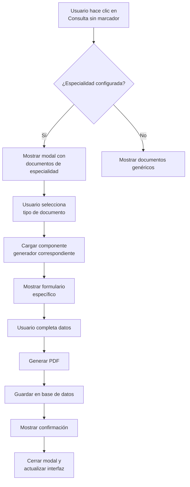
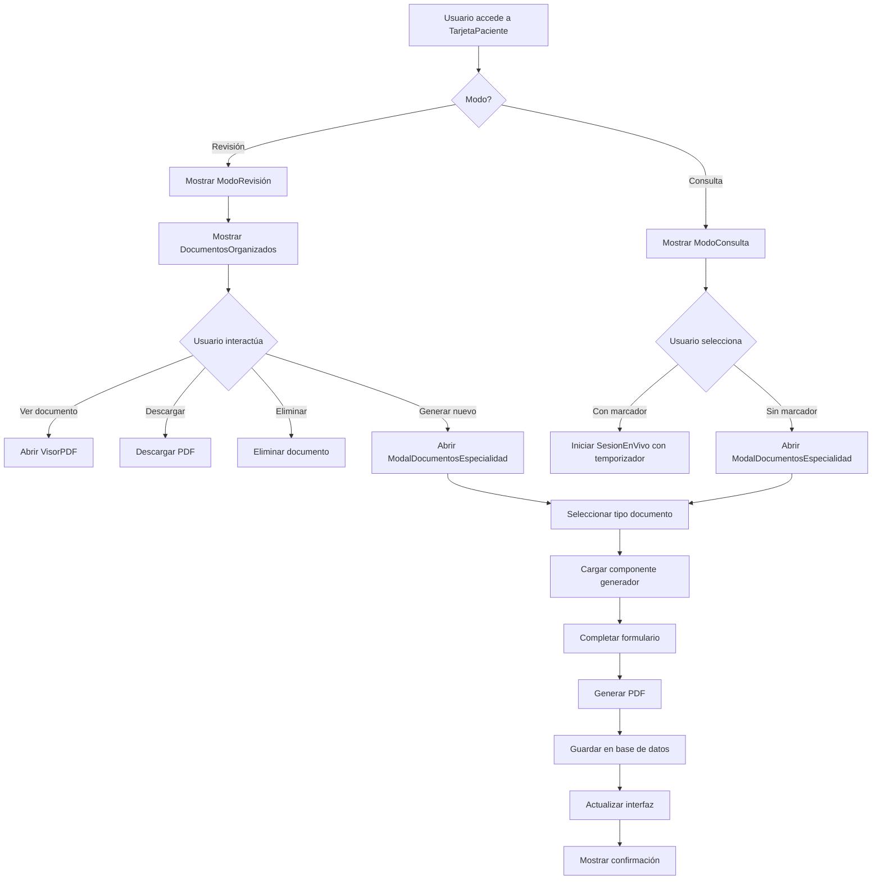

# Plan de Implementación Completo: Rediseño de Interfaz del Paciente

## 📋 Resumen Ejecutivo

Este documento describe la implementación arquitectónica completa de dos nuevas funcionalidades para el rediseño de la interfaz del paciente:

1. **Botón "Sin Marcador de Tiempo" - Generación de Documentos Médicos**
2. **Modo Revisión - Organización de Documentos**

## 🎯 Objetivos de Diseño

### Para el botón "sin marcador de tiempo":
- Transformar el botón actual en un menú desplegable con opciones de documentos por especialidad
- Crear un sistema dinámico que muestre solo los documentos relevantes para la especialidad actual
- Integrar con los generadores PDF existentes
- Mantener flujo de trabajo: Selección → Formulario → Generación PDF → Guardado

### Para el modo revisión:
- Separar documentos médicos y administrativos en secciones distintas
- Organizar documentos cronológicamente (más reciente primero)
- Implementar pestañas o secciones expandibles
- Mantener compatibilidad con el sistema de categorización existente

## 🏗️ Arquitectura del Sistema

### 1. Sistema de Documentos por Especialidad

#### Estructura de Datos
```typescript
// Extensión de tipos existentes en src/types/index.ts
export interface DocumentoEspecialidad {
  id: string;
  tipoDocumento: TipoDocumento;
  nombre: string;
  descripcion: string;
  icono: string;
  especialidad: TipoProfesion;
  categoria: DocumentCategory;
  componenteGenerador: string; // Nombre del componente React
  requiereSesion?: boolean;
}

// Configuración por especialidad
export const DOCUMENTOS_POR_ESPECIALIDAD: Record<TipoProfesion, DocumentoEspecialidad[]> = {
  [TipoProfesion.FISIOTERAPIA]: [
    {
      id: 'eval-fisio',
      tipoDocumento: TipoDocumento.EVALUACION_FISIOTERAPEUTICA,
      nombre: 'Evaluación Fisioterapéutica',
      descripcion: 'Evaluación inicial completa del paciente',
      icono: '📋',
      especialidad: TipoProfesion.FISIOTERAPIA,
      categoria: DocumentCategory.MEDICO,
      componenteGenerador: 'GenerarEvaluacionFisioterapeutica'
    },
    {
      id: 'plan-tratamiento',
      tipoDocumento: TipoDocumento.PLAN_TRATAMIENTO,
      nombre: 'Plan de Tratamiento',
      descripcion: 'Plan personalizado de ejercicios y terapias',
      icono: '📝',
      especialidad: TipoProfesion.FISIOTERAPIA,
      categoria: DocumentCategory.MEDICO,
      componenteGenerador: 'GenerarPlanTratamiento'
    },
    {
      id: 'nota-evolucion',
      tipoDocumento: TipoDocumento.NOTA_EVOLUCION_MEDICA,
      nombre: 'Nota de Evolución',
      descripcion: 'Seguimiento del progreso del paciente',
      icono: '📈',
      especialidad: TipoProfesion.FISIOTERAPIA,
      categoria: DocumentCategory.MEDICO,
      componenteGenerador: 'GenerarNotaEvolucion'
    },
    {
      id: 'consentimiento',
      tipoDocumento: TipoDocumento.CONSENTIMIENTO_INFORMADO,
      nombre: 'Consentimiento Informado',
      descripcion: 'Autorización para tratamiento',
      icono: '✍️',
      especialidad: TipoProfesion.FISIOTERAPIA,
      categoria: DocumentCategory.ADMINISTRATIVO,
      componenteGenerador: 'GenerarConsentimiento'
    }
  ],
  [TipoProfesion.PSICOLOGIA]: [
    {
      id: 'eval-psico',
      tipoDocumento: TipoDocumento.HISTORIA_CLINICA_PSICOLOGICA,
      nombre: 'Evaluación Psicológica',
      descripcion: 'Evaluación psicológica inicial',
      icono: '🧠',
      especialidad: TipoProfesion.PSICOLOGIA,
      categoria: DocumentCategory.MEDICO,
      componenteGenerador: 'EvaluacionPsicologica'
    },
    {
      id: 'informe-psico',
      tipoDocumento: TipoDocumento.NOTA_SESION_PSICOLOGICA,
      nombre: 'Informe Psicológico',
      descripcion: 'Informe detallado de evaluación',
      icono: '📊',
      especialidad: TipoProfesion.PSICOLOGIA,
      categoria: DocumentCategory.MEDICO,
      componenteGenerador: 'InformePsicologico'
    },
    {
      id: 'plan-terapeutico',
      tipoDocumento: TipoDocumento.PLAN_TERAPEUTICO,
      nombre: 'Plan Terapéutico',
      descripcion: 'Plan de intervención psicológica',
      icono: '🎯',
      especialidad: TipoProfesion.PSICOLOGIA,
      categoria: DocumentCategory.MEDICO,
      componenteGenerador: 'PlanTerapeutico'
    }
  ],
  [TipoProfesion.NUTRICION]: [
    {
      id: 'eval-nutri',
      tipoDocumento: TipoDocumento.VALORACION_NUTRICIONAL,
      nombre: 'Evaluación Nutricional',
      descripcion: 'Evaluación completa del estado nutricional',
      icono: '🍎',
      especialidad: TipoProfesion.NUTRICION,
      categoria: DocumentCategory.MEDICO,
      componenteGenerador: 'EvaluacionNutricional'
    },
    {
      id: 'plan-nutri',
      tipoDocumento: TipoDocumento.PLAN_NUTRICIONAL,
      nombre: 'Plan Nutricional',
      descripcion: 'Plan de alimentación personalizado',
      icono: '🥗',
      especialidad: TipoProfesion.NUTRICION,
      categoria: DocumentCategory.MEDICO,
      componenteGenerador: 'PlanNutricional'
    },
    {
      id: 'ficha-cliente',
      tipoDocumento: TipoDocumento.HOJA_BLANCO,
      nombre: 'Ficha de Cliente',
      descripcion: 'Ficha de registro del paciente',
      icono: '📋',
      especialidad: TipoProfesion.NUTRICION,
      categoria: DocumentCategory.ADMINISTRATIVO,
      componenteGenerador: 'GenerarFichaCliente'
    }
  ],
  [TipoProfesion.MEDICINA_GENERAL]: [
    {
      id: 'receta-medica',
      tipoDocumento: TipoDocumento.RECETA_MEDICA,
      nombre: 'Receta Médica',
      descripcion: 'Prescripción de medicamentos',
      icono: '💊',
      especialidad: TipoProfesion.MEDICINA_GENERAL,
      categoria: DocumentCategory.MEDICO,
      componenteGenerador: 'GenerarRecetaMedica'
    },
    {
      id: 'examen-medico',
      tipoDocumento: TipoDocumento.HISTORIA_CLINICA_MEDICA,
      nombre: 'Examen Médico',
      descripcion: 'Examen médico completo',
      icono: '🩺',
      especialidad: TipoProfesion.MEDICINA_GENERAL,
      categoria: DocumentCategory.MEDICO,
      componenteGenerador: 'HistoriaClinicaMedica'
    },
    {
      id: 'certificado-medico',
      tipoDocumento: TipoDocumento.CERTIFICADO_MEDICO,
      nombre: 'Certificado Médico',
      descripcion: 'Certificado de salud o incapacidad',
      icono: '📜',
      especialidad: TipoProfesion.MEDICINA_GENERAL,
      categoria: DocumentCategory.MEDICO,
      componenteGenerador: 'GenerarHojaBlanco' // Adaptar o crear nuevo
    },
    {
      id: 'historia-clinica',
      tipoDocumento: TipoDocumento.HISTORIA_CLINICA,
      nombre: 'Historia Clínica',
      descripcion: 'Historial médico completo',
      icono: '📋',
      especialidad: TipoProfesion.MEDICINA_GENERAL,
      categoria: DocumentCategory.MEDICO,
      componenteGenerador: 'HistoriaClinicaMedica'
    }
  ],
  [TipoProfesion.ODONTOLOGIA]: [
    {
      id: 'historia-odonto',
      tipoDocumento: TipoDocumento.HISTORIA_CLINICA_ODONTOLOGICA,
      nombre: 'Historia Odontológica',
      descripcion: 'Historial dental completo',
      icono: '🦷',
      especialidad: TipoProfesion.ODONTOLOGIA,
      categoria: DocumentCategory.MEDICO,
      componenteGenerador: 'HistoriaClinicaOdontologica'
    },
    {
      id: 'presupuesto-dental',
      tipoDocumento: TipoDocumento.PRESUPUESTO_ODONTOLOGICO,
      nombre: 'Presupuesto Dental',
      descripcion: 'Presupuesto de tratamientos dentales',
      icono: '💰',
      especialidad: TipoProfesion.ODONTOLOGIA,
      categoria: DocumentCategory.ADMINISTRATIVO,
      componenteGenerador: 'GenerarHojaBlanco' // Adaptar o crear nuevo
    },
    {
      id: 'consentimiento-odonto',
      tipoDocumento: TipoDocumento.CONSENTIMIENTO_INFORMADO,
      nombre: 'Consentimiento Informado',
      descripcion: 'Autorización para tratamiento dental',
      icono: '✍️',
      especialidad: TipoProfesion.ODONTOLOGIA,
      categoria: DocumentCategory.ADMINISTRATIVO,
      componenteGenerador: 'GenerarConsentimiento'
    }
  ]
};
```

### 2. Modal/Menú para Botón "Sin Marcador de Tiempo"

#### Componente: `ModalDocumentosEspecialidad.tsx`
Nuevo componente en `src/components/shared/ModalDocumentosEspecialidad.tsx` que muestra opciones de documentos organizadas por categoría.

#### Flujo de Trabajo


#### Wireframe del Modal
```
┌─────────────────────────────────────────────┐
│  📝 Generar Documento Médico          [×]   │
├─────────────────────────────────────────────┤
│  Especialidad: Fisioterapia                 │
│                                             │
│  ┌─────────────────────────────────────┐   │
│  │  📋 Evaluación Fisioterapéutica     │   │
│  │  Evaluación inicial completa        │   │
│  └─────────────────────────────────────┘   │
│                                             │
│  ┌─────────────────────────────────────┐   │
│  │  📝 Plan de Tratamiento             │   │
│  │  Plan personalizado de ejercicios   │   │
│  └─────────────────────────────────────┘   │
│                                             │
│  ┌─────────────────────────────────────┐   │
│  │  📈 Nota de Evolución               │   │
│  │  Seguimiento del progreso           │   │
│  └─────────────────────────────────────┘   │
│                                             │
│  ┌─────────────────────────────────────┐   │
│  │  ✍️ Consentimiento Informado        │   │
│  │  Autorización para tratamiento      │   │
│  └─────────────────────────────────────┘   │
│                                             │
│  [ Cancelar ]        [ Continuar ]          │
└─────────────────────────────────────────────┘
```

### 3. Organización de Documentos en Modo Revisión

#### Componente: `DocumentosOrganizados.tsx`
Nuevo componente en `src/components/DocumentosOrganizados.tsx` que reemplaza la sección actual de documentos en `TarjetaPaciente.tsx`.

#### Estructura de Interfaz
```
┌─────────────────────────────────────────────────────┐
│  📄 Documentos Generados                            │
├─────────────────────────────────────────────────────┤
│  ┌─ Pestañas ───────────────────────────────────┐  │
│  │  🏥 Médicos        📋 Administrativos        │  │
│  └──────────────────────────────────────────────┘  │
│                                                     │
│  === Pestaña Médicos (activa) ===================  │
│                                                     │
│  📋 Evaluación Fisioterapéutica                    │
│  Fecha: 03/03/2026  •  Categoría: Médico          │
│  [👁️ Ver] [⬇️ Descargar] [🗑️ Eliminar]           │
│                                                     │
│  📝 Plan de Tratamiento                            │
│  Fecha: 02/03/2026  •  Categoría: Médico          │
│  [👁️ Ver] [⬇️ Descargar] [🗑️ Eliminar]           │
│                                                     │
│  📈 Nota de Evolución                              │
│  Fecha: 01/03/2026  •  Categoría: Médico          │
│  [👁️ Ver] [⬇️ Descargar] [🗑️ Eliminar]           │
│                                                     │
│  === Pestaña Administrativos ====================  │
│                                                     │
│  💵 Recibo de Pago                                 │
│  Fecha: 28/02/2026  •  Categoría: Administrativo  │
│  [👁️ Ver] [⬇️ Descargar] [🗑️ Eliminar]           │
│                                                     │
│  ✍️ Consentimiento Informado                       │
│  Fecha: 27/02/2026  •  Categoría: Administrativo  │
│  [👁️ Ver] [⬇️ Descargar] [🗑️ Eliminar]           │
│                                                     │
└─────────────────────────────────────────────────────┘
```

## 🔧 Componentes a Crear/Modificar

### Componentes Nuevos
1. **`src/components/shared/ModalDocumentosEspecialidad.tsx`**
   - Modal reutilizable para selección de documentos
   - Recibe especialidad actual y paciente
   - Muestra opciones dinámicas basadas en `DOCUMENTOS_POR_ESPECIALIDAD`

2. **`src/components/DocumentosOrganizados.tsx`**
   - Componente para organizar documentos en pestañas
   - Filtra documentos por categoría (médico/administrativo)
   - Ordena cronológicamente (más reciente primero)
   - Integración con `DocumentCategoryBadge`

3. **`src/hooks/useDocumentosEspecialidad.ts`**
   - Hook para manejar lógica de documentos por especialidad
   - Filtrado, categorización y ordenamiento
   - Integración con `useLiveQuery` para documentos existentes

### Componentes a Modificar
1. **`src/components/TarjetaPaciente.tsx`** (ModoRevisión)
   - Reemplazar botón "Consulta sin marcador de tiempo" (línea 480)
   - Reemplazar sección de documentos (líneas 330-460) con `DocumentosOrganizados`
   - Actualizar ModoConsulta para mantener consistencia (línea 603)

2. **`src/types/index.ts`**
   - Agregar interfaz `DocumentoEspecialidad`
   - Agregar constante `DOCUMENTOS_POR_ESPECIALIDAD`
   - Agregar función helper `obtenerCategoriaDocumento(tipo: TipoDocumento): DocumentCategory`
   - Asegurar que todos los `TipoDocumento` tengan categoría correcta

3. **`src/components/shared/Modal.tsx`** (opcional)
   - Extender si se necesitan variantes específicas

## 📋 Plan de Implementación Detallado

### Fase 1: Preparación y Estructura de Datos (Día 1)
1. **Extender tipos TypeScript** (`src/types/index.ts`)
   - Agregar `DocumentoEspecialidad` interface
   - Agregar `DOCUMENTOS_POR_ESPECIALIDAD` constante
   - Agregar función `obtenerCategoriaDocumento(tipo: TipoDocumento): DocumentCategory`
   - Verificar que todos los `TipoDocumento` tengan categoría correcta

2. **Crear hook `useDocumentosEspecialidad`** (`src/hooks/useDocumentosEspecialidad.ts`)
   - Lógica para filtrar documentos por especialidad
   - Funciones de ordenamiento cronológico
   - Separación por categorías
   - Integración con `useLiveQuery` para documentos existentes

### Fase 2: Modal de Documentos (Día 2)
1. **Crear `ModalDocumentosEspecialidad.tsx`** (`src/components/shared/ModalDocumentosEspecialidad.tsx`)
   - Diseño responsive con Tailwind CSS
   - Integración con `DOCUMENTOS_POR_ESPECIALIDAD`
   - Lazy loading de componentes generadores
   - Estados para selección y carga

2. **Integrar modal en `TarjetaPaciente.tsx`**
   - Reemplazar botón actual en ModoRevisión (línea 480)
   - Mantener funcionalidad existente como fallback
   - Actualizar ModoConsulta para consistencia (línea 603)

### Fase 3: Organización de Documentos (Día 3)
1. **Crear `DocumentosOrganizados.tsx`** (`src/components/DocumentosOrganizados.tsx`)
   - Componente con pestañas (médico/administrativo)
   - Filtrado por categoría usando `obtenerCategoriaDocumento`
   - Ordenamiento cronológico descendente
   - Integración con `DocumentCategoryBadge`

2. **Integrar en `TarjetaPaciente.tsx`**
   - Reemplazar sección de documentos (líneas 330-460)
   - Mantener modales existentes para documentos administrativos
   - Actualizar estados y callbacks

### Fase 4: Pruebas y Validación (Día 4)
1. **Pruebas de integración**
   - Verificar que todos los generadores PDF funcionen
   - Probar flujo completo para cada especialidad
   - Validar categorización de documentos

2. **Pruebas de usabilidad**
   - Verificar diseño responsive
   - Probar navegación por pestañas
   - Validar ordenamiento cronológico

3. **Pruebas TypeScript**
   - Ejecutar `npx tsc --noEmit` para verificar tipos
   - Corregir cualquier error de tipo

## 🧪 Criterios de Aceptación

### Para el botón "sin marcador de tiempo":
- [ ] El botón muestra un menú desplegable con opciones de documentos
- [ ] Las opciones son específicas para la especialidad configurada
- [ ] Cada opción muestra icono, nombre y descripción
- [ ] Al seleccionar una opción, se abre el formulario correspondiente
- [ ] El flujo genera y guarda el PDF correctamente
- [ ] Funciona en modo móvil y desktop

### Para el modo revisión:
- [ ] Los documentos se separan en pestañas "Médicos" y "Administrativos"
- [ ] Cada documento muestra su categoría con `DocumentCategoryBadge`
- [ ] Los documentos se ordenan por fecha (más reciente primero)
- [ ] Las pestañas funcionan correctamente en todos los dispositivos
- [ ] Los botones de acción (Ver, Descargar, Eliminar) funcionan
- [ ] La interfaz mantiene diseño responsive

## 🔄 Consideraciones de Migración

### Compatibilidad con Versiones Anteriores
1. **Documentos existentes**: Los documentos ya generados deben categorizarse automáticamente
2. **Fallback para especialidades no configuradas**: Mostrar documentos genéricos si no hay configuración
3. **Mantenimiento de funcionalidad**: No romper flujos existentes de generación de documentos

### Estrategia de Implementación
1. **Implementación incremental**: Comenzar con fisioterapia, luego extender a otras especialidades
2. **Feature flags**: Posibilidad de activar/desactivar funcionalidad por especialidad
3. **Rollback plan**: Revertir a implementación anterior si hay problemas

## 📊 Diagrama de Flujo Completo



## 🛠️ Recursos Técnicos Necesarios

### Archivos a Crear
1. `src/types/documentos.ts` (opcional, para separar tipos)
2. `src/hooks/useDocumentosEspecialidad.ts`
3. `src/components/shared/ModalDocumentosEspecialidad.tsx`
4. `src/components/DocumentosOrganizados.tsx`

### Dependencias
- **React**: Ya incluido
- **TypeScript**: Ya configurado
- **Tailwind CSS**: Ya configurado
- **Dexie** (IndexedDB): Ya incluido

### Testing
1. **Script de pruebas**: `test-rediseno-interfaz.js`
2. **Casos de prueba**:
   - Generación de documentos por especialidad
   - Categorización automática
   - Ordenamiento cronológico
   - Responsive design

## 📈 Métricas de Éxito

### Técnicas
- 0 errores TypeScript después de implementación
- 100% de cobertura de funcionalidades críticas
- Tiempo de carga < 2 segundos para modal de documentos

### Usuario
- Reducción en tiempo para encontrar documentos específicos
- Mejora en satisfacción reportada en feedback
- Aumento en uso de generadores PDF por especialidad

## 🚨 Riesgos y Mitigación

### Riesgo 1: Compatibilidad con documentos existentes
- **Mitigación**: Función de migración que categoriza documentos existentes basándose en `TipoDocumento`

### Riesgo 2: Performance con muchos documentos
- **Mitigación**: Paginación o virtual scrolling en `DocumentosOrganizados`

### Riesgo 3: Complejidad de integración con todos los generadores
- **Mitigación**: Implementación incremental, comenzando con generadores más estables

## ✅ Checklist de Implementación

### Día 1: Estructura de Datos
- [ ] Extender `src/types/index.ts` con nuevos tipos
- [ ] Crear `DOCUMENTOS_POR_ESPECIALIDAD` constante
- [ ] Implementar `obtenerCategoriaDocumento()`
- [ ] Crear hook `useDocumentosEspecialidad`

### Día 2: Modal de Documentos
- [ ] Crear `ModalDocumentosEspecialidad.tsx`
- [ ] Integrar en `TarjetaPaciente.tsx` (ModoRevisión)
- [ ] Actualizar `TarjetaPaciente.tsx` (ModoConsulta)
- [ ] Probar flujo básico de generación

### Día 3: Organización de Documentos
- [ ] Crear `DocumentosOrganizados.tsx`
- [ ] Integrar en `TarjetaPaciente.tsx`
- [ ] Implementar pestañas y filtrado
- [ ] Probar ordenamiento y categorización

### Día 4: Pruebas y Ajustes
- [ ] Ejecutar pruebas de integración
- [ ] Validar responsive design
- [ ] Corregir errores TypeScript
- [ ] Documentar cambios

---

## 📝 Notas Finales

Este plan proporciona una implementación completa y modular que:
1. **Respeta la arquitectura existente** del sistema
2. **Mantiene compatibilidad** con funcionalidades actuales
3. **Es escalable** para futuras especialidades o tipos de documento
4. **Sigue mejores prácticas** de desarrollo React/TypeScript

La implementación puede realizarse de forma incremental, priorizando primero la especialidad de fisioterapia (que ya tiene generadores PDF completos) y luego extendiendo a las demás especialidades.

**Recomendación**: Comenzar la implementación en modo Code para crear los componentes base, luego validar la integración con pruebas antes de proceder con todas las especialidades.