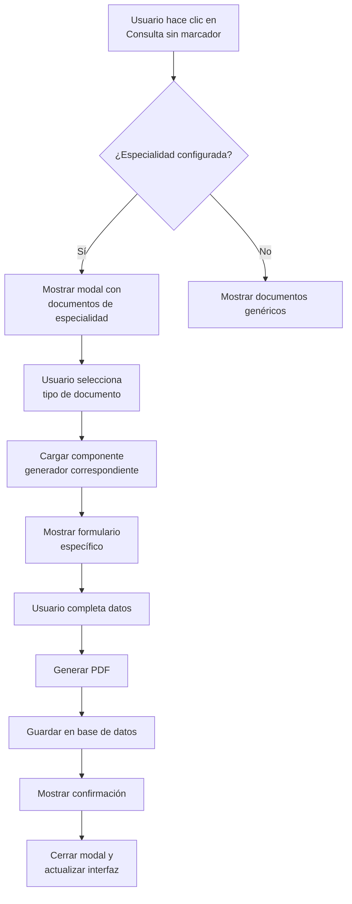

# Plan de Implementación: Rediseño de Interfaz del Paciente

## 📋 Resumen Ejecutivo

Este documento describe la implementación arquitectónica de dos nuevas funcionalidades para el rediseño de la interfaz del paciente:

1. **Botón "Sin Marcador de Tiempo" - Generación de Documentos Médicos**
2. **Modo Revisión - Organización de Documentos**

## 🎯 Objetivos de Diseño

### Para el botón "sin marcador de tiempo":
- Transformar el botón actual en un menú desplegable con opciones de documentos por especialidad
- Crear un sistema dinámico que muestre solo los documentos relevantes para la especialidad actual
- Integrar con los generadores PDF existentes
- Mantener flujo de trabajo: Selección → Formulario → Generación PDF → Guardado

### Para el modo revisión:
- Separar documentos médicos y administrativos en secciones distintas
- Organizar documentos cronológicamente (más reciente primero)
- Implementar pestañas o secciones expandibles
- Mantener compatibilidad con el sistema de categorización existente

## 🏗️ Arquitectura del Sistema

### 1. Sistema de Documentos por Especialidad

#### Estructura de Datos
```typescript
// Extensión de tipos existentes en src/types/index.ts
export interface DocumentoEspecialidad {
  id: string;
  tipoDocumento: TipoDocumento;
  nombre: string;
  descripcion: string;
  icono: string;
  especialidad: TipoProfesion;
  categoria: DocumentCategory;
  componenteGenerador: string; // Nombre del componente React
  requiereSesion?: boolean;
}

// Configuración por especialidad
export const DOCUMENTOS_POR_ESPECIALIDAD: Record<TipoProfesion, DocumentoEspecialidad[]> = {
  [TipoProfesion.FISIOTERAPIA]: [
    {
      id: 'eval-fisio',
      tipoDocumento: TipoDocumento.EVALUACION_FISIOTERAPEUTICA,
      nombre: 'Evaluación Fisioterapéutica',
      descripcion: 'Evaluación inicial completa del paciente',
      icono: '📋',
      especialidad: TipoProfesion.FISIOTERAPIA,
      categoria: DocumentCategory.MEDICO,
      componenteGenerador: 'GenerarEvaluacionFisioterapeutica'
    },
    {
      id: 'plan-tratamiento',
      tipoDocumento: TipoDocumento.PLAN_TRATAMIENTO,
      nombre: 'Plan de Tratamiento',
      descripcion: 'Plan personalizado de ejercicios y terapias',
      icono: '📝',
      especialidad: TipoProfesion.FISIOTERAPIA,
      categoria: DocumentCategory.MEDICO,
      componenteGenerador: 'GenerarPlanTratamiento'
    },
    {
      id: 'nota-evolucion',
      tipoDocumento: TipoDocumento.NOTA_EVOLUCION_MEDICA,
      nombre: 'Nota de Evolución',
      descripcion: 'Seguimiento del progreso del paciente',
      icono: '📈',
      especialidad: TipoProfesion.FISIOTERAPIA,
      categoria: DocumentCategory.MEDICO,
      componenteGenerador: 'GenerarNotaEvolucion'
    },
    {
      id: 'consentimiento',
      tipoDocumento: TipoDocumento.CONSENTIMIENTO_INFORMADO,
      nombre: 'Consentimiento Informado',
      descripcion: 'Autorización para tratamiento',
      icono: '✍️',
      especialidad: TipoProfesion.FISIOTERAPIA,
      categoria: DocumentCategory.ADMINISTRATIVO,
      componenteGenerador: 'GenerarConsentimiento'
    }
  ],
  [TipoProfesion.PSICOLOGIA]: [
    {
      id: 'eval-psico',
      tipoDocumento: TipoDocumento.HISTORIA_CLINICA_PSICOLOGICA,
      nombre: 'Evaluación Psicológica',
      descripcion: 'Evaluación psicológica inicial',
      icono: '🧠',
      especialidad: TipoProfesion.PSICOLOGIA,
      categoria: DocumentCategory.MEDICO,
      componenteGenerador: 'EvaluacionPsicologica'
    },
    {
      id: 'informe-psico',
      tipoDocumento: TipoDocumento.NOTA_SESION_PSICOLOGICA,
      nombre: 'Informe Psicológico',
      descripcion: 'Informe detallado de evaluación',
      icono: '📊',
      especialidad: TipoProfesion.PSICOLOGIA,
      categoria: DocumentCategory.MEDICO,
      componenteGenerador: 'InformePsicologico'
    },
    {
      id: 'plan-terapeutico',
      tipoDocumento: TipoDocumento.PLAN_TERAPEUTICO,
      nombre: 'Plan Terapéutico',
      descripcion: 'Plan de intervención psicológica',
      icono: '🎯',
      especialidad: TipoProfesion.PSICOLOGIA,
      categoria: DocumentCategory.MEDICO,
      componenteGenerador: 'PlanTerapeutico'
    }
  ],
  [TipoProfesion.NUTRICION]: [
    {
      id: 'eval-nutri',
      tipoDocumento: TipoDocumento.VALORACION_NUTRICIONAL,
      nombre: 'Evaluación Nutricional',
      descripcion: 'Evaluación completa del estado nutricional',
      icono: '🍎',
      especialidad: TipoProfesion.NUTRICION,
      categoria: DocumentCategory.MEDICO,
      componenteGenerador: 'EvaluacionNutricional'
    },
    {
      id: 'plan-nutri',
      tipoDocumento: TipoDocumento.PLAN_NUTRICIONAL,
      nombre: 'Plan Nutricional',
      descripcion: 'Plan de alimentación personalizado',
      icono: '🥗',
      especialidad: TipoProfesion.NUTRICION,
      categoria: DocumentCategory.MEDICO,
      componenteGenerador: 'PlanNutricional'
    },
    {
      id: 'ficha-cliente',
      tipoDocumento: TipoDocumento.HOJA_BLANCO,
      nombre: 'Ficha de Cliente',
      descripcion: 'Ficha de registro del paciente',
      icono: '📋',
      especialidad: TipoProfesion.NUTRICION,
      categoria: DocumentCategory.ADMINISTRATIVO,
      componenteGenerador: 'GenerarFichaCliente'
    }
  ],
  [TipoProfesion.MEDICINA_GENERAL]: [
    {
      id: 'receta-medica',
      tipoDocumento: TipoDocumento.RECETA_MEDICA,
      nombre: 'Receta Médica',
      descripcion: 'Prescripción de medicamentos',
      icono: '💊',
      especialidad: TipoProfesion.MEDICINA_GENERAL,
      categoria: DocumentCategory.MEDICO,
      componenteGenerador: 'GenerarRecetaMedica'
    },
    {
      id: 'examen-medico',
      tipoDocumento: TipoDocumento.HISTORIA_CLINICA_MEDICA,
      nombre: 'Examen Médico',
      descripcion: 'Examen médico completo',
      icono: '🩺',
      especialidad: TipoProfesion.MEDICINA_GENERAL,
      categoria: DocumentCategory.MEDICO,
      componenteGenerador: 'HistoriaClinicaMedica'
    },
    {
      id: 'certificado-medico',
      tipoDocumento: TipoDocumento.CERTIFICADO_MEDICO,
      nombre: 'Certificado Médico',
      descripcion: 'Certificado de salud o incapacidad',
      icono: '📜',
      especialidad: TipoProfesion.MEDICINA_GENERAL,
      categoria: DocumentCategory.MEDICO,
      componenteGenerador: 'GenerarHojaBlanco' // Adaptar o crear nuevo
    },
    {
      id: 'historia-clinica',
      tipoDocumento: TipoDocumento.HISTORIA_CLINICA,
      nombre: 'Historia Clínica',
      descripcion: 'Historial médico completo',
      icono: '📋',
      especialidad: TipoProfesion.MEDICINA_GENERAL,
      categoria: DocumentCategory.MEDICO,
      componenteGenerador: 'HistoriaClinicaMedica'
    }
  ],
  [TipoProfesion.ODONTOLOGIA]: [
    {
      id: 'historia-odonto',
      tipoDocumento: TipoDocumento.HISTORIA_CLINICA_ODONTOLOGICA,
      nombre: 'Historia Odontológica',
      descripcion: 'Historial dental completo',
      icono: '🦷',
      especialidad: TipoProfesion.ODONTOLOGIA,
      categoria: DocumentCategory.MEDICO,
      componenteGenerador: 'HistoriaClinicaOdontologica'
    },
    {
      id: 'presupuesto-dental',
      tipoDocumento: TipoDocumento.PRESUPUESTO_ODONTOLOGICO,
      nombre: 'Presupuesto Dental',
      descripcion: 'Presupuesto de tratamientos dentales',
      icono: '💰',
      especialidad: TipoProfesion.ODONTOLOGIA,
      categoria: DocumentCategory.ADMINISTRATIVO,
      componenteGenerador: 'GenerarHojaBlanco' // Adaptar o crear nuevo
    },
    {
      id: 'consentimiento-odonto',
      tipoDocumento: TipoDocumento.CONSENTIMIENTO_INFORMADO,
      nombre: 'Consentimiento Informado',
      descripcion: 'Autorización para tratamiento dental',
      icono: '✍️',
      especialidad: TipoProfesion.ODONTOLOGIA,
      categoria: DocumentCategory.ADMINISTRATIVO,
      componenteGenerador: 'GenerarConsentimiento'
    }
  ]
};
```

### 2. Modal/Menú para Botón "Sin Marcador de Tiempo"

#### Componente: `ModalDocumentosEspecialidad.tsx`
```typescript
// Nuevo componente en src/components/shared/ModalDocumentosEspecialidad.tsx
// Modal que muestra opciones de documentos organizadas por categoría
```

#### Flujo de Trabajo


#### Wireframe del Modal
```
┌─────────────────────────────────────────────┐
│  📝 Generar Documento Médico          [×]   │
├─────────────────────────────────────────────┤
│  Especialidad: Fisioterapia                 │
│                                             │
│  ┌─────────────────────────────────────┐   │
│  │  📋 Evaluación Fisioterapéutica     │   │
│  │  Evaluación inicial completa        │   │
│  └─────────────────────────────────────┘   │
│                                             │
│  ┌─────────────────────────────────────┐   │
│  │  📝 Plan de Tratamiento             │   │
│  │  Plan personalizado de ejercicios   │   │
│  └─────────────────────────────────────┘   │
│                                             │
│  ┌─────────────────────────────────────┐   │
│  │  📈 Nota de Evolución               │   │
│  │  Seguimiento del progreso           │   │
│  └─────────────────────────────────────┘   │
│                                             │
│  ┌─────────────────────────────────────┐   │
│  │  ✍️ Consentimiento Informado        │   │
│  │  Autorización para tratamiento      │   │
│  └─────────────────────────────────────┘   │
│                                             │
│  [ Cancelar ]        [ Continuar ]          │
└─────────────────────────────────────────────┘
```

### 3. Organización de Documentos en Modo Revisión

#### Componente: `DocumentosOrganizados.tsx`
```typescript
// Nuevo componente en src/components/DocumentosOrganizados.tsx
// Reemplaza la sección actual de documentos en TarjetaPaciente.tsx
```

#### Estructura de Interfaz
```
┌─────────────────────────────────────────────────────┐
│  📄 Documentos Generados                            │
├─────────────────────────────────────────────────────┤
│  ┌─ Pestañas ───────────────────────────────────┐  │
│  │  🏥 Médicos        📋 Administrativos        │  │
│  └──────────────────────────────────────────────┘  │
│                                                     │
│  === Pestaña Médicos (activa) ===================  │
│                                                     │
│  📋 Evaluación Fisioterapéutica                    │
│  Fecha: 03/03/2026  •  Categoría: Médico          │
│  [👁️ Ver] [⬇️ Descargar] [🗑️ Eliminar]           │
│                                                     │
│  📝 Plan de Tratamiento                            │
│  Fecha: 02/03/2026  •  Categoría: Médico          │
│  [👁️ Ver] [⬇️ Descargar] [🗑️ Eliminar]           │
│                                                     │
│  📈 Nota de Evolución                              │
│  Fecha: 01/03/2026  •  Categoría: Médico          │
│  [👁️ Ver] [⬇️ Descargar] [🗑️ Eliminar]           │
│                                                     │
│  === Pestaña Administrativos ====================  │
│                                                     │
│  💵 Recibo de Pago                                 │
│  Fecha: 28/02/2026  •  Categoría: Administrativo  │
│  [👁️ Ver] [⬇️ Descargar] [🗑️ Eliminar]           │
│                                                     │
│  ✍️ Consentimiento Informado                       │
│  Fecha: 27/02/2026  •  Categoría: Administrativo  │
│  [👁️ Ver] [⬇️ Descargar] [🗑️ Eliminar]           │
│                                                     │
└─────────────────────────────────────────────────────┘
```

## 🔧 Componentes a Crear/Modificar

### Componentes Nuevos
1. **`src/components/shared/ModalDocumentosEspecialidad.tsx`**
   - Modal reutilizable para selección de documentos
   - Recibe especialidad actual y paciente
   - Muestra opciones dinámicas basadas en `DOCUMENTOS_POR_ESPECIALIDAD`

2. **`src/components/DocumentosOrganizados.tsx`**
   - Componente para organizar documentos en pestañas
   - Filtra documentos por categoría (médico/administrativo)
   - Ordena cronológicamente (más reciente primero)

3. **`src/hooks/useDocumentosEspecialidad.ts`**
   - Hook para manejar lógica de documentos por especialidad
   - Filtrado, categorización y ordenamiento

### Componentes a Modificar
1. **`src/components/TarjetaPaciente.tsx`** (ModoRevisión)
   - Reemplazar botón "Consulta sin marcador de tiempo" (línea 480)
   - Reemplazar sección de documentos (líneas 330-460)
   - Actualizar ModoConsulta para mantener consistencia

2. **`src/types/index.ts`**
   - Agregar interfaz `DocumentoEspecialidad`
   - Agregar constante `DOCUMENTOS_POR_ESPECIALIDAD`
   - Asegurar que todos los `TipoDocumento` tengan categoría correcta

3. **`src/components/shared/Modal.tsx`** (opcional)
   - Extender si se necesitan variantes específicas

## 📋 Plan de Implementación Detallado

### Fase 1: Preparación y Estructura de Datos
1. **Extender tipos TypeScript** (`src/types/index.ts`)
   - Agregar `DocumentoEspecialidad` interface
   - Agregar `DOCUMENTOS_POR_ESPECIALIDAD` constante
   - Verificar que todos los `TipoDocumento` tengan categoría correcta

2. **Crear hook `useDocumentosEspecialidad`**
   - Lógica para filtrar documentos por especialidad
   - Funciones de ordenamiento cronológico
   - Separación por categorías

### Fase 2: Modal de Documentos
1. **Crear `ModalDocumentosEspecialidad.tsx`**
   - Diseño responsive con Tailwind CSS
   - Integración con `DOCUMENTOS_POR_ESPECIALIDAD`
   - Lazy loading de componentes generadores

2. **Integrar modal en `TarjetaPaciente.tsx`**
   - Reemplazar botón actual en ModoRevisión
   - Mantener funcionalidad existente como fallback
   - Actualizar ModoConsulta para consistencia

### Fase 3: Organización de Documentos
1. **Crear `DocumentosOrganizados.tsx`**
   - Componente con pestañas (médico/administrativo