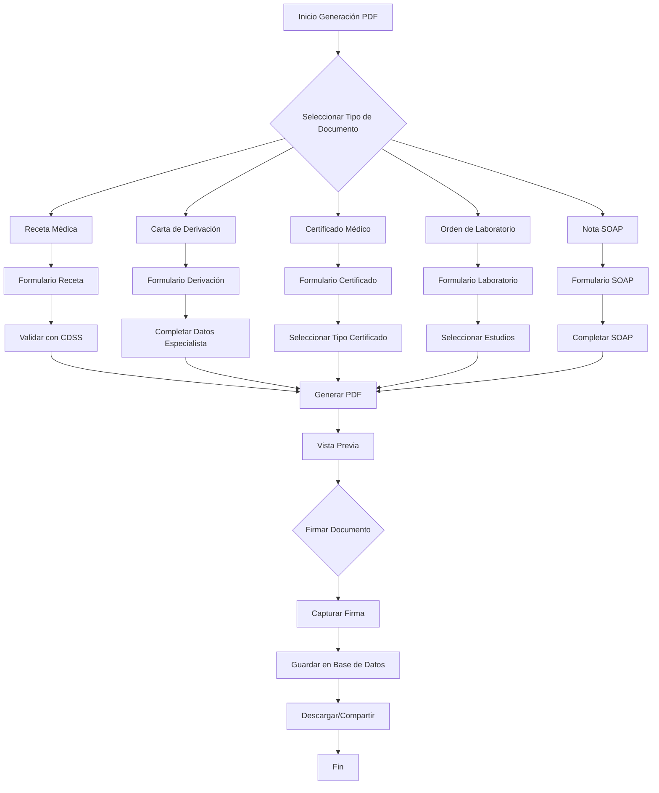

# 📋 Plan de Generación de PDF para Módulo de Medicina

## 📊 Estado Actual del Sistema de PDF

### ✅ **Servicio de PDF Existente** (`src/services/pdfService.ts`)
- **Líneas de código**: 1,254 líneas
- **Bibliotecas utilizadas**: jsPDF, html2canvas, jspdf-autotable
- **Documentos actualmente soportados**:
  - Recibos de pago
  - Consentimientos informados
  - Hojas en blanco
  - Reportes de sesión
  - Confirmaciones de cita
  - Cotizaciones
  - Documentos de psicología

### ✅ **Componente de Medicina Existente** (`src/modules/medicina/components/GenerarRecetaMedica.tsx`)
- **Estado**: Implementado (568 líneas)
- **Funcionalidad**: Genera recetas médicas con:
  - Encabezado profesional
  - Datos del paciente
  - Medicamentos prescritos
  - Indicaciones generales
  - Recomendaciones
  - Firma del médico

### ❌ **Documentos Médicos Faltantes**
1. **Cartas de Derivación/Referencia**
2. **Certificados Médicos**
3. **Órdenes de Laboratorio/Estudios**
4. **Notas SOAP (Subjetivo, Objetivo, Análisis, Plan)**
5. **Historia Clínica Médica Completa**
6. **Informes de Evolución Médica**

## 🎯 **Objetivos de la Implementación**

### **Objetivo Principal**
Crear un sistema de generación de PDFs específico para medicina que permita a los médicos generar todos los documentos necesarios en su práctica clínica diaria.

### **Objetivos Específicos**
1. **Completar el conjunto de documentos médicos esenciales**
2. **Integrar con el sistema de soporte a decisiones clínicas (CDSS)**
3. **Optimizar para uso en tablet (touch-first)**
4. **Mantener consistencia con el diseño existente de SaludValpa**
5. **Garantizar cumplimiento normativo (NOM-004-SSA3-2012)**

## 📄 **Documentos Médicos a Implementar**

### **1. Receta Médica** (`RECETA_MEDICA`)
- **Estado**: ✅ Implementado
- **Mejoras necesarias**:
  - Integrar con CDSS para verificación de interacciones
  - Agregar código de barras para farmacias
  - Incluir firma digital del médico

### **2. Carta de Derivación/Referencia** (`CARTA_DERIVACION`)
- **Propósito**: Referir pacientes a especialistas
- **Contenido**:
  - Datos del médico referente
  - Datos del especialista destino
  - Motivo de la referencia
  - Resumen clínico
  - Estudios realizados
  - Diagnóstico presuntivo
  - Tratamiento actual

### **3. Certificado Médico** (`CERTIFICADO_MEDICO`)
- **Propósito**: Certificar estado de salud
- **Tipos**:
  - Certificado de aptitud física
  - Certificado de enfermedad
  - Certificado de incapacidad laboral
  - Certificado de vacunación
  - Certificado de salud general

### **4. Orden de Laboratorio/Estudios** (`ORDEN_LABORATORIO`)
- **Propósito**: Solicitar estudios diagnósticos
- **Contenido**:
  - Lista de estudios solicitados
  - Instrucciones de preparación
  - Urgencia (rutina/urgente)
  - Justificación clínica
  - Datos del laboratorio destino

### **5. Nota SOAP** (`NOTA_SOAP`)
- **Propósito**: Documentar consulta médica
- **Estructura SOAP**:
  - **S** (Subjetivo): Síntomas del paciente
  - **O** (Objetivo): Hallazgos del examen físico
  - **A** (Análisis): Diagnóstico y evaluación
  - **P** (Plan): Tratamiento y seguimiento

### **6. Historia Clínica Médica** (`HISTORIA_CLINICA_MEDICA`)
- **Propósito**: Documento médico completo
- **Contenido**:
  - Antecedentes personales y familiares
  - Examen físico por sistemas
  - Evolución de consultas
  - Estudios de laboratorio
  - Tratamientos prescritos
  - Plan de seguimiento

## 🏗️ **Arquitectura Técnica**

### **Estructura de Directorios Propuesta**
```
src/modules/medicina/pdf/
├── generators/                    # Generadores de PDF
│   ├── MedicalPrescriptionGenerator.ts
│   ├── ReferralLetterGenerator.ts
│   ├── MedicalCertificateGenerator.ts
│   ├── LaboratoryOrderGenerator.ts
│   ├── SOAPNoteGenerator.ts
│   └── MedicalHistoryGenerator.ts
├── templates/                     # Plantillas de PDF
│   ├── prescription-template.html
│   ├── referral-template.html
│   ├── certificate-template.html
│   ├── laboratory-template.html
│   └── soap-template.html
├── components/                    # Componentes React
│   ├── PDFGeneratorModal.tsx
│   ├── DocumentPreview.tsx
│   ├── TemplateSelector.tsx
│   └── SignatureCapture.tsx
└── hooks/                        # Hooks personalizados
    ├── usePDFGeneration.ts
    └── useDocumentTemplates.ts
```

### **Integración con Servicio Existente**
```typescript
// Extensión del pdfService.ts
export const generarRecetaMedica = async (
  paciente: Paciente,
  datosMedicina: DatosMedicinaGeneral,
  config: Configuracion
): Promise<Blob> => {
  // Usar generador específico de medicina
  const generator = new MedicalPrescriptionGenerator();
  return generator.generate(paciente, datosMedicina, config);
};

export const generarCartaDerivacion = async (
  paciente: Paciente,
  datosDerivacion: DatosDerivacion,
  config: Configuracion
): Promise<Blob> => {
  const generator = new ReferralLetterGenerator();
  return generator.generate(paciente, datosDerivacion, config);
};

// ... otros generadores
```

## 🔧 **Componentes a Desarrollar**

### **A. Generadores de PDF (TypeScript)**
1. **`MedicalPrescriptionGenerator`** - Extender el existente
2. **`ReferralLetterGenerator`** - Nuevo
3. **`MedicalCertificateGenerator`** - Nuevo
4. **`LaboratoryOrderGenerator`** - Nuevo
5. **`SOAPNoteGenerator`** - Nuevo
6. **`MedicalHistoryGenerator`** - Nuevo

### **B. Componentes React**
1. **`PDFGeneratorModal`** - Modal reutilizable para generación
2. **`DocumentPreview`** - Vista previa de documentos
3. **`TemplateSelector`** - Selector de plantillas
4. **`SignatureCapture`** - Captura de firma digital
5. **`DocumentHistory`** - Historial de documentos generados

### **C. Hooks Personalizados**
1. **`usePDFGeneration`** - Lógica de generación de PDFs
2. **`useDocumentTemplates`** - Gestión de plantillas
3. **`useSignature`** - Manejo de firma digital

## 📋 **Flujo de Trabajo de Generación**



## 🎨 **Diseño de Plantillas**

### **Principios de Diseño**
1. **Consistencia visual** con SaludValpa
2. **Legibilidad médica** prioritaria
3. **Espacio para firmas** y sellos
4. **Información obligatoria** según normativa
5. **Responsive** para impresión

### **Elementos Comunes a Todas las Plantillas**
- Encabezado con logo y datos del médico
- Datos del paciente (nombre, edad, sexo, ID)
- Fecha y hora de generación
- Folio único del documento
- Pie de página con datos de contacto
- Marca de agua (versión gratuita)

## 🔗 **Integración con CDSS**

### **Verificaciones Automáticas**
1. **Recetas Médicas**:
   - Interacciones medicamentosas
   - Alergias del paciente
   - Dosis según función renal/hepática
   - Contraindicaciones

2. **Órdenes de Laboratorio**:
   - Estudios apropiados para diagnóstico
   - Frecuencia recomendada
   - Contraindicaciones específicas

3. **Cartas de Derivación**:
   - Especialista apropiado para patología
   - Estudios previos necesarios
   - Urgencia de la referencia

## 📱 **Optimización para Tablet**

### **Características Touch-First**
1. **Botones grandes** para selección de documentos
2. **Formularios optimizados** para pantalla táctil
3. **Captura de firma** con lápiz óptico/dedo
4. **Vista previa instantánea**
5. **Gestos para navegación** (swipe entre documentos)

### **Componentes Específicos para Tablet**
```typescript
// Componentes reutilizables
<MedicalTouchButton 
  variant="primary"
  onPress={() => generarDocumento()}
  hapticFeedback={true}
>
  Generar Receta
</MedicalTouchButton>

<SignatureCapture 
  onSignatureComplete={(signature) => guardarFirma(signature)}
  penColor="#000000"
  lineWidth={2}
/>
```

## 🗄️ **Almacenamiento y Gestión**

### **Base de Datos (IndexedDB)**
```typescript
// Esquema para documentos médicos
interface DocumentoMedico {
  id: string;
  pacienteId: string;
  tipo: TipoDocumentoMedico;
  folio: string;
  fechaGeneracion: Date;
  contenido: any; // Datos específicos del documento
  pdfBlob: Blob;
  firmaDigital?: string;
  hashSeguridad: string;
  metadata: {
    medicoGenerador: string;
    versionPlantilla: string;
    checksum: string;
  };
}
```

### **Gestión de Versiones**
1. **Versionado de plantillas**
2. **Historial de cambios**
3. **Backup automático**
4. **Sincronización en la nube**

## 🧪 **Plan de Pruebas**

### **Pruebas Unitarias**
1. **Generadores de PDF**: Verificar formato y contenido
2. **Validaciones CDSS**: Confirmar verificaciones automáticas
3. **Componentes React**: Testear interacción de usuario

### **Pruebas de Integración**
1. **Flujo completo**: Desde selección hasta descarga
2. **Integración con CDSS**: Verificar alertas y recomendaciones
3. **Almacenamiento**: Confirmar guardado en IndexedDB

### **Pruebas de Usabilidad**
1. **Médicos reales**: Evaluar flujo de trabajo
2. **Tablet optimization**: Verificar uso táctil
3. **Tiempos de generación**: Medir performance

## 📅 **Cronograma de Implementación**

### **Fase 1: Fundamentos (1 semana)**
- [ ] Analizar servicio PDF existente
- [ ] Diseñar plantillas base
- [ ] Crear estructura de directorios
- [ ] Configurar TypeScript para generadores

### **Fase 2: Generadores Básicos (2 semanas)**
- [ ] Implementar `ReferralLetterGenerator`
- [ ] Implementar `MedicalCertificateGenerator`
- [ ] Implementar `LaboratoryOrderGenerator`
- [ ] Crear componentes React base

### **Fase 3: Integración Avanzada (2 semanas)**
- [ ] Implementar `SOAPNoteGenerator`
- [ ] Implementar `MedicalHistoryGenerator`
- [ ] Integrar con CDSS
- [ ] Desarrollar captura de firma digital

### **Fase 4: Optimización y Pruebas (1 semana)**
- [ ] Optimizar para tablet
- [ ] Implementar gestos táctiles
- [ ] Realizar pruebas completas
- [ ] Documentar sistema

## 🚀 **Criterios de Éxito**

### **Métricas Técnicas**
1. **Tiempo de generación**: < 3 segundos por documento
2. **Tamaño de PDF**: < 500KB por documento
3. **Compatibilidad**: 100% con lectores PDF estándar
4. **Rendimiento**: Sin bloqueo de UI durante generación

### **Métricas de Usuario**
1. **Satisfacción médica**: > 4.5/5 en encuestas
2. **Tiempo ahorrado**: > 50% vs. métodos tradicionales
3. **Tasa de adopción**: > 80% de médicos usando el sistema
4. **Errores reducidos**: < 1% de documentos con errores

### **Métricas de Negocio**
1. **Documentos generados**: > 100/mes por médico
2. **Papel ahorrado**: 100% digital
3. **Cumplimiento normativo**: 100% de documentos válidos
4. **Integración exitosa**: Con todos los módulos existentes

## 🔒 **Consideraciones de Seguridad**

### **Protección de Datos**
1. **Encriptación** de documentos sensibles
2. **Control de acceso** por rol de usuario
3. **Auditoría** de todos los documentos generados
4. **Firma digital** con hash de verificación

### **Cumplimiento Normativo**
1. **NOM-004-SSA3-2012**: Historia clínica
2. **Ley Federal de Protección de Datos**: Datos personales
3. **Normas oficiales mexicanas**: Documentación médica
4. **Estándares internacionales**: HIPAA (para futura expansión)

## 📝 **Próximos Pasos Inmediatos**

1. **Revisar y aprobar** este plan con el equipo
2. **Crear branch específico** para desarrollo de PDFs
3. **Implementar Fase 1** (Fundamentos)
4. **Integrar progresivamente** con módulo de medicina existente
5. **Realizar pruebas piloto** con médicos reales

---

## 📞 **Contacto y Soporte**

- **Responsable del proyecto**: Equipo de Desarrollo SaludValpa
- **Branch de desarrollo**: `feature/pdf-medicina`
- **Documentación**: En `/docs/pdf-generation/`
- **Issues tracker**: Usar etiqueta `pdf-medicina`

---

*Última actualización: 2 de marzo de 2026*  
*Versión del plan: 1.0*  
*Estado: En revisión*