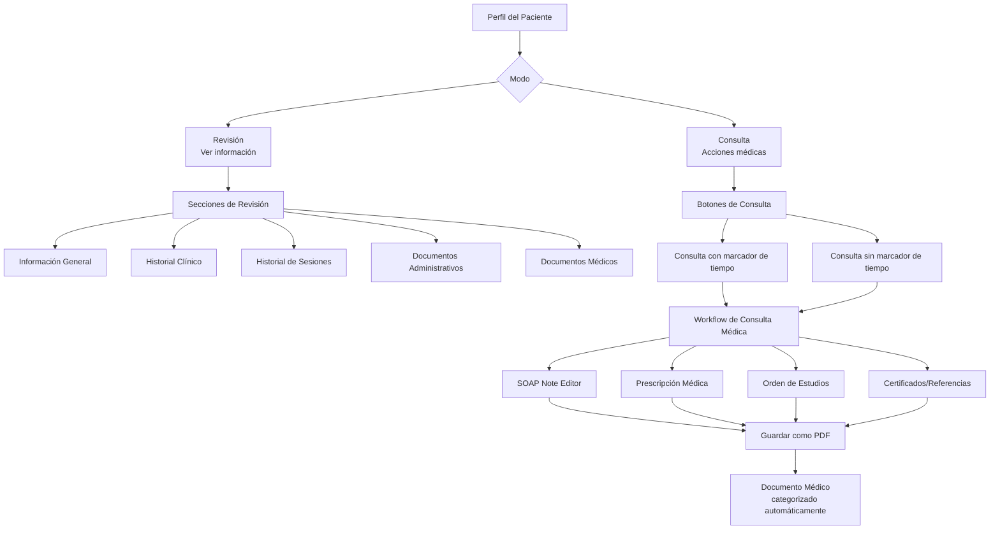

# Rediseño Arquitectónico de la Interfaz del Paciente - Módulo de Medicina

## 1. Análisis del Estado Actual

### Problemas Identificados
1. **Confusión en botones de inicio**: 3 botones diferentes para "iniciar sesión/consulta" causan ambigüedad
2. **Modos separados**: Interfaz dividida en "Revisión" (solo lectura) y "Ejecución" (acciones)
3. **Organización de documentos**: Documentos médicos y administrativos mezclados sin categorización clara
4. **Terminología inconsistente**: "Ejecución" no refleja claramente el propósito de "Consulta"
5. **Navegación compleja**: Transiciones entre modos no son intuitivas

### Estructura Actual
- **PerfilPaciente.tsx**: Vista principal con tarjeta de paciente y botón "Iniciar sesión"
- **Modal selector**: 3-4 opciones de tipo de sesión según especialidad
- **Documentos.tsx**: Lista única de todos los documentos sin categorización médica/administrativa
- **ConsultationDashboard.tsx**: Dashboard médico con múltiples botones de acción

## 2. Nuevo Flujo de Consulta Unificado

### Diagrama de Flujo del Proceso de Consulta



### Descripción del Flujo
1. **Acceso único**: Un solo punto de entrada desde PerfilPaciente
2. **Modo dual**: Alternar entre "Revisión" (información) y "Consulta" (acciones)
3. **Botones simplificados**: Solo 2 opciones claras para iniciar consulta
4. **Workflow integrado**: Flujo continuo desde inicio de consulta hasta generación de documentos
5. **Categorización automática**: Documentos clasificados como Médicos o Administrativos

## 3. Estructura de Componentes Reorganizada

### Nueva Jerarquía de Componentes

```
src/
├── pages/
│   └── PerfilPaciente.tsx (Rediseñado)
│
├── modules/
│   └── [especialidad]/
│       ├── components/
│       │   ├── patient/
│       │   │   ├── PatientReviewView.tsx (Modo Revisión)
│       │   │   ├── PatientConsultationView.tsx (Modo Consulta)
│       │   │   ├── PatientDocumentsView.tsx (Vista documentos)
│       │   │   └── PatientSessionHistory.tsx (Historial sesiones)
│       │   │
│       │   ├── consultation/
│       │   │   ├── ConsultationWorkflow.tsx (Flujo principal)
│       │   │   ├── ConsultationTimer.tsx (Marcador tiempo)
│       │   │   ├── SOAPNoteEditor.tsx
│       │   │   └── PrescriptionEditor.tsx
│       │   │
│       │   └── documents/
│       │       ├── MedicalDocumentsSection.tsx
│       │       ├── AdministrativeDocumentsSection.tsx
│       │       └── DocumentCategoryFilter.tsx
│       │
│       └── hooks/
│           ├── usePatientReview.ts
│           ├── useConsultationWorkflow.ts
│           └── useDocumentCategorization.ts
│
└── components/
    └── shared/
        ├── ModeToggle.tsx (Revisión/Consulta)
        ├── ConsultationButton.tsx (Botón unificado)
        └── DocumentViewer.tsx (Visor PDF mejorado)
```

### Componentes Clave

#### 1. **ModeToggle Component**
- Alternador visual entre "Revisión" y "Consulta"
- Estado persistente por paciente
- Indicador visual claro del modo activo

#### 2. **PatientReviewView Component**
- **Información General**: Datos demográficos, contacto, antecedentes
- **Historial Clínico**: Condiciones crónicas, alergias, medicamentos
- **Historial de Sesiones**: Timeline de consultas anteriores
- **Documentos**: Vista dividida en Médicos/Administrativos

#### 3. **PatientConsultationView Component**
- **Botones de acción principal**: 
  - "Consulta con marcador de tiempo" (primario)
  - "Consulta sin marcador de tiempo" (secundario)
- **Workflow integrado**: Navegación paso a paso
- **Herramientas en tiempo real**: Calculadoras, referencias, plantillas

#### 4. **DocumentCategoryFilter Component**
- Filtrado inteligente por categoría (Médico/Administrativo)
- Ordenación por fecha, tipo, relevancia
- Búsqueda integrada con sugerencias

## 4. Wireframes Conceptuales

### Wireframe 1: Perfil del Paciente - Modo Revisión
```
┌─────────────────────────────────────────────────┐
│ ← Volver a pacientes        [Revisión] [Consulta]│
├─────────────────────────────────────────────────┤
│  ┌─────────────────────────────────────────┐   │
│  │  TARJETA DEL PACIENTE                   │   │
│  │  Nombre: Juan Pérez                     │   │
│  │  Edad: 45 años | Género: Masculino      │   │
│  │  Tel: 555-1234 | Última visita: 15/01   │   │
│  └─────────────────────────────────────────┘   │
│                                                 │
│  [INICIAR CONSULTA]                            │
│  ┌──────────────┐ ┌──────────────┐            │
│  │Con marcador  │ │Sin marcador  │            │
│  │de tiempo     │ │de tiempo     │            │
│  └──────────────┘ └──────────────┘            │
│                                                 │
│  ┌───────┬───────┬───────┬───────┬───────┐    │
│  │ Info  │Hist.  │Sesiones│Admin. │Médico │    │
│  │General│Clínico│        │       │       │    │
│  └───────┴───────┴───────┴───────┴───────┘    │
│                                                 │
│  ┌─────────────────────────────────────────┐   │
│  │ INFORMACIÓN GENERAL                     │   │
│  │ • Datos demográficos                    │   │
│  │ • Contacto de emergencia                │   │
│  │ • Antecedentes relevantes               │   │
│  └─────────────────────────────────────────┘   │
└─────────────────────────────────────────────────┘
```

### Wireframe 2: Modo Consulta - Workflow Activo
```
┌─────────────────────────────────────────────────┐
│ ← Volver a pacientes        [Revisión] [Consulta]│
├─────────────────────────────────────────────────┤
│  CONSULTA EN CURSO - 00:15:23                   │
│                                                 │
│  ┌───────┬───────┬───────┬───────┬───────┐    │
│  │ SOAP  │Presc. │Estudios│Certif.│Finalizar│  │
│  │ Notes │ripción│        │       │       │    │
│  └───────┴───────┴───────┴───────┴───────┘    │
│                                                 │
│  ┌─────────────────────────────────────────┐   │
│  │ NOTA SOAP - Subjetivo                   │   │
│  │ [ ] Motivo de consulta:                 │   │
│  │ _______________________________________ │   │
│  │                                         │   │
│  │ [ ] Historia de la enfermedad actual:   │   │
│  │ _______________________________________ │   │
│  │                                         │   │
│  │ [ ] Síntomas asociados:                 │   │
│  │ _______________________________________ │   │
│  └─────────────────────────────────────────┘   │
│                                                 │
│  [Guardar borrador] [Siguiente: Objetivo]       │
└─────────────────────────────────────────────────┘
```

### Wireframe 3: Vista de Documentos Categorizados
```
┌─────────────────────────────────────────────────┐
│ DOCUMENTOS - Juan Pérez                         │
├─────────────────────────────────────────────────┤
│  ┌───────┬───────┐ Buscar documentos... [🔍]   │
│  │Todos  │Admin. │ Médico │ Orden: Más reciente│
│  └───────┴───────┘                             │
│                                                 │
│  ┌─────────────────────────────────────────┐   │
│  │ 📄 DOCUMENTOS MÉDICOS                   │   │
│  │ ┌───────────────────────────────────┐  │   │
│  │ │ Receta Médica - 01/03/2026        │  │   │
│  │ │ Losartán 50mg, Metformina 850mg   │  │   │
│  │ │ [👁️ Ver] [📥 Descargar] [🗑️]      │  │   │
│  │ └───────────────────────────────────┘  │   │
│  │                                         │   │
│  │ ┌───────────────────────────────────┐  │   │
│  │ │ Certificado Médico - 15/02/2026   │  │   │
│  │ │ Reposo por 5 días, gripe          │  │   │
│  │ │ [👁️ Ver] [📥 Descargar] [🗑️]      │  │   │
│  │ └───────────────────────────────────┘  │   │
│  └─────────────────────────────────────────┘   │
│                                                 │
│  ┌─────────────────────────────────────────┐   │
│  │ 📄 DOCUMENTOS ADMINISTRATIVOS           │   │
│  │ ┌───────────────────────────────────┐  │   │
│  │ │ Recibo de Pago - 10/02/2026       │  │   │
│  │ │ $500.00 - Consulta general        │  │   │
│  │ │ [👁️ Ver] [📥 Descargar] [🗑️]      │  │   │
│  │ └───────────────────────────────────┘  │   │
│  └─────────────────────────────────────────┘   │
└─────────────────────────────────────────────────┘
```

## 5. Especificación de Cambios en Componentes Existentes

### 5.1 PerfilPaciente.tsx - Cambios Principales
```typescript
// Cambios requeridos:
1. Reemplazar modal de selección de tipo de sesión con ModeToggle
2. Agregar botones unificados de consulta (con/sin marcador)
3. Integrar PatientReviewView y PatientConsultationView
4. Actualizar manejo de estado para modo dual
```

### 5.2 Documentos.tsx - Reorganización
```typescript
// Nueva estructura:
1. Dividir vista en pestañas: "Todos", "Administrativos", "Médicos"
2. Agregar DocumentCategoryFilter component
3. Implementar categorización automática basada en TipoDocumento
4. Mejorar visor PDF con anotaciones médicas
```

### 5.3 ConsultationDashboard.tsx - Simplificación
```typescript
// Rediseño:
1. Reemplazar múltiples botones con workflow paso a paso
2. Integrar ConsultationTimer component
3. Unificar flujos de SOAP, prescripción, estudios
4. Agregar autoguardado y recuperación de borradores
```

### 5.4 Tipos de Datos - Actualizaciones
```typescript
// En src/types/index.ts:
1. Agregar categoría a TipoDocumento:
   - ADMINISTRATIVO: recibo_pago, consentimiento_informado, hoja_blanco
   - MÉDICO: receta_medica, certificado_medico, nota_evolucion_medica, etc.
   
2. Agregar interfaz para modo de vista:
   interface PatientViewMode {
     pacienteId: string;
     mode: 'review' | 'consultation';
     activeTab: string;
     consultationTimer?: number;
   }
```

## 6. Plan de Implementación por Fases

### Fase 1: Estructura Base (Semanas 1-2)
- [ ] Crear componentes base: ModeToggle, ConsultationButton
- [ ] Actualizar tipos de datos con categorización de documentos
- [ ] Implementar PatientReviewView component
- [ ] Configurar routing y estado para modo dual

### Fase 2: Workflow de Consulta (Semanas 3-4)
- [ ] Desarrollar PatientConsultationView component
- [ ] Implementar ConsultationWorkflow con pasos SOAP
- [ ] Crear ConsultationTimer con funcionalidad completa
- [ ] Integrar autoguardado y recuperación

### Fase 3: Gestión de Documentos (Semanas 5-6)
- [ ] Rediseñar Documentos.tsx con categorización
- [ ] Implementar DocumentCategoryFilter component
- [ ] Crear MedicalDocumentsSection y AdministrativeDocumentsSection
- [ ] Mejorar VisorPDF con herramientas médicas

### Fase 4: Integración y Pruebas (Semanas 7-8)
- [ ] Integrar todos los componentes en PerfilPaciente
- [ ] Realizar pruebas de usabilidad con usuarios médicos
- [ ] Optimizar rendimiento y carga de datos
- [ ] Documentar nuevos flujos y componentes

### Fase 5: Extensión a Otros Módulos (Semanas 9-10)
- [ ] Adaptar estructura para fisioterapia
- [ ] Adaptar estructura para psicología
- [ ] Adaptar estructura para nutrición
- [ ] Adaptar estructura para odontología
- [ ] Crear componentes especializados por profesión

## 7. Consideraciones Técnicas

### Compatibilidad con Componentes Existentes
1. **Mantener APIs**: No romper interfaces existentes
2. **Migración gradual**: Usar feature flags para transición
3. **Datos existentes**: Categorizar documentos históricos automáticamente
4. **Rendimiento**: Lazy loading de componentes pesados

### Integración con Visor PDF Existente
- Reutilizar `VisorPDF` component
- Agregar funcionalidades médicas (anotaciones, firmas)
- Mantener compatibilidad con todos los formatos existentes

### Gestión de Estado
- Usar Zustand store para modo de vista
- Persistir estado de consulta en curso
- Sincronizar entre componentes sin prop drilling

### Responsive Design
- Diseño adaptable para tabletas médicas
- Optimización para pantallas táctiles
- Modo compacto para vistas rápidas

## 8. Métricas de Éxito

### Usabilidad
- Reducción del 70% en clics para iniciar consulta
- Tiempo promedio de consulta reducido en 25%
- Satisfacción del usuario > 4.5/5 en encuestas

### Calidad de Datos
- 100% de documentos categorizados correctamente
- Reducción del 90% en documentos mal clasificados
- Completitud de notas SOAP > 95%

### Rendimiento
- Tiempo de carga inicial < 2 segundos
- Transiciones entre modos < 500ms
- Uso de memoria estable durante consultas largas

## 9. Riesgos y Mitigaciones

### Riesgo 1: Resistencia al cambio
- **Mitigación**: Transición gradual con tutorial interactivo
- **Mitigación**: Mantener modo legacy disponible temporalmente

### Riesgo 2: Pérdida de datos durante migración
- **Mitigación**: Backup completo antes de implementación
- **Mitigación**: Scripts de migración validados en staging

### Riesgo 3: Impacto en rendimiento
- **Mitigación**: Optimización con React.memo y useMemo
- **Mitigación**: Lazy loading estratégico de componentes

### Riesgo 4: Incompatibilidad con especialidades
- **Mitigación**: Diseño modular con extension points
- **Mitigación**: Pruebas exhaustivas en todos los módulos

## 10. Conclusión

Este rediseño arquitectónico aborda todos los