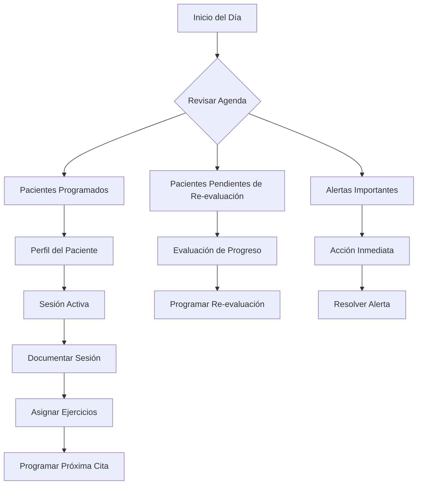
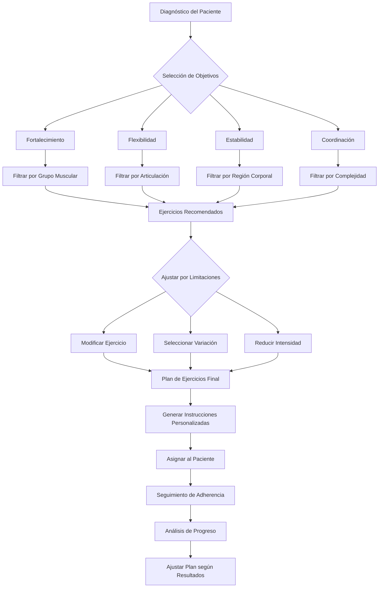
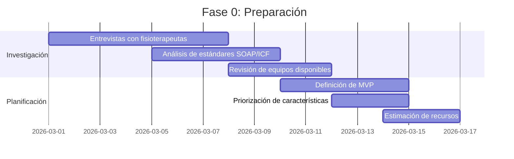

# Plan de Transformación del Módulo de Fisioterapia - SaludValpa App

## Visión General
Transformar el módulo actual de fisioterapia en una solución específica para fisioterapeutas que refleje su flujo de trabajo profesional, documentación especializada y necesidades únicas de práctica clínica.

## Análisis del Estado Actual

### Fortalezas Existentes
1. **Biblioteca de ejercicios**: 200+ ejercicios precargados con categorización
2. **Sistema de rutinas**: Editor funcional para crear planes de tratamiento
3. **Documentos básicos**: Evaluación, plan de tratamiento y notas de evolución
4. **Arquitectura modular**: Base sólida para expansión

### Oportunidades de Mejora
1. **Flujo de trabajo genérico**: No refleja el proceso real de evaluación-tratamiento-seguimiento
2. **Documentación limitada**: Falta de estándares profesionales (SOAP, ICF)
3. **Interfaz genérica**: No optimizada para uso durante sesiones de terapia
4. **Falta de integración**: No considera equipos especializados de fisioterapia

## 1. Flujo de Trabajo Específico para Fisioterapia

### Proceso Clínico Estructurado
```
Evaluación Inicial → Diagnóstico → Plan de Tratamiento → Sesiones de Terapia → Re-evaluación → Alta
```

### Componentes del Flujo de Trabajo

#### A. Evaluación Inicial Integral
- **Historia clínica específica para fisioterapia**
- **Evaluación postural completa** (vistas anterior, posterior, lateral)
- **Goniometría digital** con rangos normales de referencia
- **Evaluación de fuerza muscular** (escala 0-5)
- **Pruebas especiales** por región corporal
- **Escalas de dolor** (EVA, escala numérica, caras)
- **Evaluación funcional** (ADLs, movimientos específicos)

#### B. Diagnóstico Basado en ICF
- **Componente corporal** (estructuras y funciones)
- **Componente de actividad** (limitaciones)
- **Componente de participación** (restricciones)
- **Factores contextuales** (ambientales, personales)

#### C. Plan de Tratamiento Personalizado
- **Objetivos SMART** (específicos, medibles, alcanzables, relevantes, temporales)
- **Intervenciones específicas** (terapia manual, ejercicio terapéutico, modalidades)
- **Frecuencia y duración** recomendadas
- **Ejercicios domiciliarios** con progresión

#### D. Sesiones de Terapia
- **Check-in rápido** del paciente
- **Registro en tiempo real** durante la sesión
- **Seguimiento de progreso** por objetivo
- **Notas SOAP** por sesión

#### E. Re-evaluación Periódica
- **Comparativa automática** con evaluación inicial
- **Análisis de progreso** por objetivo
- **Ajuste del plan** basado en resultados

## 2. Documentos Especializados

### Plantillas Basadas en Estándares Profesionales

#### A. Notas SOAP (Subjetivo, Objetivo, Análisis, Plan)
- **Formulario estructurado** con campos específicos
- **Plantillas predefinidas** por tipo de sesión
- **Integración con datos** de evaluación previa
- **Exportación a PDF** con formato profesional

#### B. Evaluación Fisioterapéutica Completa
- **Secciones organizadas** por sistemas corporales
- **Diagramas anatómicos** para marcar áreas de dolor
- **Tablas de goniometría** con rangos normales
- **Checklists de pruebas** especiales

#### C. Plan de Tratamiento ICF
- **Formulario alineado** con marco ICF
- **Objetivos vinculados** a componentes ICF
- **Intervenciones clasificadas** por tipo
- **Indicadores de resultado** medibles

#### D. Informe de Progreso
- **Gráficos de evolución** por parámetro
- **Comparativa visual** entre evaluaciones
- **Análisis de tendencias** automático
- **Recomendaciones** basadas en progreso

#### E. Documentos de Alta
- **Resumen de tratamiento** completo
- **Logros alcanzados** vs objetivos iniciales
- **Recomendaciones de mantenimiento**
- **Plan de prevención** de recidivas

## 3. Interfaz Centrada en el Fisioterapeuta

### Diseño para Uso en Sesión

#### A. Vista de Consultorio (Dashboard del Día)


#### B. Vista de Sesión Activa (Tablet Optimizada)
- **Diseño Touch-First**: Botones grandes (≥ 44px), espaciado amplio
- **Navegación por Gestos**: Swipe izquierda/derecha entre secciones, tap largo para acciones rápidas
- **Entrada Rápida**: Plantillas predefinidas, campos con valores comunes, autocompletado
- **Modo Manos Libres**: Comandos de voz para navegación básica, dictado de notas
- **Diseño Responsivo**: Adaptación automática a orientación portrait/landscape

#### C. Biblioteca de Ejercicios Mejorada
- **Búsqueda Inteligente**: Por diagnóstico, región corporal, equipo disponible, nivel de dolor
- **Filtros Avanzados**: Por objetivo terapéutico, complejidad, tiempo requerido, espacio necesario
- **Vista de Demostración**: Videos paso a paso, imágenes de técnica correcta, precauciones visuales
- **Variaciones y Progresiones**: Ejercicios base → intermedio → avanzado, modificaciones por limitación

#### D. Sistema de Plantillas Inteligentes
- **Plantillas por Especialidad**: Ortopedia (hombro, rodilla, columna), Neurología (ACV, Parkinson), Deportiva (lesiones comunes)
- **Plantillas por Patología**: Tendinitis rotuliana, Síndrome del túnel carpiano, Lumbalgia mecánica
- **Personalización por Terapeuta**: Campos favoritos, atajos personalizados, flujos de trabajo propios
- **Sugerencias Contextuales**: Basadas en diagnóstico previo, edad del paciente, equipo disponible

#### E. Diseño Visual Específico para Fisioterapia
1. **Paleta de Colores Terapéutica**
   - Azules/verdes para calma y rehabilitación
   - Naranjas/rojos para alertas y dolor
   - Contraste alto para legibilidad en consultorio

2. **Iconografía Específica**
   - Iconos anatómicos claros
   - Símbolos de equipos de fisioterapia
   - Indicadores visuales de progreso

3. **Jerarquía Visual para Datos Clínicos**
   - Información crítica en primer plano
   - Datos históricos accesibles pero no intrusivos
   - Resaltado automático de cambios significativos

## 4. Características Especializadas para Fisioterapia

### A. Herramientas de Evaluación Digital
1. **Goniometría Digital**
   - Simulador de rangos articulares
   - Registro de mediciones con diagramas
   - Comparativa con rangos normales

2. **Evaluación de Fuerza**
   - Registro de pruebas manuales de fuerza
   - Seguimiento de progreso por grupo muscular
   - Gráficos de evolución de fuerza

3. **Análisis Postural**
   - Plantillas de evaluación postural
   - Diagramas para marcar desviaciones
   - Sistema de scoring postural

### B. Sistema de Ejercicios Terapéuticos Inteligente



1. **Biblioteca Enriquecida con Inteligencia Contextual**
   - 500+ ejercicios con videos demostrativos en alta calidad
   - Categorización multidimensional: objetivo terapéutico, región corporal, equipo necesario, nivel de dolor permitido
   - Sistema de etiquetas inteligentes: "apto para post-operatorio", "sin carga axial", "modo sentado"
   - Algoritmo de recomendación basado en diagnóstico similar de otros pacientes

2. **Planificador de Progresión Adaptativa**
   - Algoritmo que considera: edad, condición basal, tolerancia al dolor, progresión histórica
   - Sugerencias automáticas de incremento: repeticiones, series, resistencia, duración
   - Sistema de "prueba y ajuste": registro de respuesta del paciente a cada incremento
   - Alertas de meseta: detección automática de estancamiento en progreso

3. **Seguimiento de Adherencia con Gamificación**
   - Registro simplificado para pacientes: check-in diario, escala de dificultad
   - Sistema de recompensas visuales: streaks, logros, progreso visible
   - Recordatorios inteligentes: horarios óptimos basados en rutina del paciente
   - Reporte de cumplimiento con análisis de patrones: mejores días/horas, obstáculos comunes

### C. Integración con Equipos de Fisioterapia
1. **Conexión con Dispositivos Comunes**
   - Goniómetros digitales (via Bluetooth)
   - Dinamómetros manuales
   - Plataformas de equilibrio (datos básicos)

2. **Registro de Modalidades**
   - Electroterapia (parámetros, tiempo, área)
   - Ultrasonido (intensidad, frecuencia)
   - Termoterapia/Crioterapia
   - Terapia manual (técnicas aplicadas)

### D. Sistema de Códigos y Facturación
1. **Códigos de Procedimiento Específicos**
   - Códigos CPT para fisioterapia
   - Códigos mexicanos (si aplica)
   - Categorización por tipo de intervención

2. **Gestión de Autorizaciones**
   - Seguimiento de autorizaciones de seguro
   - Registro de sesiones autorizadas vs realizadas
   - Alertas de límites de cobertura

## 5. Optimización Móvil/Tablet

### A. Diseño Responsivo para Uso en Consultorio
1. **Interfaz Touch-First**
   - Botones grandes y espaciados
   - Gestos intuitivos para navegación
   - Modo portrait y landscape

2. **Funcionalidades Offline**
   - Sincronización automática cuando hay conexión
   - Almacenamiento local de datos de sesión
   - Generación de documentos offline

3. **Integración con Cámara/Tablet**
   - Fotos de postura/ejercicios
   - Videos de técnica de ejercicio
   - Escaneo de documentos

### B. App para Pacientes
1. **Portal del Paciente**
   - Acceso a ejercicios asignados
   - Registro de síntomas/dolor
   - Comunicación con terapeuta
   - Recordatorios de sesiones

2. **Seguimiento en Casa**
   - Registro de ejercicios realizados
   - Escala de dolor diaria
   - Reporte de incidencias

## 6. Plan de Implementación

### Fase 1: Fundamentos (2-3 semanas)
1. **Rediseño de estructura de datos** para soportar ICF/SOAP
2. **Creación de plantillas base** de documentos
3. **Mejora de biblioteca de ejercicios** con categorización terapéutica
4. **Implementación de formularios SOAP** básicos

### Fase 2: Flujo de Trabajo (3-4 semanas)
1. **Desarrollo del proceso clínico** completo
2. **Implementación de herramientas** de evaluación digital
3. **Creación del sistema** de planificación de tratamiento
4. **Integración de seguimiento** de progreso

### Fase 3: Interfaz y Experiencia (3-4 semanas)
1. **Rediseño de interfaz** para tablet/consulta
2. **Implementación de vistas** optimizadas para sesión
3. **Desarrollo de funcionalidades** móviles avanzadas
4. **Creación de dashboard** específico para fisioterapeutas

### Fase 4: Integración y Pulido (2-3 semanas)
1. **Pruebas con fisioterapeutas** reales
2. **Ajustes basados en feedback**
3. **Optimización de rendimiento**
4. **Documentación y capacitación**

## 7. Consideraciones Técnicas

### A. Estructura de Datos Ampliada
```typescript
interface EvaluacionFisioterapia {
  // Componente ICF: Estructuras y Funciones Corporales
  estructurasCorporales: {
    sistemaMusculoesqueletico: EvaluacionMusculoesqueletica;
    sistemaNeuromuscular: EvaluacionNeuromuscular;
    sistemaCardiorespiratorio: EvaluacionCardiorespiratoria;
  };
  
  // Componente ICF: Actividad y Participación
  actividadParticipacion: {
    movilidad: EvaluacionMovilidad;
    autocuidado: EvaluacionAutocuidado;
    vidaDomestica: EvaluacionVidaDomestica;
  };
  
  // Factores Contextuales
  factoresContextuales: {
    ambientales: FactoresAmbientales;
    personales: FactoresPersonales;
  };
}

interface NotaSOAP {
  subjetivo: {
    quejaPrincipal: string;
    historiaEnfermedad: string;
    sintomasActuales: string;
    medicacion: string;
  };
  objetivo: {
    signosVitales: SignosVitales;
    hallazgosFisicos: HallazgosFisicos;
    pruebasEspeciales: PruebaEspecial[];
    mediciones: Mediciones[];
  };
  analisis: {
    interpretacion: string;
    progreso: string;
    problemasIdentificados: string[];
  };
  plan: {
    intervenciones: Intervencion[];
    modificaciones: string;
    objetivosSesion: string[];
  };
}
```

### B. Integración con Sistema Existente
1. **Compatibilidad con versiones anteriores** de datos
2. **Migración gradual** de pacientes existentes
3. **Coexistencia** con módulo actual durante transición
4. **Formación** para usuarios actuales

## 8. Métricas de Éxito

### A. Para Fisioterapeutas
1. **Reducción del tiempo** de documentación en 40%
2. **Mejora en la calidad** de documentación clínica
3. **Aumento en la adherencia** a planes de tratamiento
4. **Satisfacción del usuario** > 4.5/5

### B. Para Pacientes
1. **Mejor comprensión** de su plan de tratamiento
2. **Mayor adherencia** a ejercicios domiciliarios
3. **Comunicación mejorada** con su terapeuta
4. **Resultados clínicos** más consistentes

## 9. Roadmap de Implementación Detallado

### Fase 0: Preparación (1-2 semanas)


### Fase 1: Núcleo del Sistema (3-4 semanas)
- **Estructura de datos ICF/SOAP** completa
- **Plantillas base** de documentos profesionales
- **Sistema de evaluación** inicial digital
- **Integración** con módulo existente

### Fase 2: Flujo de Trabajo Completo (4-5 semanas)
- **Proceso clínico** de principio a fin
- **Herramientas de evaluación** avanzadas
- **Sistema de planificación** de tratamiento
- **Seguimiento de progreso** automatizado

### Fase 3: Experiencia de Usuario (3-4 semanas)
- **Interfaz tablet** optimizada
- **Biblioteca inteligente** de ejercicios
- **Sistema de plantillas** contextuales
- **Dashboard** específico para fisioterapeutas

### Fase 4: Integración y Validación (2-3 semanas)
- **Pruebas con usuarios** reales
- **Ajustes basados en feedback**
- **Optimización de rendimiento**
- **Documentación y capacitación**

## 10. Resumen Ejecutivo

### Transformación Clave: De Genérico a Específico
| Aspecto | Estado Actual | Estado Deseado |
|---------|--------------|----------------|
| **Flujo de Trabajo** | Genérico de salud | Específico de fisioterapia (evaluación→tratamiento→seguimiento) |
| **Documentación** | Formatos básicos | Notas SOAP + Marco ICF profesionales |
| **Interfaz** | Web responsive | Tablet-first para uso en consultorio |
| **Ejercicios** | Biblioteca estática | Sistema inteligente con progresión adaptativa |
| **Integración** | Aislado | Conexión con equipos de fisioterapia |

### Valor para Fisioterapeutas
1. **Eficiencia**: Reducción del 40% en tiempo de documentación
2. **Calidad**: Documentación clínica estandarizada y completa
3. **Resultados**: Mejor seguimiento y ajuste de tratamientos
4. **Experiencia**: Interfaz diseñada específicamente para su flujo de trabajo

### Valor para Pacientes
1. **Comprensión**: Planes de tratamiento claros y visuales
2. **Compromiso**: Seguimiento gamificado de ejercicios domiciliarios
3. **Comunicación**: Conexión mejorada con su terapeuta
4. **Resultados**: Progresión más consistente y medible

## 11. Próximos Pasos Inmediatos

1. **Validación del Plan** (Semana 1)
   - Presentar a 3-5 fisioterapeutas de referencia
   - Recopilar feedback específico sobre prioridades
   - Ajustar roadmap según necesidades reales

2. **Prototipo de Interfaz Clave** (Semanas 2-3)
   - Diseñar vista de sesión activa para tablet
   - Crear formulario SOAP interactivo
   - Desarrollar demostración de biblioteca inteligente

3. **Planificación Técnica Detallada** (Semana 4)
   - Especificar estructura de datos ampliada
   - Definir API para integración con equipos
   - Estimar esfuerzo de desarrollo por componente

4. **Implementación de MVP** (Semanas 5-12)
   - Comenzar con Fase 1 del roadmap
   - Iteraciones quincenales con feedback
   - Lanzamiento gradual por características

## 12. Consideraciones de Negocio

### Modelo de Implementación
1. **Actualización Gratuita** para usuarios existentes del módulo de fisioterapia
2. **Nuevas Funcionalidades Premium** para suscripciones avanzadas
3. **Formación y Soporte** incluido durante transición

### Estrategia de Adopción
1. **Beta cerrada** con fisioterapeutas colaboradores
2. **Lanzamiento por etapas** (regiones, especialidades)
3. **Programa de referidos** entre profesionales

### Métricas de Éxito Clave (KPI)
1. **Adopción**: 70% de fisioterapeutas existentes usando nuevas funciones en 3 meses
2. **Satisfacción**: Puntuación NPS > 50 entre usuarios del nuevo módulo
3. **Eficiencia**: Reducción medible en tiempo de documentación
4. **Retención**: Aumento en renovación de suscripciones

---

*Este plan transformará radicalmente el módulo de fisioterapia de SaludValpa de una solución genérica de salud a una herramienta especializada diseñada exclusivamente para fisioterapeutas, reflejando su expertise profesional, flujo de trabajo clínico y necesidades únicas de práctica.*