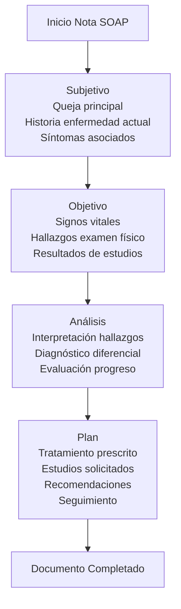
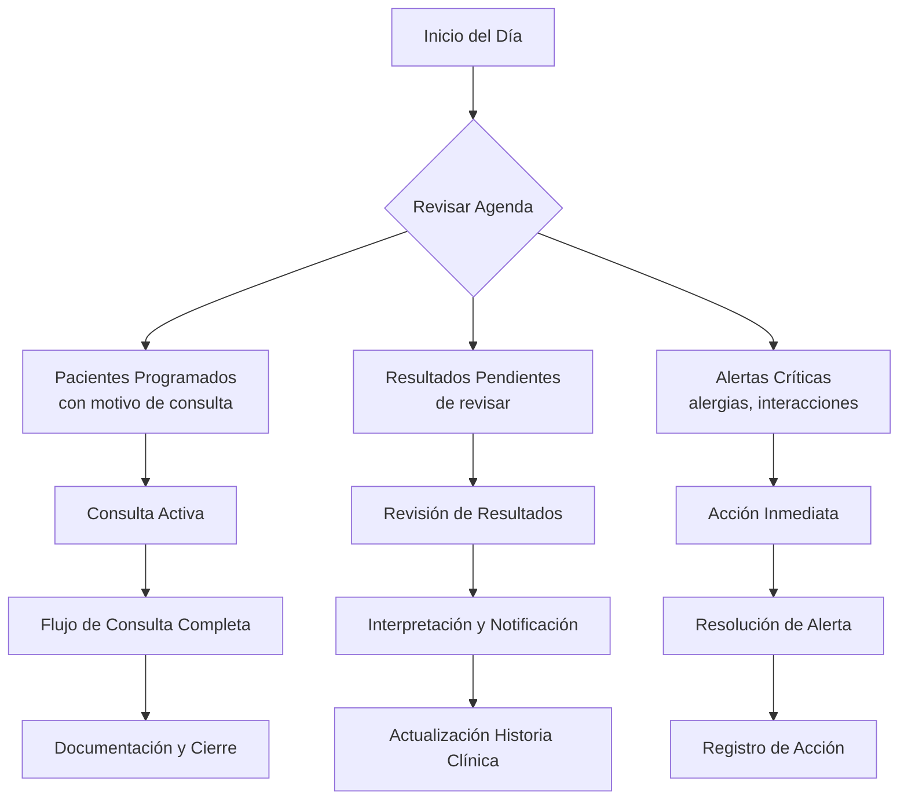
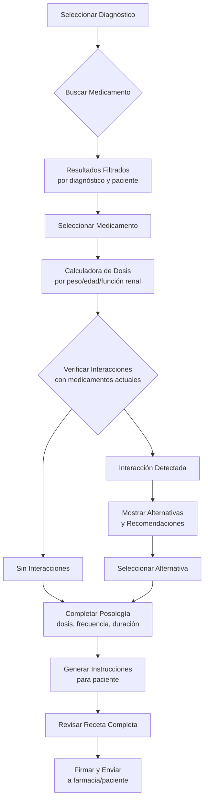
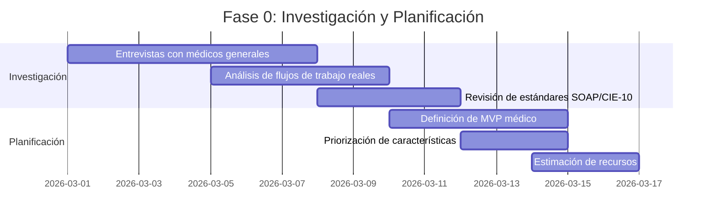

# Plan de Transformación del Módulo de Medicina - SaludValpa App

## Visión General
Transformar el módulo actual de medicina en una solución específica para médicos generales en consultorios ambulatorios que refleje su flujo de trabajo profesional, documentación especializada y necesidades únicas de práctica clínica en atención primaria.

## Análisis del Estado Actual

### Fortalezas Existentes
1. **Componentes básicos**: CamposMedicina, GenerarRecetaMedica, HistoriaClinicaMedica
2. **Datos médicos precargados**: Diagnósticos CIE-10, estudios de laboratorio, medicamentos
3. **Hooks especializados**: useDiagnosticos, useEstudios, useMedicamentos
4. **Arquitectura modular**: Base sólida para expansión

### Oportunidades de Mejora
1. **Flujo de trabajo genérico**: No refleja el proceso real de consulta médica
2. **Documentación limitada**: Falta de estándares profesionales (SOAP, notas de evolución)
3. **Interfaz no optimizada**: No diseñada para uso rápido durante consultas
4. **Falta de integración**: No considera sistemas de referencia, laboratorios, farmacias
5. **Soporte limitado para decisiones clínicas**: Sin alertas de interacciones, dosis calculadoras, etc.

## 1. Flujo de Trabajo Específico para Médicos Generales

### Proceso Clínico Estructurado para Consultorio Ambulatorio
```
Recepción → Triaje → Consulta → Diagnóstico → Tratamiento → Documentación → Seguimiento
```

### Componentes del Flujo de Trabajo

#### A. Recepción y Triaje Rápido
- **Check-in del paciente** con datos básicos actualizados
- **Triaje automatizado**: Signos vitales, motivo de consulta, urgencia
- **Alertas inmediatas**: Alergias, condiciones críticas, medicamentos actuales
- **Historial rápido**: Últimas consultas, tratamientos en curso, pendientes

#### B. Consulta Médica Estructurada
- **Motivo de consulta** con historial de la enfermedad actual
- **Revisión por sistemas** organizada por aparatos y sistemas
- **Antecedentes relevantes** accesibles en un vistazo
- **Examen físico** con plantillas por especialidad/sistema

#### C. Diagnóstico Asistido
- **Búsqueda inteligente de CIE-10** por síntomas, hallazgos, categorías
- **Diagnósticos diferenciales** sugeridos basados en presentación clínica
- **Algoritmos diagnósticos** integrados para patologías comunes
- **Documentación automática** de criterios diagnósticos utilizados

#### D. Tratamiento Integral
- **Prescripción médica** con base de datos de medicamentos actualizada
- **Cálculo automático de dosis** por peso, edad, función renal
- **Verificación de interacciones** medicamentosas y contraindicaciones
- **Indicaciones personalizadas** con lenguaje claro para el paciente

#### E. Documentación Eficiente
- **Notas SOAP** estructuradas (Subjetivo, Objetivo, Análisis, Plan)
- **Plantillas inteligentes** que se auto-completan con datos del paciente
- **Dictado por voz** para notas rápidas durante la consulta
- **Exportación a formatos estándar** (PDF, XML para interoperabilidad)

#### F. Seguimiento y Continuidad
- **Citas de seguimiento** programadas automáticamente según patología
- **Recordatorios automatizados** para paciente y médico
- **Indicadores de seguimiento** por condición crónica
- **Comunicación con pacientes** (resultados, recordatorios, educación)

## 2. Sistema de Documentación Médica Profesional

### Plantillas Basadas en Estándares Médicos

#### A. Nota de Evolución SOAP


#### B. Historia Clínica Integral
- **Datos identificativos** y demográficos
- **Antecedentes personales y familiares** estructurados
- **Historia médica completa** con línea de tiempo
- **Alergias y reacciones adversas** con nivel de severidad
- **Medicamentos actuales** con historial de cambios
- **Inmunizaciones** con registro de fechas y lotes

#### C. Receta Médica Profesional
- **Encabezado estandarizado** con datos del médico y paciente
- **Medicamentos** con posología completa (dosis, frecuencia, duración, vía)
- **Indicaciones especiales** (ayuno, con alimentos, precauciones)
- **Firma digital** del médico con registro de fecha/hora
- **Código de barras** para farmacia y seguimiento

#### D. Orden de Estudios
- **Plantillas por tipo de estudio** (laboratorio, imagenología, gabinete)
- **Indicaciones clínicas** pre-llenadas según diagnóstico
- **Instrucciones de preparación** automáticas según estudio
- **Seguimiento de resultados** pendientes y recibidos

#### E. Certificados y Constancias
- **Plantillas legales** para incapacidades, certificados de salud
- **Datos automáticos** del paciente y diagnóstico
- **Períodos calculados** según patología y normativa
- **Firmas y sellos** digitales integrados

## 3. Interfaz Centrada en el Médico

### Diseño para Consulta Rápida y Eficiente

#### A. Dashboard del Día (Vista Consultorio)


#### B. Vista de Consulta Activa (Tablet Optimizada)
- **Diseño Touch-First**: Botones grandes para uso con guantes/estetoscopio
- **Navegación por pestañas**: Anamnesis → Examen → Diagnóstico → Tratamiento → Documentación
- **Campos inteligentes**: Autocompletado, valores sugeridos, validación en tiempo real
- **Accesos directos**: Atajos de teclado para acciones frecuentes
- **Modo manos libres**: Dictado por voz para notas y comandos

#### C. Sistema de Prescripción Inteligente
- **Búsqueda de medicamentos**: Por nombre, principio activo, categoría terapéutica
- **Base de datos completa**: Dosis pediátricas/adultas, presentaciones, vías
- **Calculadora de dosis**: Por peso, superficie corporal, función renal
- **Verificador de interacciones**: Alertas en tiempo real durante prescripción
- **Plantillas de tratamiento**: Por diagnóstico común (HTA, DM2, infecciones)

#### D. Biblioteca Médica Integrada
- **Diagnósticos CIE-10/11**: Con búsqueda por síntomas, código, categoría
- **Guías de práctica clínica**: Acceso rápido a algoritmos de tratamiento
- **Calculadoras médicas**: Score clínicos (Framingham, CHADS2, APACHE, etc.)
- **Recursos de educación**: Para pacientes por diagnóstico

#### E. Diseño Visual Específico para Medicina
1. **Paleta de Colores Clínica**
   - Azules para calma y confianza
   - Rojos/naranjas para alertas críticas
   - Verdes para información positiva/progreso
   - Contraste alto para legibilidad rápida

2. **Jerarquía Visual para Datos Clínicos**
   - Información crítica en primer plano (alergias, medicamentos actuales)
   - Datos históricos accesibles pero no intrusivos
   - Resaltado automático de valores anormales (signos vitales, laboratorios)

3. **Sistema de Alertas Inteligente**
   - Niveles de prioridad (crítico, alto, medio, bajo)
   - Agrupación por tipo (interacciones, alergias, resultados anormales)
   - Acciones rápidas desde la alerta

## 4. Sistema de Soporte a Decisiones Clínicas (CDSS)

### A. Alertas y Recordatorios Inteligentes

#### 1. Sistema de Interacciones Medicamentosas
```typescript
interface InteraccionMedicamentosa {
  medicamentoA: string;
  medicamentoB: string;
  tipoInteraccion: 'farmacodinámica' | 'farmacocinética' | 'contraindicación';
  nivelSeveridad: 'contraindicado' | 'grave' | 'moderado' | 'leve';
  mecanismo: string;
  recomendacion: string;
  alternativas: string[];
}

interface AlertaInteraccion {
  pacienteId: string;
  medicamentosInvolucrados: string[];
  interaccion: InteraccionMedicamentosa;
  fechaDeteccion: Date;
  estado: 'pendiente' | 'revisada' | 'resuelta';
  accionMedico?: string;
}
```

#### 2. Verificación de Alergias y Contraindicaciones
- **Base de datos de alergias cruzadas** (penicilinas, sulfas, etc.)
- **Verificación contra antecedentes** del paciente
- **Alertas para pruebas cutáneas** necesarias
- **Alternativas terapéuticas** sugeridas automáticamente

#### 3. Ajuste de Dosis por Función Renal/Hepática
- **Calculadora de CrCl** (Cockcroft-Gault, MDRD)
- **Recomendaciones de ajuste** por nivel de insuficiencia
- **Medicamentos que requieren ajuste** destacados
- **Seguimiento de función renal** en pacientes crónicos

### B. Guías y Algoritmos Integrados

#### 1. Guías de Práctica Clínica por Diagnóstico
- **Hipertensión arterial**: JNC 8, guías locales
- **Diabetes mellitus**: ADA, guías nacionales
- **Dislipidemias**: ATP IV, guías de tratamiento
- **Infecciones comunes**: Guías de antibióticos por localización

#### 2. Scores y Calculadoras Clínicas
- **Cardiovasculares**: Framingham, ASCVD, CHADS2-VASc
- **Renales**: CKD-EPI, MDRD, Child-Pugh
- **Infecciosas**: CURB-65, PSI, APACHE II
- **Nutricionales**: MUST, NRS-2002

#### 3. Algoritmos Diagnósticos
- **Dolor torácico**: Algoritmo de síndrome coronario agudo
- **Dificultad respiratoria**: Abordaje por disnea aguda/crónica
- **Fiebre**: Enfoque por fiebre de origen desconocido
- **Dolor abdominal**: Diagnóstico diferencial por cuadrante

### C. Sistema de Referencia y Contrarreferencia

#### 1. Gestión de Interconsultas
- **Formulario estructurado** de referencia
- **Especialistas disponibles** con perfil y contacto
- **Seguimiento de referencia** (enviada, aceptada, completada)
- **Nota de contrarreferencia** integrada a historia clínica

#### 2. Red de Especialistas
- **Directorio integrado** por especialidad, ubicación, disponibilidad
- **Sistema de citas** para referencias urgentes/electivas
- **Comunicación segura** médico-médico
- **Historial de referencias** por paciente

## 5. Gestión de Estudios de Laboratorio e Imagenología

### A. Sistema de Órdenes Inteligentes

#### 1. Plantillas de Estudios por Diagnóstico
- **Perfiles predefinidos**: Química sanguínea básica, perfil lipídico, hepatograma
- **Estudios por sospecha**: Tiroides, anemia, enfermedad renal
- **Seguimiento de crónicos**: DM2, HTA, dislipidemia
- **Estudios preoperatorios**: Según tipo de cirugía y paciente

#### 2. Integración con Laboratorios
- **Conexión electrónica** para envío de órdenes
- **Recepción automática** de resultados (HL7, JSON)
- **Normalización de valores** de diferentes laboratorios
- **Alertas de resultados críticos** (panic values)

### B. Visualización e Interpretación de Resultados

#### 1. Panel de Resultados Inteligente
- **Valores actuales vs históricos** en gráfico de tendencias
- **Marcadores de anormalidad** (↑, ↓, crítico)
- **Rangos de referencia** por edad, sexo, condición
- **Interpretación sugerida** basada en patrones

#### 2. Sistema de Alertas de Resultados
- **Valores críticos**: Notificación inmediata
- **Cambios significativos**: Alertas de tendencia
- **Patrones de alarma**: Combinaciones peligrosas
- **Acciones recomendadas**: Según resultado anormal

## 6. Sistema de Prescripción Integral

### A. Base de Datos de Medicamentos Completa

#### 1. Información por Medicamento
```typescript
interface Medicamento {
  id: string;
  nombre: string;
  nombreGenerico: string;
  categoría: string;
  presentaciones: Presentacion[];
  dosis: {
    adulto: DosisRango;
    pediatrico: DosisRango[];
    geriatrico?: DosisAjuste;
    renal?: DosisAjusteRenal;
    hepatico?: DosisAjusteHepatico;
  };
  contraindicaciones: string[];
  interacciones: Interaccion[];
  efectosAdversosComunes: string[];
  monitorizacion: ParametroMonitorizacion[];
  costoAproximado: number;
  disponibilidad: 'alta' | 'media' | 'baja';
}
```

#### 2. Sistema de Prescripción Paso a Paso


### B. Gestión de Farmacoterapia

#### 1. Seguimiento de Medicamentos
- **Historial completo** de prescripciones por paciente
- **Adherencia al tratamiento** (recetas surtidas vs prescritas)
- **Efectos adversos reportados** vinculados a medicamentos
- **Cambios de tratamiento** con justificación clínica

#### 2. Educación al Paciente sobre Medicamentos
- **Instrucciones personalizadas** en lenguaje claro
- **Efectos adversos a vigilar** específicos por medicamento
- **Interacciones con alimentos/alcohol** destacadas
- **Recordatorios de toma** según horario del paciente

## 7. Optimización Móvil/Tablet para Consultorio

### A. Diseño Responsivo para Uso en Consulta

#### 1. Interfaz Touch-First para Tablet
- **Botones grandes** (≥ 44px) para uso rápido
- **Gestos intuitivos**: Swipe entre secciones, tap largo para acciones
- **Modo portrait/landscape** según preferencia
- **Tema de alto contraste** para diferentes condiciones de luz

#### 2. Funcionalidades Offline
- **Sincronización automática** cuando hay conexión
- **Almacenamiento local** de datos de consulta en curso
- **Generación de documentos** offline (recetas, notas)
- **Acceso a datos críticos** sin conexión (alergias, medicamentos actuales)

#### 3. Integración con Dispositivos Médicos
- **Conectividad Bluetooth** con dispositivos médicos comunes
- **Importación automática** de signos vitales (tensiómetros, glucómetros)
- **Sincronización con wearables** (opcional para seguimiento crónico)
- **Captura de imágenes** para dermatología, heridas, etc.

### B. App para Pacientes Integrada

#### 1. Portal del Paciente
- **Acceso a recetas** y órdenes de estudios
- **Resultados de laboratorio** con explicación simplificada
- **Recordatorios de medicación** y citas
- **Comunicación segura** con el médico

#### 2. Seguimiento de Salud en Casa
- **Registro de síntomas** diarios para condiciones crónicas
- **Monitoreo de signos vitales** (tensión arterial, glucosa)
- **Reporte de efectos adversos** a medicamentos
- **Recordatorios de ejercicios/recomendaciones**

## 8. Plan de Implementación por Fases

### Fase 1: Fundamentos y Estructura (3-4 semanas)
1. **Rediseño de estructura de datos** para soportar SOAP y flujo médico completo
2. **Creación de plantillas base** de documentos médicos profesionales
3. **Mejora de base de datos médica** con información completa de medicamentos
4. **Implementación de formularios SOAP** básicos para notas de evolución

### Fase 2: Flujo de Trabajo Médico (4-5 semanas)
1. **Desarrollo del proceso clínico** completo (recepción → consulta → diagnóstico → tratamiento)
2. **Implementación de sistema de prescripción** inteligente con verificaciones
3. **Creación del sistema** de órdenes de estudios y gestión de resultados
4. **Integración de seguimiento** de pacientes crónicos

### Fase 3: Soporte a Decisiones Clínicas (3-4 semanas)
1. **Sistema de alertas** de interacciones medicamentosas y alergias
2. **Calculadoras clínicas** integradas (dosis, scores, ajustes renales)
3. **Guías de práctica clínica** por diagnóstico común
4. **Sistema de referencia/contrarreferencia** estructurado

### Fase 4: Interfaz y Experiencia (3-4 semanas)
1. **Rediseño de interfaz** para tablet/consulta optimizada
2. **Implementación de vistas** touch-first para uso durante consulta
3. **Desarrollo de funcionalidades** móviles avanzadas
4. **Creación de dashboard** específico para médicos generales

### Fase 5: Integración y Validación (2-3 semanas)
1. **Pruebas con médicos** reales en consultorio ambulatorio
2. **Ajustes basados en feedback** clínico
3. **Optimización de rendimiento** y experiencia de usuario
4. **Documentación y capacitación** para usuarios

## 9. Consideraciones Técnicas

### A. Estructura de Datos Ampliada para Medicina
```typescript
interface HistoriaClinicaMedica {
  // Información básica del paciente
  datosBasicos: DatosPaciente;
  
  // Antecedentes estructurados
  antecedentes: {
    personales: AntecedentePersonal[];
    familiares: AntecedenteFamiliar[];
    quirurgicos: AntecedenteQuirurgico[];
    alergicos: Alergia[];
    ginecoObstetricos?: GinecoObstetricos;
  };
  
  // Historial de consultas
  consultas: Array<ConsultaMedica>;
  
  // Medicamentos actuales con historial
  farmacoterapia: {
    actual: MedicamentoActual[];
    historial: PrescripcionHistorica[];
    efectosAdversos: EfectoAdverso[];
  };
  
  // Estudios y resultados
  estudios: {
    laboratorio: ResultadoLaboratorio[];
    imagenologia: ResultadoImagen[];
    otros: ResultadoOtro[];
  };
  
  // Condiciones crónicas y seguimiento
  condicionesCronicas: CondicionCronica[];
}

interface ConsultaMedica {
  fecha: Date;
  motivoConsulta: string;
  notaSOAP: NotaSOAP;
  diagnosticos: DiagnosticoCIE10[];
  tratamientos: TratamientoPrescrito[];
  estudiosSolicitados: EstudioSolicitado[];
  referencias: ReferenciaMedica[];
}
```

### B. Integración con Sistema Existente
1. **Compatibilidad con versiones anteriores** de datos de pacientes
2. **Migración gradual** de historias clínicas existentes al nuevo formato
3. **Coexistencia** con módulo actual durante transición
4. **Formación específica** para usuarios actuales del módulo de medicina

### C. Arquitectura de Componentes
```
src/modules/medicina-mejorada/
├── components/
│   ├── consulta/
│   │   ├── FlujoConsulta.tsx           # Flujo completo de consulta
│   │   ├── PanelAnamnesis.tsx          # Historia y revisión por sistemas
│   │   ├── PanelExamenFisico.tsx       # Examen físico con plantillas
│   │   ├── PanelDiagnostico.tsx        # Diagnóstico con CIE-10 inteligente
│   │   └── PanelTratamiento.tsx        # Prescripción con verificaciones
│   ├── documentos/
│   │   ├── EditorSOAP.tsx              # Editor de notas SOAP
│   │   ├── GeneradorRecetas.tsx        # Generador de recetas profesionales
│   │   ├── OrdenEstudios.tsx           # Órdenes de estudios inteligentes
│   │   └── PlantillasDocumentos.tsx    # Gestor de plantillas
│   ├── dashboard/
│   │   ├── DashboardMedico.tsx         # Vista del día para médico
│   │   ├── PanelAlertas.tsx            # Sistema de alertas clínicas
│   │   ├── PanelPacientesDia.tsx       # Pacientes programados
│   │   └── PanelResultados.tsx         # Resultados pendientes de revisar
│   └── recursos/
│       ├── BibliotecaMedicamentos.tsx  # Base de datos de medicamentos
│       ├── CalculadorasClinicas.tsx    # Calculadoras y scores
│       ├── GuiasPractica.tsx           # Guías de práctica clínica
│       └── DirectorioEspecialistas.tsx # Sistema de referencias
├── hooks/
│   ├── useConsultaMedica.ts            # Gestión de consulta en curso
│   ├── usePrescripcionInteligente.ts   # Prescripción con verificaciones
│   ├── useAlertasClinicas.ts           # Sistema de alertas
│   ├── useResultadosLaboratorio.ts     # Gestión de resultados
│   └── useSeguimientoCronico.ts        # Seguimiento de condiciones crónicas
├── data/
│   ├── medicamentosCompletos.ts        # Base de datos completa de medicamentos
│   ├── interaccionesMedicamentosas.ts  # Base de interacciones
│   ├── guiasPracticaClinica.ts         # Guías por diagnóstico
│   ├── plantillasSOAP.ts               # Plantillas de notas SOAP
│   └── algoritmosDiagnosticos.ts       # Algoritmos diagnósticos
└── utils/
    ├── calculadorasDosis.ts            # Cálculo de dosis por peso/edad/función renal
    ├── verificadorInteracciones.ts     # Verificación de interacciones
    ├── normalizadorResultados.ts       # Normalización de resultados de laboratorio
    └── generadorDocumentos.ts          # Generación de documentos profesionales
```

## 10. Métricas de Éxito

### A. Para Médicos
1. **Reducción del tiempo** de documentación en 50%
2. **Disminución de errores** de prescripción en 70%
3. **Mejora en la calidad** de documentación clínica (completitud SOAP)
4. **Satisfacción del usuario** > 4.7/5 entre médicos usuarios
5. **Adopción de nuevas funciones** > 80% en primer mes

### B. Para Pacientes
1. **Mejor comprensión** de su diagnóstico y tratamiento
2. **Mayor adherencia** a tratamientos prescritos
3. **Comunicación mejorada** con su médico
4. **Seguimiento más efectivo** de condiciones crónicas

### C. Para la Práctica Médica
1. **Reducción de reclamaciones** por errores de medicación
2. **Mejor organización** del flujo de consultorio
3. **Interoperabilidad mejorada** con otros sistemas (laboratorios, especialistas)
4. **Documentación legalmente sólida** para protección profesional

## 11. Roadmap de Implementación Detallado

### Fase 0: Investigación y Planificación (1-2 semanas)


### Fase 1: Núcleo del Sistema (3-4 semanas)
- **Estructura de datos SOAP/CIE-10** completa
- **Plantillas base** de documentos médicos profesionales
- **Sistema de consulta** médica estructurada
- **Integración** con módulo existente de medicina

### Fase 2: Flujo de Trabajo Completo (4-5 semanas)
- **Proceso clínico** de principio a fin (recepción a seguimiento)
- **Sistema de prescripción** inteligente con verificaciones
- **Gestión de estudios** (órdenes y resultados)
- **Seguimiento de pacientes** crónicos automatizado

### Fase 3: Soporte a Decisiones (3-4 semanas)
- **Sistema de alertas** clínicas (interacciones, alergias)
- **Calculadoras y scores** clínicos integrados
- **Guías de práctica** clínica contextuales
- **Sistema de referencia** estructurado

### Fase 4: Experiencia de Usuario (3-4 semanas)
- **Interfaz tablet** optimizada para consulta
- **Biblioteca inteligente** de medicamentos y diagnósticos
- **Sistema de plantillas** contextuales
- **Dashboard médico** específico para atención primaria

### Fase 5: Validación y Lanzamiento (2-3 semanas)
- **Pruebas piloto** con médicos en consultorio real
- **Ajustes basados en feedback** clínico
- **Optimización de rendimiento**
- **Documentación y capacitación** para usuarios

## 12. Resumen Ejecutivo

### Transformación Clave: De Genérico a Específico para Médicos
| Aspecto | Estado Actual | Estado Deseado |
|---------|--------------|----------------|
| **Flujo de Trabajo** | Genérico de salud | Específico de consulta médica (recepción→consulta→diagnóstico→tratamiento→seguimiento) |
| **Documentación** | Formatos básicos | Notas SOAP profesionales + documentos médicos estándar |
| **Prescripción** | Lista simple de medicamentos | Sistema inteligente con verificaciones de interacciones, dosis, contraindicaciones |
| **Interfaz** | Web responsive | Tablet-first para uso durante consulta con diseño touch-friendly |
| **Soporte Decisiones** | Limitado | Sistema completo de CDSS con alertas, calculadoras, guías |
| **Integración** | Aislado | Conexión con laboratorios, sistema de referencias, dispositivos médicos |

### Valor para Médicos Generales
1. **Eficiencia**: Reducción del 50% en tiempo de documentación clínica
2. **Seguridad**: Disminución del 70% en errores potenciales de prescripción
3. **Calidad**: Documentación clínica estandarizada y completa (SOAP)
4. **Soporte**: Acceso inmediato a guías, calculadoras y verificaciones durante la consulta
5. **Organización**: Dashboard del día optimizado para flujo de consultorio ambulatorio

### Valor para Pacientes
1. **Comprensión**: Diagnósticos y tratamientos explicados claramente
2. **Seguridad**: Reducción de errores de medicación e interacciones peligrosas
3. **Seguimiento**: Monitoreo efectivo de condiciones crónicas
4. **Comunicación**: Canal seguro para consultas y resultados
5. **Continuidad**: Historial médico completo accesible para cualquier profesional

### Valor para la Práctica Médica
1. **Protección legal**: Documentación clínica robusta y estandarizada
2. **Interoperabilidad**: Integración con otros sistemas de salud
3. **Gestión eficiente**: Organización optimizada del flujo de pacientes
4. **Calidad asistencial**: Adherencia a guías de práctica clínica basadas en evidencia

## 13. Próximos Pasos Inmediatos

1. **Validación del Plan con Médicos** (Semana 1)
   - Presentar a 3-5 médicos generales de referencia
   - Recopilar feedback específico sobre prioridades clínicas
   - Ajustar roadmap según necesidades reales de consultorio

2. **Prototipo de Interfaz Clave** (Semanas 2-3)
   - Diseñar vista de consulta activa para tablet
   - Crear formulario SOAP interactivo
   - Desarrollar demostración de prescripción inteligente

3. **Planificación Técnica Detallada** (Semana 4)
   - Especificar estructura de datos ampliada
   - Definir APIs para integración con laboratorios
   - Estimar esfuerzo de desarrollo por componente

4. **Implementación de MVP** (Semanas 5-16)
   - Comenzar con Fase 1 del roadmap
   - Iteraciones quincenales con feedback de médicos
   - Lanzamiento gradual por características

## 14. Consideraciones de Negocio

### Modelo de Implementación
1. **Actualización Gratuita** para usuarios existentes del módulo de medicina
2. **Funcionalidades Premium** para suscripciones avanzadas (CDSS avanzado, integraciones)
3. **Formación y Soporte** incluido durante transición
4. **Programa de adopción temprana** con descuentos y soporte prioritario

### Estrategia de Adopción
1. **Beta cerrada** con médicos colaboradores
2. **Lanzamiento por etapas** (regiones, tipos de consultorio)
3. **Programa de referidos** entre profesionales de la salud
4. **Alianzas con colegios médicos** y asociaciones profesionales

### Métricas de Éxito Clave (KPI)
1. **Adopción**: 75% de médicos existentes usando nuevas funciones en 3 meses
2. **Satisfacción**: Puntuación NPS > 60 entre usuarios del nuevo módulo
3. **Eficiencia**: Reducción medible en tiempo de documentación (> 50%)
4. **Seguridad**: Disminución en alertas de interacciones no detectadas (> 70%)
5. **Retención**: Aumento del 30% en renovación de suscripciones

---

*Este plan transformará radicalmente el módulo de medicina de SaludValpa de una solución genérica de salud a una herramienta especializada diseñada exclusivamente para médicos generales en consultorio ambulatorio, reflejando su expertise profesional, flujo de trabajo clínico real y necesidades únicas de práctica en atención primaria.*