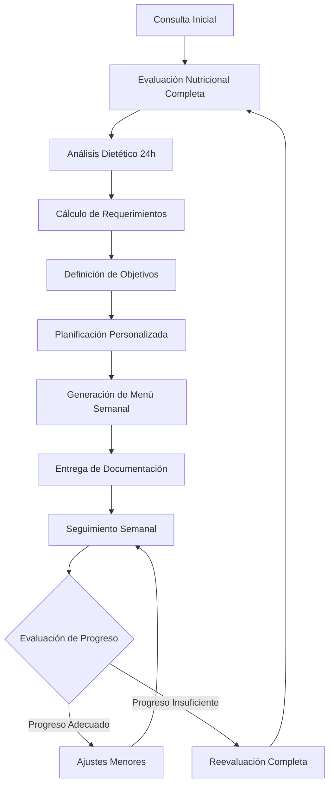

# Plan de Transformación: Módulo de Nutrición Especializado

## Visión General
Transformar el módulo de nutrición existente en una herramienta integral diseñada específicamente para nutricionistas/dietistas, con flujos de trabajo especializados, documentación estandarizada y herramientas de análisis nutricional avanzadas.

## Análisis del Estado Actual

### Componentes Existentes
1. **EvaluaciónNutricional.tsx** - Formulario básico de antropometría y hábitos
2. **PlanNutricional.tsx** - Planificación de comidas con distribución básica
3. **SeguimientoNutricional.tsx** - Seguimiento de peso y cumplimiento
4. **CalculadoraNutricional.tsx** - Cálculos básicos de nutrientes
5. **Base de datos de alimentos** - 100+ alimentos con información nutricional
6. **Planes nutricionales precargados** - Plantillas básicas

### Limitaciones Identificadas
- Flujo de trabajo genérico, no específico para nutricionistas
- Falta de documentación estandarizada (SOCHINUT, AND)
- Interfaz no optimizada para consultas rápidas
- Análisis nutricional limitado
- Sin soporte para dietas especializadas
- Falta de herramientas educativas para pacientes

## Objetivos de Transformación

### 1. Flujo de Trabajo Específico para Nutricionistas
Diseñar un flujo que refleje el proceso real de consulta nutricional:
1. Evaluación inicial completa
2. Análisis dietético detallado
3. Planificación personalizada
4. Seguimiento y ajustes
5. Documentación profesional

### 2. Sistema de Documentación Nutricional Estándar
Crear plantillas que cumplan con estándares profesionales:
- Valoración nutricional SOCHINUT
- Plan de alimentación personalizado
- Informes de progreso
- Material educativo para pacientes

### 3. Interfaz Centrada en el Dietista
Diseño UX/UI que optimice:
- Consultas rápidas durante sesiones
- Acceso rápido a información relevante
- Visualización clara de datos nutricionales
- Experiencia móvil/tablet para food logging

### 4. Herramientas de Análisis Nutricional Avanzadas
- Base de datos ampliada (500+ alimentos)
- Análisis de recetas y platos combinados
- Cálculo automático de macronutrientes
- Seguimiento de micronutrientes esenciales

### 5. Sistema de Planificación Dietética
- Planes personalizados por objetivos (pérdida de peso, ganancia muscular, mantenimiento)
- Soporte para dietas especializadas (keto, mediterránea, vegetariana, etc.)
- Generación automática de menús semanales
- Listas de compras personalizadas

### 6. Seguimiento de Progreso Integral
- Registro de medidas corporales
- Diario de alimentos con análisis
- Fotos de progreso
- Gráficos de evolución

### 7. Materiales Educativos
- Recursos para pacientes
- Guías de alimentación
- Recetas saludables
- Planes de educación nutricional

## Arquitectura Técnica

### Estructura de Módulo Mejorada
```
src/modules/nutricion/
├── index.ts                          # Exportaciones principales
├── components/
│   ├── dashboard/                    # Dashboard nutricional
│   │   ├── NutricionDashboard.tsx    # Vista principal
│   │   ├── ResumenPaciente.tsx       # Resumen rápido
│   │   └── AlertasNutricionales.tsx  # Alertas automáticas
│   ├── evaluacion/                   # Evaluación completa
│   │   ├── EvaluacionCompleta.tsx    # Evaluación integral
│   │   ├── AntropometriaAvanzada.tsx # Medidas detalladas
│   │   ├── HabitosAlimentarios.tsx   # Análisis de hábitos
│   │   └── HistorialMedico.tsx       # Historial médico-nutricional
│   ├── analisis/                     # Análisis nutricional
│   │   ├── AnalisisDietetico.tsx     # Análisis de dieta actual
│   │   ├── CalculadoraAvanzada.tsx   # Cálculos avanzados
│   │   ├── ComparativaNutricional.tsx# Comparación de planes
│   │   └── GraficosNutricionales.tsx # Visualización de datos
│   ├── planificacion/                # Planificación dietética
│   │   ├── PlanificadorComidas.tsx   # Planificador interactivo
│   │   ├── GeneradorMenus.tsx        # Generador de menús
│   │   ├── EditorRecetas.tsx         # Editor de recetas
│   │   └── ListaCompras.tsx          # Lista de compras
│   ├── seguimiento/                  # Seguimiento
│   │   ├── DiarioAlimentos.tsx       # Diario de alimentos móvil
│   │   ├── RegistroProgreso.tsx      # Registro de medidas
│   │   ├── GaleriaFotos.tsx          # Fotos de progreso
│   │   └── ReportesEvolucion.tsx     # Reportes de evolución
│   ├── documentos/                   # Documentación
│   │   ├── PlantillasDocumentos.tsx  # Plantillas estandarizadas
│   │   ├── GeneradorInformes.tsx     # Generador de informes
│   │   ├── MaterialEducativo.tsx     # Material para pacientes
│   │   └── Consentimientos.tsx       # Consentimientos informados
│   └── especialidades/               # Especialidades nutricionales
│       ├── NutricionClinica.tsx      # Nutrición clínica
│       ├── NutricionDeportiva.tsx    # Nutrición deportiva
│       ├── NutricionPediatrica.tsx   # Nutrición pediátrica
│       └── DietasEspecializadas.tsx  # Dietas especiales
├── data/
│   ├── alimentos/                    # Base de datos de alimentos
│   │   ├── alimentosNutricionales.ts # Alimentos básicos (500+)
│   │   ├── recetasPrecargadas.ts     # Recetas saludables
│   │   ├── combinacionesAlimentos.ts # Combinaciones comunes
│   │   └── equivalenciasPorciones.ts # Equivalencias de porciones
│   ├── planes/                       # Planes nutricionales
│   │   ├── planesPorObjetivo.ts      # Planes por objetivo
│   │   ├── dietasEspecializadas.ts   # Dietas keto, mediterránea, etc.
│   │   ├── menusSemanal.ts           # Menús semanales
│   │   └── plantillasPlanes.ts       # Plantillas reutilizables
│   ├── estandares/                   # Estándares profesionales
│   │   ├── estandaresSOCHINUT.ts     # Estándares SOCHINUT
│   │   ├── requerimientosDRI.ts      # Requerimientos DRI
│   │   ├── guiasAlimentarias.ts      # Guías alimentarias
│   │   └── protocolosEvaluacion.ts   # Protocolos de evaluación
│   └── educativos/                   # Material educativo
│       ├── guiasPacientes.ts         # Guías para pacientes
│       ├── infografias.ts            # Infografías
│       ├── recetasEducativas.ts      # Recetas con explicaciones
│       └── planesEducacion.ts        # Planes de educación
├── hooks/
│   ├── useEvaluacionNutricional.ts   # Hook para evaluación
│   ├── useAnalisisDietetico.ts       # Hook para análisis
│   ├── usePlanificacionComidas.ts    # Hook para planificación
│   ├── useSeguimientoProgreso.ts     # Hook para seguimiento
│   └── useBaseDatosAlimentos.ts      # Hook para alimentos
├── utils/
│   ├── calculosNutricionales.ts      # Cálculos nutricionales
│   ├── analisisDietetico.ts          # Análisis de dietas
│   ├── generacionPlanes.ts           # Generación de planes
│   └── estandaresProfesionales.ts    # Utilidades estándar
└── types/
    └── tiposNutricion.ts             # Tipos específicos de nutrición
```

### Tipos de Datos Ampliados
```typescript
export interface EvaluacionNutricionalCompleta {
  // Datos demográficos y clínicos
  datosPaciente: {
    edad: number;
    sexo: 'masculino' | 'femenino';
    actividadFisica: 'sedentario' | 'ligero' | 'moderado' | 'activo' | 'muy_activo';
    condicionesMedicas: string[];
    medicamentos: string[];
    objetivos: string[];
  };
  
  // Antropometría avanzada
  antropometria: {
    peso: number;
    talla: number;
    imc: number;
    clasificacionIMC: string;
    circunferencias: {
      cintura: number;
      cadera: number;
      brazo: number;
      muslo: number;
    };
    plieguesCutaneos: {
      tricipital: number;
      bicipital: number;
      subescapular: number;
      suprailiaco: number;
      abdominal: number;
      muslo: number;
      pantorrilla: number;
    };
    composicionCorporal: {
      masaGrasa: number;
      masaMagra: number;
      aguaCorporal: number;
      masaOsea: number;
    };
  };
  
  // Hábitos alimentarios detallados
  habitosAlimentarios: {
    frecuenciaComidas: number;
    horariosRegulares: boolean;
    consumoAgua: number; // litros/día
    consumoFrutasVerduras: number; // porciones/día
    consumoAlcohol: number; // unidades/semana
    consumoAzucares: number; // cucharadas/día
    consumoSal: number; // gramos/día
    preferencias: string[];
    aversiones: string[];
    alergias: string[];
    intolerancias: string[];
  };
  
  // Análisis dietético 24h
  registroDietetico24h: {
    desayuno: AlimentoConsumido[];
    colacionManana: AlimentoConsumido[];
    comida: AlimentoConsumido[];
    colacionTarde: AlimentoConsumido[];
    cena: AlimentoConsumido[];
    colacionNoche: AlimentoConsumido[];
  };
  
  // Evaluación clínica
  evaluacionClinica: {
    sintomasDigestivos: string[];
    sintomasGenerales: string[];
    examenesLaboratorio: {
      glucosa: number;
      hemoglobinaGlicosilada: number;
      perfilLipidico: {
        colesterolTotal: number;
        hdl: number;
        ldl: number;
        trigliceridos: number;
      };
      funcionRenal: {
        creatinina: number;
        urea: number;
      };
      funcionHepatica: {
        transaminasas: number[];
        bilirrubina: number;
      };
    };
  };
}

export interface PlanNutricionalPersonalizado {
  // Requerimientos calculados
  requerimientos: {
    calorias: {
      total: number;
      mantenimiento: number;
      objetivo: number;
      deficitSuperavit: number;
    };
    macronutrientes: {
      proteinas: { gramos: number; porcentaje: number };
      carbohidratos: { gramos: number; porcentaje: number };
      grasas: { gramos: number; porcentaje: number };
      fibra: { gramos: number };
    };
    micronutrientes: {
      vitaminas: { [vitamina: string]: number };
      minerales: { [mineral: string]: number };
    };
  };
  
  // Distribución de comidas
  distribucionComidas: {
    desayuno: { hora: string; calorias: number; descripcion: string };
    colacionManana: { hora: string; calorias: number; descripcion: string };
    comida: { hora: string; calorias: number; descripcion: string };
    colacionTarde: { hora: string; calorias: number; descripcion: string };
    cena: { hora: string; calorias: number; descripcion: string };
    colacionNoche?: { hora: string; calorias: number; descripcion: string };
  };
  
  // Menú semanal detallado
  menuSemanal: {
    lunes: { [comida: string]: PlatoDetallado[] };
    martes: { [comida: string]: PlatoDetallado[] };
    miercoles: { [comida: string]: PlatoDetallado[] };
    jueves: { [comida: string]: PlatoDetallado[] };
    viernes: { [comida: string]: PlatoDetallado[] };
    sabado: { [comida: string]: PlatoDetallado[] };
    domingo: { [comida: string]: PlatoDetallado[] };
  };
  
  // Recomendaciones específicas
  recomendaciones: {
    generales: string[];
    porComida: { [comida: string]: string[] };
    suplementacion?: string[];
    hidratacion: string[];
    actividadFisica: string[];
  };
  
  // Lista de compras
  listaCompras: {
    frutasVerduras: string[];
    proteinas: string[];
    carbohidratos: string[];
    grasasSaludables: string[];
    lacteos: string[];
    condimentos: string[];
    otros: string[];
  };
}
```

## Flujo de Trabajo Nutricional



## Plan de Implementación por Fases

### Fase 1: Fundamentos (Semanas 1-2)
- [ ] **Actualizar estructura de módulo**
  - Reorganizar componentes en subdirectorios especializados
  - Actualizar `index.ts` con nuevas exportaciones
  - Crear tipos de datos ampliados

- [ ] **Mejorar base de datos de alimentos**
  - Ampliar a 500+ alimentos con información completa
  - Agregar recetas precargadas
  - Implementar sistema de búsqueda avanzada

- [ ] **Actualizar evaluación nutricional**
  - Implementar evaluación completa SOCHINUT
  - Agregar antropometría avanzada
  - Incluir análisis de hábitos detallado

### Fase 2: Herramientas de Análisis (Semanas 3-4)
- [ ] **Desarrollar análisis dietético**
  - Análisis de registro 24h
  - Cálculo automático de nutrientes
  - Comparativa con requerimientos

- [ ] **Implementar calculadora avanzada**
  - Cálculos de requerimientos personalizados
  - Estimación de composición corporal
  - Análisis de progreso

- [ ] **Crear sistema de planificación**
  - Generador de planes personalizados
  - Editor de menús semanales
  - Lista de compras automática

### Fase 3: Interfaz y Experiencia (Semanas 5-6)
- [ ] **Diseñar dashboard nutricional**
  - Vista resumen de paciente
  - Alertas nutricionales automáticas
  - Acceso rápido a herramientas

- [ ] **Optimizar para móvil/tablet**
  - Diario de alimentos móvil
  - Consultas rápidas durante sesiones
  - Experiencia táctil optimizada

- [ ] **Implementar sistema de documentos**
  - Plantillas estandarizadas SOCHINUT
  - Generador de informes profesionales
  - Material educativo para pacientes

### Fase 4: Especializaciones (Semanas 7-8)
- [ ] **Desarrollar módulo de nutrición clínica**
  - Soporte para condiciones médicas
  - Interacciones alimento-medicamento
  - Protocolos especializados

- [ ] **Implementar nutrición deportiva**
  - Cálculos para atletas
  - Timing nutricional
  - Suplementación

- [ ] **Crear sistema de dietas especializadas**
  - Keto, mediterránea, vegetariana
  - Planes por restricciones alimentarias
  - Adaptaciones culturales

### Fase 5: Integración y Optimización (Semanas 9-10)
- [ ] **Integrar con sistema principal**
  - Sincronización con agenda de citas
  - Integración con historial médico
  - Compatibilidad con sistema de facturación
- [ ] **Implementar análisis avanzado**
  - Machine learning para recomendaciones
  - Predicción de progreso
  - Detección de patrones alimentarios
- [ ] **Optimizar rendimiento**
  - Caché de alimentos frecuentes
  - Indexación de búsqueda
  - Optimización de consultas nutricionales
- [ ] **Pruebas y validación**
  - Pruebas con nutricionistas reales
  - Validación de cálculos nutricionales
  - Ajustes basados en feedback

## Diseño de Interfaz Centrada en el Dietista

### Principios de Diseño UX
1. **Eficiencia en Consultas**
   - Acceso rápido a herramientas frecuentes
   - Plantillas reutilizables
   - Atajos de teclado para nutricionistas
2. **Visualización Clara**
   - Gráficos nutricionales intuitivos
   - Código de colores para grupos alimentarios
   - Indicadores visuales de progreso
3. **Experiencia Móvil Primero**
   - Diario de alimentos optimizado para móvil
   - Escaneo de códigos de barras
   - Reconocimiento de voz para registro rápido
4. **Personalización Profesional**
   - Configuración de preferencias por nutricionista
   - Plantillas personalizables
   - Flujos de trabajo adaptables

### Componentes de Interfaz Clave
1. **Dashboard Nutricional**
   - Resumen visual del paciente
   - Alertas nutricionales prioritarias
   - Acceso rápido a herramientas principales
2. **Editor de Planes Nutricionales**
   - Arrastrar y soltar alimentos
   - Vista previa en tiempo real
   - Ajuste automático de porciones
3. **Diario de Alimentos Móvil**
   - Búsqueda por voz/cámara
   - Escaneo de códigos de barras
   - Recordatorios de comidas
4. **Visualizador de Progreso**
   - Gráficos de tendencias
   - Comparación de fotos
   - Análisis de cumplimiento

## Herramientas de Análisis Nutricional Avanzadas

### Base de Datos de Alimentos Mejorada
- **500+ alimentos** con información completa
- **Recetas precargadas** con análisis nutricional
- **Equivalencias de porciones** (tazas, gramos, piezas)
- **Índice glucémico** y carga glucémica
- **Alérgenos comunes** marcados
- **Información de sostenibilidad** (huella de carbono)

### Sistema de Análisis Dietético
1. **Análisis de Registro 24h**
   - Identificación de patrones alimentarios
   - Detección de deficiencias nutricionales
   - Comparación con guías alimentarias
2. **Cálculo de Requerimientos**
   - Fórmulas personalizadas (Harris-Benedict, Mifflin-St Jeor)
   - Ajuste por actividad física
   - Consideración de condiciones médicas
3. **Análisis de Macronutrientes**
   - Distribución óptima por objetivo
   - Timing nutricional para deportistas
   - Ajuste para dietas especializadas

### Sistema de Planificación de Comidas
1. **Generador de Planes Personalizados**
   - Basado en objetivos (pérdida de peso, ganancia muscular)
   - Consideración de preferencias y restricciones
   - Adaptación a presupuesto y disponibilidad
2. **Editor de Menús Semanales**
   - Variedad automática de alimentos
   - Balance nutricional por día
   - Lista de compras generada automáticamente
3. **Biblioteca de Recetas**
   - Recetas saludables categorizadas
   - Análisis nutricional por porción
   - Instrucciones paso a paso con imágenes

## Sistema de Documentación Nutricional Estándar

### Plantillas Profesionales
1. **Valoración Nutricional SOCHINUT**
   - Formato estandarizado
   - Secciones obligatorias
   - Firmas digitales
2. **Plan de Alimentación Personalizado**
   - Menú semanal detallado
   - Recomendaciones específicas
   - Lista de compras
3. **Informes de Progreso**
   - Evolución de medidas
   - Análisis de cumplimiento
   - Recomendaciones de ajuste
4. **Material Educativo**
   - Guías de alimentación
   - Recetas saludables
   - Planes de educación nutricional

### Generador de Documentos
- **Exportación a PDF/Word**
- **Personalización de logotipos**
- **Firmas digitales integradas**
- **Almacenamiento en historial del paciente**

## Especializaciones Nutricionales

### Nutrición Clínica
- **Protocolos para condiciones médicas** (diabetes, hipertensión, renal)
- **Interacciones alimento-medicamento**
- **Recomendaciones para procedimientos médicos**
- **Soporte para nutrición enteral/parenteral**

### Nutrición Deportiva
- **Cálculos para atletas** (gasto energético, requerimientos proteicos)
- **Timing nutricional** (pre/post entrenamiento)
- **Hidratación y electrolitos**
- **Suplementación deportiva**

### Nutrición Pediátrica
- **Curvas de crecimiento** (OMS)
- **Alimentación complementaria**
- **Prevención de alergias**
- **Educación alimentaria familiar**

### Dietas Especializadas
- **Keto** (cálculo de cetosis, monitoreo)
- **Mediterránea** (pirámide alimentaria)
- **Vegetariana/Vegana** (suplementación B12, hierro)
- **Low FODMAP** (alimentos permitidos/restringidos)

## Roadmap de Transformación Completo

### Fase 1: Cimientos (Semanas 1-2)
**Objetivo:** Establecer estructura base y datos fundamentales
- [ ] Reorganizar estructura de módulo
- [ ] Ampliar base de datos de alimentos (500+)
- [ ] Implementar tipos de datos ampliados
- [ ] Crear evaluación nutricional SOCHINUT

### Fase 2: Análisis (Semanas 3-4)
**Objetivo:** Desarrollar herramientas de análisis avanzadas
- [ ] Implementar análisis dietético 24h
- [ ] Crear calculadora nutricional avanzada
- [ ] Desarrollar sistema de planificación básico
- [ ] Integrar visualizaciones de datos

### Fase 3: Experiencia (Semanas 5-6)
**Objetivo:** Optimizar interfaz y experiencia de usuario
- [ ] Diseñar dashboard nutricional
- [ ] Desarrollar diario de alimentos móvil
- [ ] Implementar sistema de documentos
- [ ] Optimizar para tablet/móvil

### Fase 4: Especialización (Semanas 7-8)
**Objetivo:** Agregar funcionalidades especializadas
- [ ] Desarrollar módulo de nutrición clínica
- [ ] Implementar nutrición deportiva
- [ ] Crear sistema de dietas especializadas
- [ ] Agregar nutrición pediátrica

### Fase 5: Integración (Semanas 9-10)
**Objetivo:** Integrar y optimizar sistema completo
- [ ] Integrar con sistema principal de SaludValpa
- [ ] Implementar análisis predictivo (ML)
- [ ] Optimizar rendimiento y escalabilidad
- [ ] Realizar pruebas con nutricionistas reales

### Fase 6: Lanzamiento y Mejora Continua (Semanas 11-12)
**Objetivo:** Lanzar y recoger feedback para mejoras
- [ ] Lanzamiento beta con nutricionistas seleccionados
- [ ] Recopilar feedback y métricas de uso
- [ ] Implementar mejoras basadas en feedback
- [ ] Documentación completa y capacitación

## Métricas de Éxito

### Para Nutricionistas
- **Reducción del tiempo de consulta** en 30%
- **Aumento de la satisfacción** con herramientas en 40%
- **Mejora en la adherencia del paciente** en 25%
- **Reducción de errores en cálculos** en 90%

### Para Pacientes
- **Mejora en el cumplimiento** del plan nutricional en 35%
- **Aumento en la comprensión** de recomendaciones en 50%
- **Mejora en resultados de salud** (peso, medidas, marcadores) en 20%

### Técnicas
- **Tiempo de carga** de herramientas < 2 segundos
- **Disponibilidad** del sistema > 99.5%
- **Escalabilidad** para 1000+ nutricionistas simultáneos

## Recursos Requeridos

### Equipo de Desarrollo
- **2 desarrolladores Frontend** (React/TypeScript)
- **1 desarrollador Backend** (Node.js/Base de datos)
- **1 diseñador UX/UI** especializado en salud
- **1 nutricionista asesor** (consultor de dominio)

### Infraestructura Técnica
- **Base de datos** optimizada para consultas nutricionales
- **API de alimentos** para expansión continua
- **Servidores** para procesamiento de análisis
- **CDN** para entrega de contenido educativo

### Contenido y Datos
- **Licencias** de bases de datos nutricionales
- **Contenido educativo** creado por nutricionistas
- **Plantillas** validadas por asociaciones profesionales
- **Recetas** desarrolladas por chefs nutricionales

## Riesgos y Mitigación

### Riesgo 1: Complejidad de Cálculos Nutricionales
- **Mitigación:** Validación con múltiples fuentes, pruebas con casos extremos

### Riesgo 2: Resistencia al Cambio de Nutricionistas
- **Mitigación:** Capacitación gradual, demostraciones prácticas, soporte continuo

### Riesgo 3: Precisión de Base de Datos de Alimentos
- **Mitigación:** Múltiples fuentes verificadas, sistema de reporte de errores, actualizaciones periódicas

### Riesgo 4: Rendimiento con Grandes Volúmenes de Datos
- **Mitigación:** Indexación avanzada, caché estratégico, arquitectura escalable

## Conclusión

La transformación del módulo de nutrición de SaludValpa creará una herramienta integral diseñada específicamente para nutricionistas, que no solo automatizará tareas repetitivas sino que también mejorará la calidad de la atención al paciente. Al seguir este plan, lograremos:

1. **Un flujo de trabajo optimizado** que refleje la práctica real de nutricionistas
2. **Herramientas de análisis avanzadas** que proporcionen insights valiosos
3. **Una experiencia de usuario excepcional** tanto para nutricionistas como pacientes
4. **Documentación profesional** que cumpla con estándares internacionales
5. **Especializaciones flexibles** que se adapten a diferentes prácticas nutricionales

Este módulo transformado posicionará a SaludValpa como la plataforma líder para profesionales de la nutrición en Latinoamérica, ofreciendo una experiencia verdaderamente diseñada por y para nutricionistas.