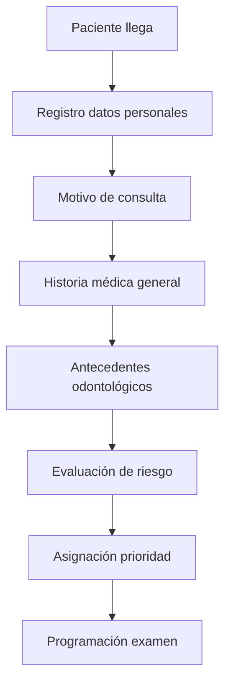
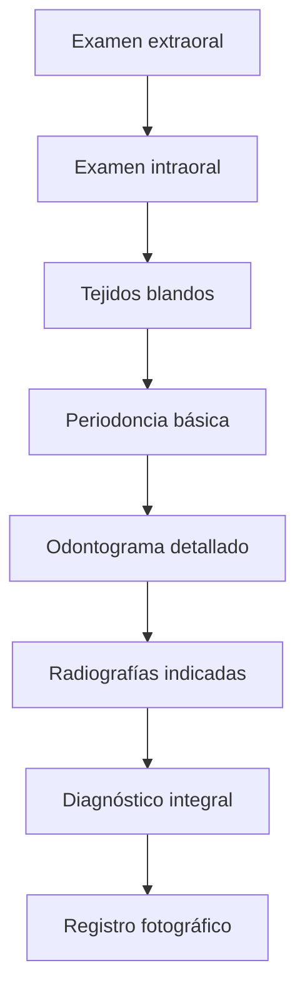
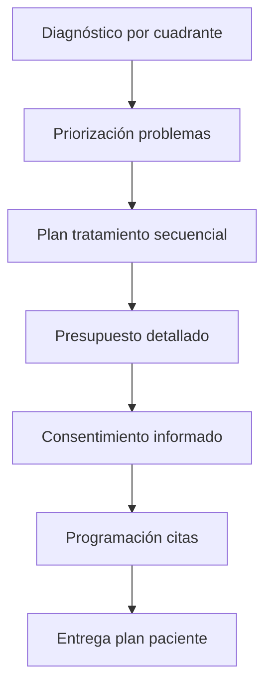
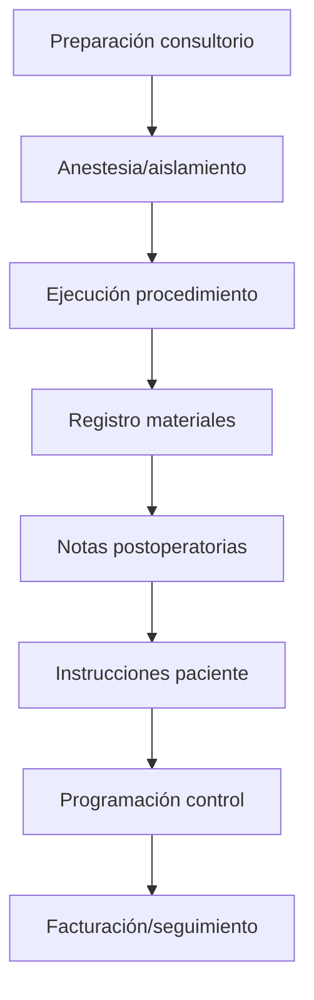
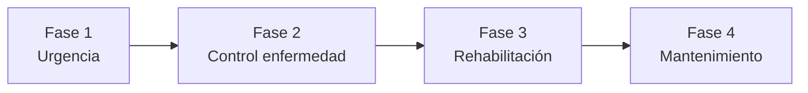

# Plan de Transformación: Módulo de Odontología Especializado

## Visión General
Transformar el módulo de odontología existente en una herramienta integral diseñada específicamente para dentistas, con flujos de trabajo clínicos especializados, documentación dental estandarizada, odontograma avanzado y gestión completa de la práctica odontológica.

## Análisis del Estado Actual

### Componentes Existentes
1. **CamposOdontologia.tsx** - Componente principal con navegación por pestañas
2. **HistoriaClinicaOdontologica.tsx** - Formulario básico de historia clínica
3. **OdontogramaSVG.tsx** - Odontograma interactivo con sistema FDI
4. **PiezaDental.tsx** - Componente individual de pieza dental
5. **EstadoDental.tsx** - Leyenda y estados dentales
6. **Base de datos CDT** - 400+ códigos dentales organizados por categoría
7. **Base de procedimientos** - Procedimientos dentales con costos y duraciones
8. **Base de materiales** - Materiales dentales con inventario básico

### Fortalezas Actuales
- Odontograma interactivo funcional con sistema FDI
- Base de datos CDT completa y organizada
- Estructura modular bien definida
- Integración con tipos de datos existentes
- Navegación por secciones (historia, odontograma, tratamiento, documentos)

### Limitaciones Identificadas
- Flujo de trabajo genérico, no específico para consulta dental
- Falta de documentación estandarizada (formatos ADA, SOED)
- Interfaz no optimizada para uso durante procedimientos
- Odontograma básico sin anotaciones avanzadas
- Sin planificación de tratamiento secuencial
- Gestión de inventario limitada
- Sin integración con radiología/imágenes
- Falta de optimización móvil/tablet para uso en consultorio

## Objetivos de Transformación

### 1. Flujo de Trabajo Específico para Dentistas
Diseñar un flujo que refleje el proceso real de consulta odontológica:
1. Recepción y triage del paciente
2. Historia clínica odontológica completa
3. Examen clínico y diagnóstico
4. Odontograma detallado con anotaciones
5. Plan de tratamiento secuencial
6. Presupuesto y consentimiento informado
7. Ejecución de procedimientos
8. Seguimiento y recordatorios

### 2. Sistema de Documentación Dental Estándar
Crear plantillas que cumplan con estándares profesionales:
- Historia clínica odontológica (formato ADA/SOED)
- Odontograma profesional con leyenda estandarizada
- Plan de tratamiento secuencial
- Presupuesto dental detallado
- Consentimiento informado por procedimiento
- Notas de evolución SOAP
- Informes radiográficos

### 3. Interfaz Centrada en el Dentista
Diseño UX/UI que optimice:
- Consultas rápidas durante procedimientos
- Acceso rápido a códigos CDT y materiales
- Visualización clara del odontograma
- Experiencia móvil/tablet para uso con guantes
- Integración con equipos dentales (radiografía, cámara intraoral)

### 4. Odontograma Avanzado y Planificación de Tratamiento
- Odontograma interactivo con múltiples capas (caries, restauraciones, periodoncia)
- Anotaciones por superficie dental (oclusal, mesial, distal, vestibular, lingual)
- Plan de tratamiento secuencial con fases
- Cálculo automático de costos y tiempos
- Integración con códigos CDT

### 5. Gestión de Práctica Odontológica
- Inventario de materiales dentales con alertas de stock bajo
- Gestión de proveedores y pedidos
- Programación de citas con bloques de tiempo por procedimiento
- Recordatorios automáticos (control, higiene, mantenimiento)
- Integración con sistemas de pago y seguros

## Flujo de Trabajo Clínico Odontológico

### Fase 1: Recepción y Evaluación Inicial


### Fase 2: Examen Clínico Completo


### Fase 3: Diagnóstico y Planificación


### Fase 4: Ejecución y Seguimiento


## Sistema de Documentación Dental

### 1. Historia Clínica Odontológica Estándar
**Secciones requeridas:**
- Datos identificativos del paciente
- Motivo de consulta e historia de la enfermedad actual
- Antecedentes médicos generales
- Antecedentes odontológicos
- Examen extraoral e intraoral
- Odontograma completo
- Diagnósticos (caries, periodontal, oclusal, otros)
- Plan de tratamiento
- Pronóstico
- Consentimientos

### 2. Odontograma Profesional
**Características:**
- Sistema FDI con numeración internacional
- Símbolos estandarizados (ISO 3950)
- Anotaciones por superficie dental
- Códigos de color para diferentes condiciones
- Capas separadas (caries, restauraciones, prótesis)
- Exportación en alta resolución
- Historial de cambios

### 3. Plan de Tratamiento Secuencial
**Estructura:**
- **Fase 1:** Urgencia y alivio del dolor
- **Fase 2:** Control de infección y enfermedad
- **Fase 3:** Rehabilitación y restauración
- **Fase 4:** Mantenimiento y prevención

**Por procedimiento:**
- Código CDT
- Descripción detallada
- Piezas/superficies involucradas
- Costo estimado
- Tiempo requerido
- Materiales necesarios
- Prioridad clínica

### 4. Documentos Legales y Administrativos
- Consentimiento informado por procedimiento
- Presupuesto detallado con opciones de pago
- Autorización de seguros
- Notas de evolución SOAP
- Certificados e informes
- Recetas médicas (analgésicos, antibióticos)

## Diseño de Interfaz Centrada en el Dentista

### Principios de Diseño
1. **Eficiencia clínica:** Acceso rápido a funciones frecuentes
2. **Hygiene-friendly:** Uso con guantes, fácil limpieza
3. **Context-awareness:** Información relevante según etapa del procedimiento
4. **Minimal interruption:** Flujo continuo durante procedimientos
5. **Visual clarity:** Odontograma claro, colores estandarizados

### Layout Principal
**Zona 1: Barra de herramientas clínica**
- Accesos rápidos a: Odontograma, CDT, Materiales, Radiografías
- Temporizador de procedimiento
- Estado del paciente (alergias, alertas)

**Zona 2: Área de trabajo principal**
- Odontograma interactivo (70% del espacio)
- Panel de anotaciones y diagnósticos
- Visualización de imágenes radiográficas

**Zona 3: Panel de procedimientos**
- Lista de procedimientos planificados
- Materiales seleccionados
- Costos y tiempos acumulados
- Botones de acción (iniciar, pausar, finalizar)

**Zona 4: Notas y documentación**
- Notas SOAP rápidas
- Plantillas de documentos
- Instrucciones postoperatorias

### Optimización para Tablet/Móvil
- Interfaz táctil con botones grandes
- Modo "quirófano" (pantalla simplificada)
- Comandos por voz (hands-free)
- Integración con pedal dental
- Sincronización en tiempo real con asistente

## Odontograma Avanzado

### Mejoras al Sistema Actual
1. **Capas múltiples:**
   - Capa de caries (superficies afectadas)
   - Capa de restauraciones (material, fecha)
   - Capa periodontal (bolsas, recesiones)
   - Capa de movilidad (grados 1-3)
   - Capa de prótesis (tipo, retención)

2. **Sistema de anotaciones:**
   - Anotaciones por superficie (oclusal, mesial, distal, vestibular, lingual)
   - Símbolos estandarizados ISO 3950
   - Notas de texto libre por pieza
   - Adjuntar imágenes/fotografías

3. **Herramientas de diagnóstico:**
   - Sonda periodontal virtual
   - Medición de bolsas
   - Evaluación de movilidad
   - Índices de placa y sangrado

4. **Funcionalidades avanzadas:**
   - Comparativa con odontogramas anteriores
   - Proyección de tratamiento (simulación "after")
   - Cálculo automático de índices (CPITN, DMFT)
   - Exportación en formatos profesionales (PDF, DICOM)

### Integración con Códigos CDT
- Selección de procedimientos desde el odontograma
- Asignación automática de códigos por superficie tratada
- Cálculo de costos basado en superficies/piezas
- Generación automática de presupuesto

## Planificación de Tratamiento

### Sistema de Secuenciación
**Niveles de prioridad:**
1. **Urgente:** Dolor, infección, trauma
2. **Alta:** Enfermedad activa, riesgo alto
3. **Media:** Restauraciones necesarias
4. **Baja:** Estética, electivos
5. **Mantenimiento:** Prevención, controles

**Fases de tratamiento:**


### Herramientas de Planificación
1. **Calculadora de tiempos:**
   - Estimación realista por procedimiento
   - Bloques de tiempo en agenda
   - Consideración de dificultad (simple, complejo, quirúrgico)

2. **Calculadora de costos:**
   - Costos por procedimiento (CDT)
   - Costos de materiales
   - Descuentos por paquetes
   - Opciones de financiamiento

3. **Generador de presupuesto:**
   - Formatos profesionales
   - Desglose por fases
   - Opciones de pago
   - Integración con seguros

## Gestión de Inventario y Materiales

### Sistema de Inventario Avanzado
**Categorías de materiales:**
- Restauradores (composites, amalgama, ionómeros)
- Endodoncia (gutapercha, cementos, limas)
- Periodoncia (injertos, membranas)
- Cirugía (suturas, anestésicos)
- Prótesis (acrylic, metales, cerámicas)
- Higiene (cepillos, pastas, enjuagues)
- Desinfectantes y consumibles

**Funcionalidades:**
- Control de stock con niveles mínimo/máximo
- Alertas automáticas de reposición
- Historial de uso por procedimiento
- Costeo por procedimiento
- Gestión de proveedores y pedidos
- Caducidad y lotes

### Integración con Procedimientos
- Sugerencia automática de materiales por procedimiento
- Cálculo de consumo estimado
- Registro automático de materiales utilizados
- Impacto en costos en tiempo real

## Integración con Radiología e Imágenes

### Sistema de Gestión de Imágenes Dentales (DICOM)
**Tipos de imágenes soportadas:**
- Radiografías periapicales
- Radiografías bite-wing
- Radiografías oclusales
- Panoramas (OPG)
- TAC dental (CBCT)
- Fotografías intraorales
- Modelos 3D (STL)

**Funcionalidades:**
- Visualizador DICOM con herramientas de medición
- Anotaciones en imágenes
- Comparativa lado a lado (antes/después)
- Almacenamiento en la nube
- Compartición segura con especialistas
- Integración con odontograma (click en pieza → ver radiografía)

### Flujo de Trabajo con Imágenes
1. Captura de imagen (cámara intraoral, radiografía)
2. Procesamiento automático (mejora, medición)
3. Anotación y diagnóstico
4. Asociación con piezas dentales
5. Almacenamiento en historia clínica
6. Uso en planificación de tratamiento

## Optimización para Dispositivos Móviles

### Modo "Consulta Activa"
**Características:**
- Interfaz simplificada para uso con guantes
- Botones grandes y espaciados
- Navegación por gestos
- Comandos de voz
- Integración con pedal dental

### Funcionalidades Móviles Específicas
1. **Tablet en consultorio:**
   - Odontograma táctil durante examen
   - Registro rápido de hallazgos
   - Captura de fotografías intraorales
   - Firma digital de consentimientos

2. **App para paciente:**
   - Recordatorios de citas
   - Instrucciones postoperatorias
   - Formularios pre-consulta
   - Comunicación segura con consultorio

3. **App para asistente:**
   - Gestión de agenda
   - Control de inventario
   - Preparación de consultorio
   - Soporte durante procedimientos

## Plan de Implementación por Fases

### Fase 1: Fundamentos (Semanas 1-2)
**Objetivo:** Establecer estructura base y flujo de trabajo
- [ ] Diseñar flujo de trabajo clínico completo
- [ ] Crear tipos de datos extendidos para odontología
- [ ] Implementar navegación por etapas clínicas
- [ ] Mejorar interfaz base con principios dentales

### Fase 2: Odontograma Avanzado (Semanas 3-4)
**Objetivo:** Transformar odontograma en herramienta profesional
- [ ] Implementar capas múltiples en odontograma
- [ ] Agregar anotaciones por superficie dental
- [ ] Integrar con códigos CDT
- [ ] Crear herramientas de diagnóstico virtual
- [ ] Implementar exportación profesional

### Fase 3: Planificación de Tratamiento (Semanas 5-6)
**Objetivo:** Sistema completo de planificación secuencial
- [ ] Implementar sistema de prioridades y fases
- [ ] Crear calculadora de tiempos y costos
- [ ] Desarrollar generador de presupuestos
- [ ] Implementar consentimientos informados
- [ ] Crear sistema de programación por bloques

### Fase 4: Documentación Estándar (Semanas 7-8)
**Objetivo:** Sistema completo de documentación dental
- [ ] Crear plantillas de historia clínica ADA/SOED
- [ ] Implementar generador de documentos PDF
- [ ] Desarrollar sistema de notas SOAP
- [ ] Crear formatos de informes e certificados
- [ ] Implementar firma digital

### Fase 5: Gestión de Práctica (Semanas 9-10)
**Objetivo:** Herramientas de gestión integral
- [ ] Implementar sistema de inventario avanzado
- [ ] Crear gestión de proveedores y pedidos
- [ ] Desarrollar sistema de recordatorios automáticos
- [ ] Implementar integración con seguros
- [ ] Crear reportes financieros y clínicos
- [ ] Implementar dashboard de práctica

### Fase 6: Integración e Imágenes (Semanas 11-12)
**Objetivo:** Sistema completo de imágenes y optimización móvil
- [ ] Implementar visor DICOM básico
- [ ] Crear gestión de imágenes dentales
- [ ] Desarrollar optimización para tablet/móvil
- [ ] Implementar modo "quirófano"
- [ ] Crear app para paciente/asistente
- [ ] Realizar pruebas de usabilidad con dentistas

## Arquitectura Técnica

### Estructura de Componentes
```
src/modules/odontologia/
├── components/
│   ├── clinical/
│   │   ├── DentalWorkflowNavigator.tsx      # Navegación por etapas clínicas
│   │   ├── PatientIntakeForm.tsx            # Recepción y triage
│   │   ├── ClinicalExamWizard.tsx           # Examen clínico guiado
│   │   ├── AdvancedOdontogram.tsx           # Odontograma con capas múltiples
│   │   ├── TreatmentPlanner.tsx             # Planificador de tratamiento
│   │   └── ProcedureExecutor.tsx            # Ejecutor de procedimientos
│   ├── documentation/
│   │   ├── DentalHistoryGenerator.tsx       # Historia clínica ADA
│   │   ├── TreatmentPlanDocument.tsx        # Documento plan de tratamiento
│   │   ├── ConsentFormGenerator.tsx         # Consentimientos informados
│   │   ├── BudgetGenerator.tsx              # Generador de presupuestos
│   │   └── SOAPNotesEditor.tsx              # Editor notas SOAP
│   ├── imaging/
│   │   ├── DICOMViewer.tsx                  # Visor de imágenes DICOM
│   │   ├── ImageGallery.tsx                 # Galería de imágenes
│   │   ├── PhotoCapture.tsx                 # Captura fotográfica
│   │   └── RadiographicReport.tsx           # Informes radiográficos
│   └── management/
│       ├── InventoryManager.tsx             # Gestor de inventario
│       ├── SupplierManager.tsx              # Gestor de proveedores
│       ├── AppointmentScheduler.tsx         # Programador dental
│       └── PracticeDashboard.tsx            # Dashboard de práctica
├── data/
│   ├── dentalStandards.ts                   # Estándares ADA/SOED
│   ├── surfaceAnnotations.ts                # Anotaciones por superficie
│   ├── treatmentSequences.ts                # Secuencias de tratamiento
│   └── insuranceCodes.ts                    # Códigos de seguros
├── hooks/
│   ├── useDentalWorkflow.ts                 # Gestión flujo clínico
│   ├── useOdontogramLayers.ts               # Gestión capas odontograma
│   ├── useTreatmentPlanning.ts              # Planificación de tratamiento
│   ├── useInventoryManagement.ts            # Gestión de inventario
│   └── useDentalImaging.ts                  # Gestión de imágenes
├── types/
│   └── dentalTypes.ts                       # Tipos específicos odontología
└── utils/
    ├── cdtCalculator.ts                     # Cálculos CDT
    ├── treatmentSequencer.ts                # Secuenciador de tratamiento
    ├── inventoryOptimizer.ts                # Optimizador de inventario
    └── imageProcessor.ts                    # Procesador de imágenes
```

### Tipos de Datos Extendidos
```typescript
// Tipos extendidos para odontología especializada
interface AdvancedDentalData {
  // Datos de recepción
  intake: DentalIntakeData;
  
  // Examen clínico detallado
  clinicalExam: {
    extraoral: ExtraOralExam;
    intraoral: IntraOralExam;
    periodontal: PeriodontalExam;
    occlusal: OcclusalExam;
  };
  
  // Odontograma avanzado
  odontogram: {
    layers: {
      caries: CariesLayer[];
      restorations: RestorationLayer[];
      periodontal: PeriodontalLayer[];
      mobility: MobilityLayer[];
      prosthetics: ProstheticLayer[];
    };
    surfaces: DentalSurfaceAnnotations[];
    notes: string;
  };
  
  // Plan de tratamiento
  treatmentPlan: {
    phases: TreatmentPhase[];
    sequencing: TreatmentSequence[];
    priorities: TreatmentPriority[];
    estimatedTimes: TimeEstimate[];
    costs: CostBreakdown[];
  };
  
  // Imágenes y radiografías
  imaging: {
    radiographs: Radiograph[];
    photographs: Photograph[];
    models3D: Model3D[];
    reports: ImagingReport[];
  };
  
  // Gestión de práctica
  practiceManagement: {
    inventory: DentalInventory;
    appointments: DentalAppointment[];
    reminders: PatientReminder[];
    insurance: InsuranceClaims[];
  };
}
```

### Integración con Sistema Existente
1. **Compatibilidad con tipos actuales:** Mantener compatibilidad con `DatosOdontologia`
2. **Migración gradual:** Transformación por componentes sin romper funcionalidad
3. **Reutilización de datos:** Base de datos CDT y materiales existente
4. **Integración con agenda:** Uso de hooks `useAgenda` existentes
5. **Compatibilidad con PDF:** Uso de `pdfService` existente

## Consideraciones de Implementación

### Prioridades de Desarrollo
1. **Core clínico:** Odontograma avanzado y flujo de trabajo
2. **Documentación:** Plantillas estándar y generadores
3. **Planificación:** Sistema de tratamiento secuencial
4. **Gestión:** Inventario y programación
5. **Imágenes:** Integración DICOM y fotográfica
6. **Mobile:** Optimización para tablet/consulta

### Riesgos y Mitigaciones
**Riesgo 1:** Complejidad del odontograma avanzado
- **Mitigación:** Implementación por capas, comenzando con caries y restauraciones

**Riesgo 2:** Integración con imágenes DICOM
- **Mitigación:** Usar librerías existentes (Cornerstone.js), comenzar con visor básico

**Riesgo 3:** Curva de aprendizaje para dentistas
- **Mitigación:** Diseño intuitivo, tutoriales interactivos, modo simple/avanzado

**Riesgo 4:** Performance en dispositivos móviles
- **Mitigación:** Optimización de renders, virtualización de listas, carga diferida

### Métricas de Éxito
1. **Eficiencia clínica:**
   - Tiempo reducido en registro de odontograma (objetivo: -50%)
   - Tiempo reducido en generación de documentos (objetivo: -70%)
   - Reducción de errores en codificación CDT (objetivo: -80%)

2. **Satisfacción del usuario:**
   - Puntuación SUS (System Usability Scale) > 80
   - Adopción por parte de dentistas > 75%
   - Reducción de quejas de usabilidad (objetivo: -60%)

3. **Impacto en la práctica:**
   - Aumento en productividad (citas/día) (objetivo: +20%)
   - Reducción en tiempo administrativo (objetivo: -40%)
   - Mejora en cumplimiento de controles (objetivo: +30%)

## Conclusión

La transformación del módulo de odontología en una herramienta especializada para dentistas representa una evolución significativa desde el sistema actual. Al centrarse en los flujos de trabajo clínicos reales, estándares profesionales de documentación, y optimización para el entorno dental, se creará una herramienta que:

1. **Siente como diseñada por dentistas:** Flujos intuitivos que reflejan la práctica real
2. **Aumente la eficiencia clínica:** Reducción de tiempo en documentación y registro
3. **Mejore la calidad de atención:** Documentación estandarizada y planificación precisa
4. **Optimice la gestión:** Control de inventario, programación y seguimiento integrados
5. **Facilite la colaboración:** Compartición de imágenes e informes con especialistas

Este plan establece una hoja de ruta clara para transformar el módulo existente en una solución integral que no solo cumpla con los requisitos funcionales, sino que supere las expectativas de los profesionales dentales en términos de usabilidad, eficiencia y soporte clínico.

## Próximos Pasos

1. **Revisión y aprobación:** Presentar este plan para revisión por stakeholders
2. **Priorización:** Definir qué fases/components implementar primero
3. **Diseño detallado:** Crear wireframes y especificaciones técnicas
4. **Implementación:** Comenzar desarrollo según plan por fases
5. **Pruebas con usuarios:** Validación con dentistas reales en cada fase
6. **Iteración:** Ajustar basado en feedback y métricas

---
*Documento creado: 2026-03-02*
*Versión: 1.0*
*Estado: Plan de transformación completo*