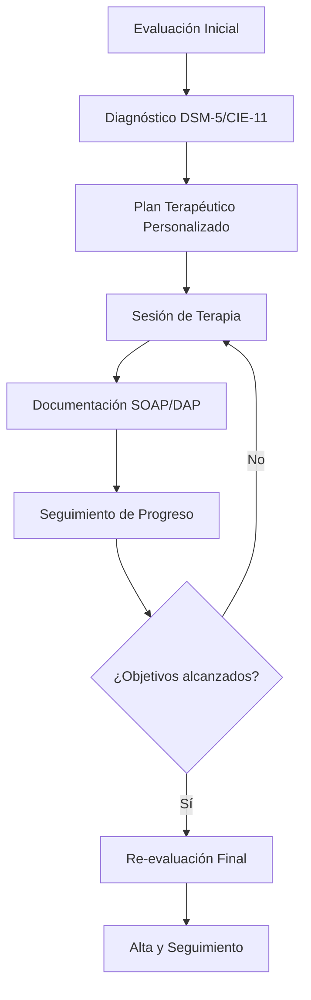
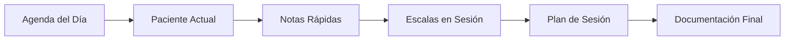

# Plan de Transformación del Módulo de Psicología - SaludValpa App

## Visión General
Transformar el módulo actual de psicología en una solución integral específica para psicólogos/psicoterapeutas que refleje su flujo de trabajo profesional, documentación especializada y necesidades únicas de práctica clínica, creando una experiencia que parezca diseñada desde cero por y para psicólogos.

## Análisis del Estado Actual

### Fortalezas Existentes
1. **Componentes básicos**: Evaluación psicológica, historia clínica, plan terapéutico, notas de sesión
2. **Datos precargados**: 20+ escalas psicológicas con puntos de corte y referencias
3. **Diagnósticos DSM-5**: Base de datos de diagnósticos psiquiátricos
4. **Intervenciones terapéuticas**: Catálogo de técnicas psicológicas
5. **Arquitectura modular**: Base sólida para expansión

### Oportunidades de Mejora
1. **Flujo de trabajo genérico**: No refleja el proceso real de evaluación-terapia-seguimiento
2. **Documentación limitada**: Falta de estándares profesionales (SOAP, DAP, notas progresivas)
3. **Interfaz genérica**: No optimizada para uso durante sesiones de terapia
4. **Evaluaciones manuales**: Sin puntuación automática ni interpretación de escalas
5. **Falta de integración ética**: No considera salvaguardas de confidencialidad y ética profesional
6. **Limitada optimización móvil**: No diseñada para uso en tablet durante sesiones

## 1. Flujo de Trabajo Específico para Psicología

### Proceso Terapéutico Estructurado


### Componentes del Flujo de Trabajo

#### A. Evaluación Psicológica Integral
- **Entrevista inicial estructurada** con formularios guiados
- **Historia clínica psicológica** completa (antecedentes, desarrollo, familiar)
- **Batería de evaluación** con selección inteligente de escalas según motivo de consulta
- **Evaluación cognitiva** básica (atención, memoria, funciones ejecutivas)
- **Evaluación emocional** multidimensional (afecto, estado de ánimo, ansiedad)
- **Evaluación de personalidad** y mecanismos de defensa
- **Evaluación del funcionamiento** global (escala GAF)

#### B. Diagnóstico Basado en DSM-5/CIE-11
- **Árbol de decisión diagnóstica** asistido por IA
- **Diagnósticos diferenciales** con criterios comparativos
- **Comorbilidades** y diagnósticos múltiples
- **Especificadores** y gravedad
- **Factores contextuales** (culturales, sociales, ambientales)

#### C. Plan Terapéutico Personalizado
- **Objetivos SMART** específicos por área de intervención
- **Selección de enfoque terapéutico** (TCC, psicodinámico, humanista, integrativo)
- **Técnicas específicas** por sesión con progresión
- **Tareas entre sesiones** personalizadas
- **Frecuencia y duración** estimada del tratamiento
- **Criterios de alta** definidos

#### D. Sesión de Terapia en Tiempo Real
- **Check-in emocional** rápido al inicio
- **Agenda de sesión** colaborativa
- **Registro de intervenciones** en tiempo real
- **Notas clínicas** durante la sesión (voz-a-texto opcional)
- **Asignación de tareas** con recordatorios automáticos
- **Check-out** y resumen de sesión

#### E. Documentación SOAP/DAP Automatizada
- **Generación automática** de notas a partir de datos de sesión
- **Plantillas personalizables** por enfoque terapéutico
- **Integración con evaluaciones** previas
- **Exportación a PDF** con formato profesional
- **Firma digital** y sellado de tiempo

#### F. Seguimiento y Re-evaluación
- **Administración periódica** de escalas de resultado
- **Gráficos de progreso** automáticos
- **Alertas de estancamiento** o deterioro
- **Revisión de objetivos** y ajuste del plan
- **Preparación para el alta** con plan de mantenimiento

## 2. Sistema de Documentación Psicológica

### Plantillas Basadas en Estándares Profesionales

#### A. Notas SOAP (Subjetivo, Objetivo, Análisis, Plan)
- **Subjetivo**: Quejas del paciente, experiencias subjetivas, auto-reporte
- **Objetivo**: Observaciones conductuales, respuestas emocionales, resultados de escalas
- **Análisis**: Interpretación clínica, conexión con diagnóstico, progreso
- **Plan**: Intervenciones realizadas, tareas asignadas, plan para próxima sesión

#### B. Notas DAP (Datos, Evaluación, Plan)
- **Datos**: Hechos observables, declaraciones del paciente, resultados
- **Evaluación**: Análisis clínico, hipótesis, conexiones
- **Plan**: Acciones futuras, intervenciones planificadas, seguimiento

#### C. Evaluación Psicológica Integral
- **Formulario estructurado** por áreas de funcionamiento
- **Integración automática** de resultados de escalas
- **Resumen narrativo** generado automáticamente
- **Recomendaciones** basadas en hallazgos
- **Anexos** con gráficos y tablas de resultados

#### D. Plan Terapéutico Personalizado
- **Formato estandarizado** con secciones obligatorias
- **Objetivos vinculados** a diagnósticos
- **Intervenciones clasificadas** por enfoque terapéutico
- **Cronograma** de tratamiento visual
- **Indicadores de progreso** medibles

#### E. Informe de Progreso y Alta
- **Comparativa visual** entre evaluaciones iniciales y actuales
- **Análisis estadístico** de cambios en escalas
- **Logros terapéuticos** documentados
- **Recomendaciones de mantenimiento**
- **Plan de prevención** de recaídas

## 3. Interfaz Centrada en el Psicoterapeuta

### Diseño para Uso en Sesión de Terapia

#### A. Vista de Consultorio (Dashboard del Día)


#### B. Modo Sesión Activa
- **Interfaz minimalista** sin distracciones
- **Acceso rápido** a herramientas frecuentes
- **Timer de sesión** con alertas discretas
- **Botones de acción rápida** (intervenciones comunes)
- **Grabación de voz** opcional con transcripción automática
- **Modo oscuro** para reducir fatiga visual

#### C. Panel de Evaluación Rápida
- **Administración en 1 clic** de escalas frecuentes (PHQ-9, GAD-7)
- **Puntuación automática** con interpretación inmediata
- **Comparativa histórica** lado a lado
- **Alertas clínicas** para puntuaciones críticas
- **Exportación rápida** a notas de sesión

#### D. Biblioteca de Intervenciones
- **Catálogo organizado** por enfoque terapéutico
- **Búsqueda inteligente** por problema, técnica, población
- **Favoritos** para intervenciones frecuentes
- **Historial** de intervenciones por paciente
- **Efectividad registrada** basada en resultados

#### E. Panel Ético y de Confidencialidad
- **Checklist de consentimiento** informado
- **Registro de límites** y situaciones éticas
- **Alertas de confidencialidad**
- **Documentación de supervisión**
- **Registro de derivaciones**

## 4. Herramientas de Evaluación Psicológica

### Sistema Integral de Escalas y Pruebas

#### A. Biblioteca de Escalas Estándar
- **Depresión**: PHQ-9, BDI-II, Hamilton, Zung
- **Ansiedad**: GAD-7, BAI, Hamilton, STAI
- **Estrés**: PSS, Escala de Estrés Percibido
- **Funcionamiento global**: GAF, WHOQOL
- **Personalidad**: MMPI-2, NEO-PI-R, 16PF
- **Cognitivas**: MoCA, MMSE, Test de Stroop
- **Específicas**: IES-R (trauma), Y-BOCS (TOC), PANSS (esquizofrenia)

#### B. Características Avanzadas
- **Administración digital** con temporizador
- **Puntuación automática** con algoritmos validados
- **Interpretación clínica** basada en puntos de corte
- **Gráficos de perfil** visuales
- **Comparativa temporal** automática
- **Informes narrativos** generados automáticamente

#### C. Evaluaciones Adaptativas
- **Baterías personalizadas** según motivo de consulta
- **Flujos condicionales** (si puntúa alto en X, administrar Y)
- **Evaluaciones periódicas** programadas automáticamente
- **Alertas de cambio** significativo
- **Integración con planes** de tratamiento

#### D. Pruebas Proyectivas y Cualitativas
- **Plantillas digitales** para HTP, TAT, Rorschach
- **Sistema de codificación** asistido
- **Banco de respuestas** para análisis comparativo
- **Informes cualitativos** con citas destacadas

## 5. Planificación y Seguimiento del Tratamiento

### Sistema de Gestión Terapéutica

#### A. Planificador de Tratamiento
- **Objetivos jerárquicos** (generales → específicos)
- **Intervenciones secuenciadas** por fase de tratamiento
- **Recursos asociados** (hojas de trabajo, ejercicios, lecturas)
- **Cronograma visual** del plan completo
- **Indicadores de progreso** por objetivo

#### B. Seguimiento de Sesiones
- **Registro estructurado** por sesión
- **Temas abordados** y técnicas aplicadas
- **Resistencia y alianza** terapéutica
- **Tareas completadas** y asignadas
- **Notas clínicas** y observaciones

#### C. Monitoreo de Resultados
- **Dashboard de progreso** con métricas clave
- **Gráficos de tendencia** por escala
- **Análisis de efectividad** por tipo de intervención
- **Reportes de resultado** para supervisión
- **Datos para investigación** (anónimos)

#### D. Gestión del Alta
- **Checklist de criterios** de alta
- **Evaluación final** comparativa
- **Plan de mantenimiento** personalizado
- **Seguimiento post-alta** programado
- **Encuesta de satisfacción** del paciente

## 6. Consideraciones Éticas y de Confidencialidad

### Salvaguardas Integradas

#### A. Sistema de Consentimiento
- **Plantillas de consentimiento** informado por tipo de servicio
- **Registro digital** de firmas y fechas
- **Renovación automática** según legislación
- **Consentimiento específico** para grabaciones, supervisión, investigación

#### B. Confidencialidad y Seguridad
- **Encriptación de extremo a extremo** para notas clínicas
- **Control de acceso** granular por tipo de dato
- **Registro de auditoría** de accesos
- **Máscara de datos** para visualización
- **Borrado seguro** según normativa

#### C. Gestión de Límites Éticos
- **Alertas de situaciones** de doble rol
- **Registro de regalos** y beneficios
- **Documentación de conflictos** de interés
- **Protocolos para crisis** éticas

#### D. Supervisión y Consulta
- **Compartición segura** de casos para supervisión
- **Anonimización automática** de datos identificables
- **Plantillas de informe** para supervisores
- **Registro de horas** de supervisión

## 7. Optimización para Móvil/Tablet

### Diseño para Uso en Sesión

#### A. Interfaz Táctil Optimizada
- **Botones grandes** y espaciados
- **Gestos intuitivos** para navegación
- **Modo portrait/landscape** adaptable
- **Teclado optimizado** para entrada rápida
- **Reconocimiento de voz** integrado

#### B. Funcionalidades para Sesión
- **Timer de sesión** discreto
- **Notas rápidas** con plantillas predefinidas
- **Escalas en 1 toque** para evaluación en sesión
- **Modo concentración** (minimiza distracciones)
- **Sincronización offline** con cloud posterior

#### C. Productividad en Movimiento
- **Dictado por voz** a notas clínicas
- **Fotos/documentos** integrados a historial
- **Recordatorios contextuales**
- **Acceso rápido** a recursos terapéuticos
- **Sincronización instantánea** entre dispositivos

## 8. Hoja de Ruta de Implementación

### Fase 1: Fundamentos (Semanas 1-4)
1. **Rediseño de flujo de trabajo** psicológico
2. **Nuevas interfaces** para evaluación y sesión
3. **Sistema de puntuación automática** para escalas
4. **Plantillas SOAP/DAP** básicas
5. **Optimización móvil** inicial

### Fase 2: Evaluación Integral (Semanas 5-8)
1. **Biblioteca completa** de escalas con puntuación automática
2. **Sistema de diagnóstico** asistido DSM-5/CIE-11
3. **Evaluaciones adaptativas** y baterías personalizadas
4. **Gráficos de progreso** y dashboards
5. **Informes automáticos** de evaluación

### Fase 3: Terapia y Seguimiento (Semanas 9-12)
1. **Planificador de tratamiento** avanzado
2. **Sistema de seguimiento** de sesiones
3. **Biblioteca de intervenciones** terapéuticas
4. **Monitoreo de resultados** y efectividad
5. **Gestión del alta** y seguimiento

### Fase 4: Ética y Profesionalización (Semanas 13-16)
1. **Sistema de consentimiento** digital
2. **Salvaguardas de confidencialidad**
3. **Herramientas para supervisión**
4. **Documentación ética** integrada
5. **Reportes profesionales** y exportación

### Fase 5: Optimización y Integración (Semanas 17-20)
1. **Modo sesión avanzado** para tablet
2. **Reconocimiento de voz** y dictado
3. **Integración con calendario** y recordatorios
4. **Sincronización cloud** segura
5. **Personalización por enfoque** terapéutico

## 9. Arquitectura Técnica

### Nuevos Componentes Requeridos

#### A. Módulos Principales
```
src/modules/psicologia/
├── assessment/           # Evaluación psicológica
│   ├── scales/          # Escalas con puntuación automática
│   ├── diagnostics/     # Diagnóstico DSM-5/CIE-11
│   └── reports/         # Informes de evaluación
├── therapy/             # Terapia y sesiones
│   ├── session/         # Modo sesión activa
│   ├── planning/        # Planificación de tratamiento
│   └── interventions/   # Biblioteca de intervenciones
├── documentation/       # Documentación clínica
│   ├── soap-notes/      # Notas SOAP/DAP
│   ├── templates/       # Plantillas profesionales
│   └── export/          # Exportación a PDF
├── ethics/              # Ética y confidencialidad
│   ├── consent/         # Consentimiento informado
│   ├── confidentiality/ # Salvaguardas
│   └── supervision/     # Herramientas de supervisión
└── mobile-optimization/ # Optimización móvil
    ├── touch-ui/        # Interfaz táctil
    ├── voice-input/     # Entrada por voz
    └── offline-sync/    # Sincronización offline
```

#### B. Nuevos Tipos de Datos
```typescript
// Tipos para evaluación psicológica avanzada
interface EscalaAdministrada {
  id: string;
  fecha: Date;
  puntuacionTotal: number;
  puntuacionesItems: number[];
  interpretacion: string;
  percentil?: number;
  puntosCorte: string;
}

interface DiagnosticoDSM5 {
  codigo: string;
  nombre: string;
  criterios: string[];
  especificadores: string[];
  gravedad: 'leve' | 'moderado' | 'grave';
  fechaDiagnostico: Date;
}

interface NotaSOAP {
  subjetivo: string;
  objetivo: string;
  analisis: string;
  plan: string;
  fecha: Date;
  duracionSesion: number;
  intervenciones: string[];
}

interface PlanTerapeutico {
  objetivos: Array<{
    descripcion: string;
    indicadores: string[];
    fechaObjetivo: Date;
    progreso: number; // 0-100%
  }>;
  enfoqueTerapeutico: string;
  tecnicas: string[];
  frecuenciaSesiones: string;
  duracionEstimada: string;
  criteriosAlta: string[];
}
```

#### C. Hooks Especializados
- `useEscalasAutomaticas`: Administración y puntuación automática de escalas
- `useDiagnosticoDSM5`: Árbol de decisión diagnóstica asistida
- `useSesionTerapia`: Gestión de sesión en tiempo real con timer
- `useDocumentacionSOAP`: Generación automática de notas SOAP/DAP
- `useConsentimientoDigital`: Gestión de consentimientos informados
- `useProgresoTerapeutico`: Seguimiento y análisis de progreso

#### D. Servicios de Backend
- `scaleScoringService`: Puntuación automática de escalas psicológicas
- `diagnosticDecisionService`: Asistencia para diagnóstico DSM-5/CIE-11
- `therapyProgressService`: Análisis estadístico de progreso terapéutico
- `documentGenerationService`: Generación de informes profesionales
- `encryptionService`: Encriptación de datos clínicos sensibles

## 10. Métricas de Éxito y Validación

### Indicadores Clave de Desempeño

#### A. Para Psicólogos Usuarios
1. **Tiempo de documentación**: Reducción del 60% en tiempo de documentación clínica
2. **Precisión diagnóstica**: Mejora en consistencia diagnóstica mediante herramientas asistidas
3. **Satisfacción profesional**: Encuestas de satisfacción > 4.5/5
4. **Adopción de tecnología**: > 80% de uso regular en sesiones
5. **Reducción de errores**: Disminución del 75% en errores de puntuación de escalas

#### B. Para Pacientes/Clientes
1. **Continuidad de cuidado**: Mejora en seguimiento y consistencia terapéutica
2. **Personalización**: Planes de tratamiento más específicos y adaptados
3. **Resultados medibles**: Mejora cuantificable en escalas de resultado
4. **Experiencia terapéutica**: Menos tiempo en documentación, más tiempo en terapia

#### C. Técnicos y Operativos
1. **Rendimiento**: Tiempo de respuesta < 200ms para operaciones críticas
2. **Disponibilidad**: 99.9% uptime para funcionalidades esenciales
3. **Seguridad**: Cumplimiento de normativas de protección de datos de salud
4. **Escalabilidad**: Soporte para 1000+ psicólogos concurrentes

## 11. Consideraciones de Implementación Práctica

### Integración con Sistema Existente

#### A. Migración de Datos
- **Conversión automática** de datos psicológicos existentes a nuevo formato
- **Preservación de historial** clínico durante la transición
- **Validación de integridad** de datos migrados
- **Período de transición** con soporte dual

#### B. Capacitación y Onboarding
- **Tutoriales interactivos** específicos para psicólogos
- **Casos de uso reales** con ejemplos clínicos
- **Certificación de uso** para estándares profesionales
- **Soporte especializado** durante implementación

#### C. Personalización por Enfoque Terapéutico
- **Perfiles preconfigurados** para TCC, psicodinámico, humanista, etc.
- **Plantillas personalizables** por especialidad (infantil, adultos, parejas)
- **Flujos de trabajo adaptables** según preferencia del terapeuta
- **Bibliotecas de recursos** específicas por enfoque

## 12. Plan de Pruebas y Validación Clínica

### Fases de Validación

#### A. Pruebas Técnicas (Fase Alpha)
- **Pruebas unitarias** para algoritmos de puntuación
- **Pruebas de integración** entre módulos
- **Pruebas de rendimiento** con carga simulada
- **Pruebas de seguridad** y encriptación

#### B. Pruebas de Usabilidad (Fase Beta)
- **Grupos focales** con psicólogos de diferentes especialidades
- **Pruebas en contexto real** durante sesiones simuladas
- **Feedback iterativo** sobre interfaz y flujo de trabajo
- **Ajustes basados** en observaciones etnográficas

#### C. Validación Clínica (Fase Gamma)
- **Estudios de concordancia** en diagnósticos asistidos vs. tradicionales
- **Validación de puntuaciones** automáticas vs. manuales
- **Impacto en resultados** terapéuticos (estudios pre-post)
- **Cumplimiento normativo** con estándares profesionales

## 13. Conclusión y Visión a Largo Plazo

### Transformación Esperada

Al implementar este plan de transformación, el módulo de psicología de SaludValpa evolucionará de una herramienta genérica a un **sistema especializado diseñado por y para psicólogos**, con:

1. **Flujo de trabajo natural** que refleja la práctica psicológica real
2. **Documentación profesional** que cumple estándares internacionales
3. **Herramientas de evaluación** con puntuación e interpretación automática
4. **Interfaz optimizada** para uso durante sesiones terapéuticas
5. **Salvaguardas éticas** integradas en cada paso del proceso
6. **Soporte móvil/tablet** para máxima flexibilidad en la práctica

### Visión Evolutiva

A largo plazo, este módulo sentará las bases para:
- **Investigación clínica** con datos agregados anónimos
- **Asistencia por IA** para intervenciones personalizadas
- **Integración con wearables** para monitoreo continuo
- **Plataforma de supervisión** para formación de nuevos psicólogos
- **Certificación digital** de competencias terapéuticas

### Próximos Pasos Inmediatos

1. **Revisión y aprobación** de este plan por stakeholders clave
2. **Priorización de fases** según recursos y cronograma
3. **Formación de equipo** multidisciplinario (psicólogos + desarrolladores)
4. **Desarrollo de prototipo** para validación inicial
5. **Plan de implementación** gradual con retroalimentación continua

---

**Documento creado**: 2026-03-02
**Versión del plan**: 1.0
**Estado**: Para revisión y aprobación
**Responsable**: Equipo de Transformación de Módulos Especializados - SaludValpa