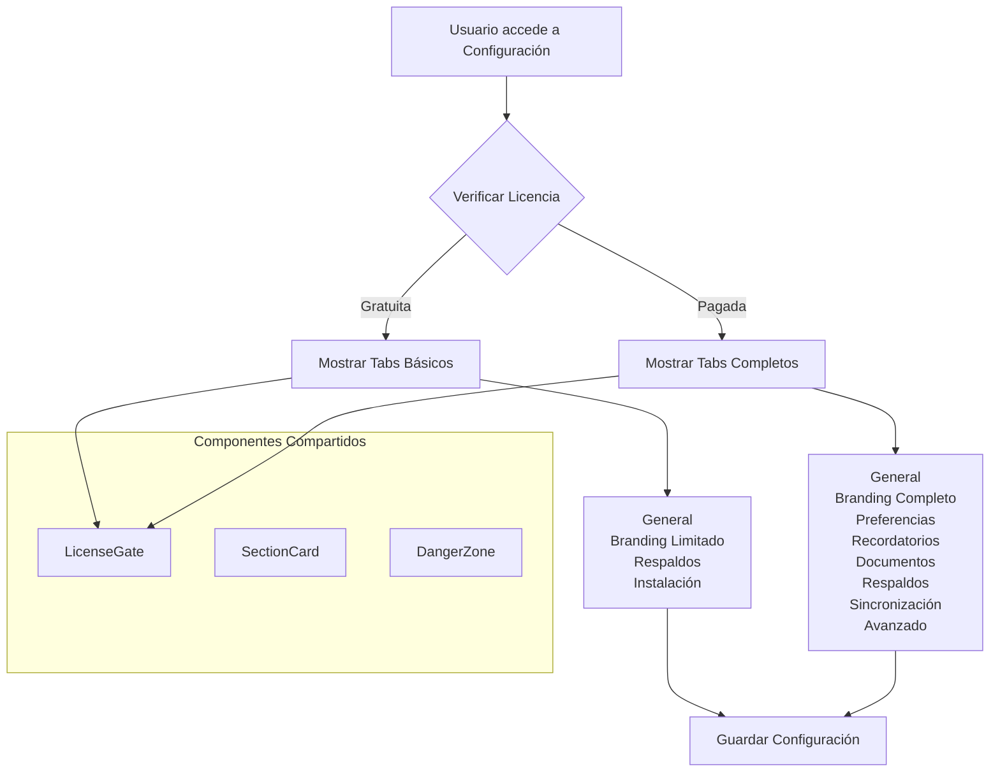

# Plan de Unificación de Configuraciones - SaludValpa 3.0

## Resumen Ejecutivo

Este documento presenta un plan integral para unificar los componentes `Configuracion.tsx` y `ConfiguracionAvanzada.tsx` en un sistema de configuración único y coherente. La unificación aborda problemas de fragmentación, duplicación de funcionalidades y experiencia de usuario inconsistente, creando una interfaz unificada que escala según el tipo de licencia del usuario.

## 1. Análisis de Arquitectura Actual

### 1.1 Configuracion.tsx (438 líneas)
- **Tabs**: General, Personalización, Respaldos, Instalación
- **Características principales**:
  - Datos profesionales básicos (nombre, teléfono, email)
  - Personalización de marca limitada (solo para licencias pagadas)
  - Gestión de respaldos (exportar/importar)
  - Guía de instalación PWA
  - Reinicio completo del sistema

### 1.2 ConfiguracionAvanzada.tsx (1083 líneas)
- **Tabs**: General, Personalización, Preferencias, Recordatorios, Documentos, Respaldos, Sincronización
- **Características principales**:
  - Datos profesionales completos (clínica, credenciales, especialidad, dirección, sitio web)
  - Personalización avanzada (logo, temas preestablecidos, colores personalizados)
  - Preferencias del sistema (formato fecha, moneda, IVA, agenda)
  - Configuración de recordatorios
  - Configuración de documentos
  - Gestión de respaldos (con estadísticas)
  - Sincronización en la nube

### 1.3 Problemas Identificados
1. **Duplicación de funcionalidades**: Ambos componentes tienen gestión de respaldos
2. **Fragmentación de datos**: Configuración dividida en dos ubicaciones
3. **Experiencia inconsistente**: Diferentes estilos y patrones de UI
4. **Gestión de licencias inconsistente**: Lógica de permisos implementada de forma diferente
5. **Falta de escalabilidad**: Nuevas características requieren modificar ambos componentes

## 2. Diseño Arquitectónico Unificado

### 2.1 Componente Unificado: `ConfiguracionUnificada.tsx`

```typescript
type TabType = 
  | 'general' 
  | 'branding' 
  | 'preferencias' 
  | 'recordatorios' 
  | 'documentos' 
  | 'respaldos' 
  | 'sincronizacion' 
  | 'avanzado' 
  | 'licencia';
```

### 2.2 Estructura Modular por Tabs

```
ConfiguracionUnificada/
├── ConfiguracionUnificada.tsx (Componente principal)
├── tabs/
│   ├── GeneralTab.tsx
│   ├── BrandingTab.tsx
│   ├── PreferenciasTab.tsx
│   ├── RecordatoriosTab.tsx
│   ├── DocumentosTab.tsx
│   ├── RespaldosTab.tsx
│   ├── SincronizacionTab.tsx
│   ├── AvanzadoTab.tsx
│   └── LicenciaTab.tsx
├── components/
│   ├── LicenseGate.tsx (Control de acceso por licencia)
│   ├── SectionCard.tsx (Contenedor de secciones)
│   └── DangerZone.tsx (Área de operaciones peligrosas)
└── hooks/
    ├── useConfiguration.ts (Lógica de configuración)
    └── useLicenseCheck.ts (Verificación de licencia)
```

### 2.3 Sistema de Permisos Basado en Licencia

```typescript
interface FeaturePermissions {
  branding: {
    logo: boolean;
    themes: boolean;
    customColors: boolean;
  };
  documentos: {
    customTemplates: boolean;
    watermark: boolean;
  };
  sincronizacion: boolean;
  multiUser: boolean;
  analytics: boolean;
}

const getFeaturePermissions = (licenseType: 'gratuita' | 'pagada'): FeaturePermissions => ({
  branding: {
    logo: licenseType === 'pagada',
    themes: licenseType === 'pagada',
    customColors: licenseType === 'pagada',
  },
  documentos: {
    customTemplates: licenseType === 'pagada',
    watermark: licenseType === 'gratuita', // Marca de agua solo en gratuita
  },
  sincronizacion: licenseType === 'pagada',
  multiUser: licenseType === 'pagada',
  analytics: licenseType === 'pagada',
});
```

### 2.4 Mermaid: Flujo de Configuración Unificada



## 3. Estrategia de Migración

### Fase 1: Desarrollo en Paralelo (2 semanas)
1. Crear `ConfiguracionUnificada.tsx` en nueva ruta (`src/pages/configuracion/`)
2. Implementar sistema de tabs con lógica de licencia
3. Migrar funcionalidades de `Configuracion.tsx`
4. Migrar funcionalidades de `ConfiguracionAvanzada.tsx`
5. Crear componentes compartidos y hooks

### Fase 2: Pruebas y Validación (1 semana)
1. Pruebas de regresión en funcionalidades existentes
2. Validación de permisos por licencia
3. Pruebas de usabilidad
4. Pruebas de rendimiento

### Fase 3: Transición Gradual (1 semana)
1. Redirigir `/configuracion` a componente unificado
2. Redirigir `/configuracion-avanzada` a componente unificado con tab activo
3. Mantener componentes antiguos como fallback
4. Monitorear errores y métricas

### Fase 4: Eliminación y Limpieza (1 semana)
1. Eliminar `Configuracion.tsx` y `ConfiguracionAvanzada.tsx`
2. Actualizar rutas en `App.tsx`
3. Actualizar enlaces en toda la aplicación
4. Documentar cambios

## 4. Consolidación de Características

### 4.1 Tab General (Consolidado)
| Característica | Configuracion.tsx | ConfiguracionAvanzada.tsx | Unificado |
|----------------|-------------------|---------------------------|-----------|
| Nombre profesional | ✓ | ✓ | ✓ Mejorado |
| Teléfono | ✓ | ✓ | ✓ |
| Email | ✓ | ✓ | ✓ |
| Nombre clínica | ✗ | ✓ | ✓ |
| Credenciales | ✗ | ✓ | ✓ |
| Especialidad | ✗ | ✓ | ✓ |
| Dirección | ✗ | ✓ | ✓ |
| Sitio web | ✗ | ✓ | ✓ |
| Redes sociales | ✗ | ✗ | ✓ Nuevo |

### 4.2 Tab Branding (Escalable por Licencia)
| Característica | Licencia Gratuita | Licencia Pagada |
|----------------|-------------------|-----------------|
| Logo personalizado | ✗ (Bloqueado) | ✓ |
| Temas preestablecidos | ✗ (Bloqueado) | ✓ |
| Colores personalizados | ✗ (Bloqueado) | ✓ |
| Pie de página | ✓ Limitado | ✓ Completo |
| Formato documentos | ✗ | ✓ |
| Marca de agua | ✓ Forzada | ✗ Opcional |

### 4.3 Nuevas Características Identificadas
1. **Configuración de plantillas de documentos** (Falta en ambos)
2. **Configuración de notificaciones push** (Falta en ambos)
3. **Configuración de integraciones** (API, calendarios externos)
4. **Configuración de seguridad** (Autenticación, backups automáticos)
5. **Configuración de analytics** (Reportes personalizados)

## 5. Sistema de Permisos por Licencia

### 5.1 Niveles de Acceso
```typescript
enum AccessLevel {
  FREE = 'free',
  PAID = 'paid',
  ENTERPRISE = 'enterprise'
}

interface TabVisibility {
  tab: TabType;
  minLevel: AccessLevel;
  icon: string;
  description: string;
}

const TAB_VISIBILITY: TabVisibility[] = [
  { tab: 'general', minLevel: AccessLevel.FREE, icon: '👤', description: 'Datos profesionales' },
  { tab: 'branding', minLevel: AccessLevel.FREE, icon: '🎨', description: 'Personalización' },
  { tab: 'respaldos', minLevel: AccessLevel.FREE, icon: '💾', description: 'Copias de seguridad' },
  { tab: 'instalacion', minLevel: AccessLevel.FREE, icon: '📱', description: 'Instalación PWA' },
  { tab: 'preferencias', minLevel: AccessLevel.PAID, icon: '⚙️', description: 'Preferencias sistema' },
  { tab: 'recordatorios', minLevel: AccessLevel.PAID, icon: '🔔', description: 'Recordatorios' },
  { tab: 'documentos', minLevel: AccessLevel.PAID, icon: '📄', description: 'Plantillas documentos' },
  { tab: 'sincronizacion', minLevel: AccessLevel.PAID, icon: '☁️', description: 'Sincronización nube' },
  { tab: 'avanzado', minLevel: AccessLevel.ENTERPRISE, icon: '🔧', description: 'Configuración avanzada' },
];
```

### 5.2 Componente LicenseGate
```tsx
interface LicenseGateProps {
  requiredLevel: AccessLevel;
  fallback?: React.ReactNode;
  children: React.ReactNode;
}

const LicenseGate: React.FC<LicenseGateProps> = ({ 
  requiredLevel, 
  fallback, 
  children 
}) => {
  const { license } = useAppStore();
  const hasAccess = checkLicenseAccess(license?.type, requiredLevel);
  
  if (!hasAccess) {
    return fallback || (
      <div className="license-gate">
        <UpgradePrompt requiredLevel={requiredLevel} />
      </div>
    );
  }
  
  return <>{children}</>;
};
```

## 6. Fases de Implementación

### Fase 1: Fundación (Semanas 1-2)
- [ ] Crear estructura de directorios
- [ ] Implementar componente principal con sistema de tabs
- [ ] Crear sistema de permisos por licencia
- [ ] Migrar tab General (consolidado)
- [ ] Migrar tab Branding (con LicenseGate)

### Fase 2: Consolidación (Semanas 3-4)
- [ ] Migrar tab Preferencias
- [ ] Migrar tab Recordatorios
- [ ] Migrar tab Documentos
- [ ] Migrar tab Respaldos (consolidado)
- [ ] Implementar tab Sincronización

### Fase 3: Mejoras (Semanas 5-6)
- [ ] Implementar nuevas características faltantes
- [ ] Crear tab Avanzado (enterprise)
- [ ] Implementar sistema de plantillas de documentos
- [ ] Agregar configuración de notificaciones
- [ ] Implementar analytics de configuración

### Fase 4: Transición (Semanas 7-8)
- [ ] Pruebas exhaustivas
- [ ] Documentación de usuario
- [ ] Migración de datos (si es necesario)
- [ ] Redirecciones y actualización de rutas
- [ ] Eliminación de componentes antiguos

## 7. Estrategia de Testing

### 7.1 Pruebas Unitarias
```typescript
// Ejemplo: Pruebas de permisos por licencia
describe('LicenseGate', () => {
  it('debe mostrar contenido para licencia pagada cuando se requiere nivel PAID', () => {
    // Test implementation
  });
  
  it('debe mostrar fallback para licencia gratuita cuando se requiere nivel PAID', () => {
    // Test implementation
  });
});
```

### 7.2 Pruebas de Integración
1. **Flujo completo de configuración**: Guardar y recuperar configuración
2. **Migración de datos**: Verificar que configuración existente funcione
3. **Permisos por licencia**: Verificar visibilidad correcta de tabs
4. **Backward compatibility**: Verificar que enlaces antiguos redirijan correctamente

### 7.3 Pruebas de Usuario
1. **Pruebas A/B**: Comparar experiencia antigua vs nueva
2. **Pruebas de accesibilidad**: WCAG 2.1 AA
3. **Pruebas de rendimiento**: Tiempo de carga < 2s
4. **Pruebas móviles**: Responsive design

### 7.4 Métricas de Éxito
- **Tasa de finalización**: > 90% de usuarios completan configuración
- **Tiempo promedio**: < 3 minutos para configuración básica
- **Satisfacción**: > 4.5/5 en encuestas de usabilidad
- **Errores**: < 0.1% de sesiones con errores críticos

## 8. Plan de Documentación

### 8.1 Documentación para Desarrolladores
1. **ARCHITECTURE.md**: Estructura del sistema unificado
2. **MIGRATION_GUIDE.md**: Guía para migrar extensiones
3. **API_REFERENCE.md**: Hooks y componentes expuestos
4. **LICENSE_SYSTEM.md**: Sistema de permisos por licencia

### 8.2 Documentación para Usuarios
1. **CONFIGURATION_GUIDE.md**: Guía completa de configuración
2. **UPGRADE_BENEFITS.md**: Beneficios por nivel de licencia
3. **TROUBLESHOOTING.md**: Solución de problemas comunes
4. **VIDEO_TUTORIALS.md**: Tutoriales en video

### 8.3 Actualizaciones Requeridas
1. **README.md**: Actualizar sección de configuración
2. **CHANGELOG.md**: Documentar cambios y nuevas características
3. **ONBOARDING_FLOW.md**: Actualizar flujo de onboarding
4. **HELP_CENTER**: Artículos de soporte actualizados

## 9. Consideraciones Técnicas

### 9.1 Gestión de Estado
- Mantener compatibilidad con `useAppStore` existente
- Extender interfaz `Configuracion` si es necesario
- Implementar migración automática de datos

### 9.2 Performance
- **Lazy loading**: Cargar tabs bajo demanda
- **Memoization**: Usar `React.memo` y `useMemo` para componentes pesados
- **Code splitting**: Separar por niveles de licencia
- **Bundle optimization**: Tree-shaking de características no utilizadas

### 9.3 SEO y Accesibilidad
- **ARIA labels**: Para todos los controles interactivos
- **Keyboard navigation**: Navegación completa por teclado
- **Screen reader support**: Compatibilidad con lectores de pantalla
- **Semantic HTML**: Estructura semántica correcta

### 9.4 Internacionalización
- Preparar para soporte multi-idioma
- Externalizar todos los textos
- Soporte para formatos regionales (fechas, monedas)

## 10. Riesgos y Mitigación

### 10.1 Riesgos Identificados
1. **Pérdida de datos durante migración**
   - Mitigación: Backup automático antes de migración
   - Rollback plan implementado

2. **Errores en permisos por licencia**
   - Mitigación: Pruebas exhaustivas con todos los niveles
   - Monitoreo en tiempo real

3. **Impacto en performance**
   - Mitigación: Optimizaciones de carga diferida
   - Monitoring de métricas de rendimiento

4. **Resistencia al cambio de usuarios**
   - Mitigación: Transición gradual con opción de volver
   - Comunicación clara de beneficios

### 10.2 Plan de Rollback
1. Mantener componentes antiguos en branch de respaldo
2. Sistema de feature flags para habilitar/deshabilitar nuevo componente
3. Punto de restauración de datos diario durante transición
4. Equipo de soporte entrenado para problemas de migración

## 11. Recursos Requeridos

### 11.1 Equipo
- **Frontend Developer**: 2 personas (4 semanas)
- **QA Engineer**: 1 persona (2 semanas)
- **UX Designer**: 1 persona (1 semana)
- **Technical Writer**: 1 persona (1 semana)

### 11.2 Infraestructura
- **Branch**: `unificacion-de-configuraciones`
- **Entorno de pruebas**: Staging environment con datos de prueba
- **Monitoring**: Sentry para errores, Google Analytics para uso
- **CI/CD**: Pipeline automatizado con tests

### 11.3 Timeline Estimado
- **Fase 1 (Fundación)**: 2 semanas
- **Fase 2 (Consolidación)**: 2 semanas
- **Fase 3 (Mejoras)**: 2 semanas
- **Fase 4 (Transición)**: 2 semanas
- **Total**: 8 semanas (2 meses)

## 12. Conclusión y Próximos Pasos

### 12.1 Beneficios Esperados
1. **Experiencia de usuario unificada**: Configuración coherente en un solo lugar
2. **Mantenimiento simplificado**: Un solo componente en lugar de dos
3. **Escalabilidad mejorada**: Sistema modular que crece con nuevas características
4. **Monetización clara**: Permisos por licencia bien definidos
5. **Reducción de bugs**: Eliminación de código duplicado y lógica inconsistente

### 12.2 Métricas de Éxito Clave (KPIs)
- **Adopción**: > 95% de usuarios usando configuración unificada después de 30 días
- **Satisfacción**: > 4.5/5 en encuestas de configuración
- **Performance**: Tiempo de carga < 1.5s en dispositivos móviles
- **Errores**: Reducción del 70% en errores reportados de configuración
- **Conversión**: Aumento del 15% en upgrades de licencia

### 12.3 Próximos Pasos Inmediatos
1. **Revisión del plan** con stakeholders técnicos y de producto
2. **Creación del branch** `unificacion-de-configuraciones`
3. **Setup del entorno** de desarrollo con estructura inicial
4. **Implementación de Fase 1** (Componente base + sistema de tabs)
5. **Pruebas iniciales** con usuarios beta

### 12.4 Consideraciones a Largo Plazo
1. **Sistema de plugins**: Permitir extensiones de configuración por módulos
2. **API de configuración**: Exponer configuración programáticamente para integraciones
3. **Configuración por equipo**: Soporte para múltiples usuarios en licencia enterprise
4. **Historial de cambios**: Track de modificaciones en configuración
5. **Configuraciones preestablecidas**: Templates para diferentes tipos de prácticas

## Apéndice A: Matriz de Decisión de Características

| Característica | Prioridad | Complejidad | Dependencias | Fase |
|----------------|-----------|-------------|--------------|------|
| Sistema de tabs unificado | Alta | Media | Ninguna | 1 |
| Permisos por licencia | Alta | Media | Sistema de licencias existente | 1 |
| Migración datos existentes | Alta | Alta | Ambas configuraciones actuales | 2 |
| Plantillas documentos | Media | Alta | Sistema de documentos | 3 |
| Sincronización nube | Media | Alta | Servicio de cloud sync | 2 |
| Configuración notificaciones | Baja | Media | Sistema de notificaciones | 3 |
| Analytics configuración | Baja | Baja | Sistema de analytics | 4 |

## Apéndice B: Checklist de Implementación

### Fase 1 Checklist
- [ ] Crear estructura de directorios `src/pages/configuracion/`
- [ ] Implementar `ConfiguracionUnificada.tsx` con sistema de tabs
- [ ] Crear componente `LicenseGate`
- [ ] Implementar tab `General` consolidado
- [ ] Implementar tab `Branding` con permisos
- [ ] Configurar routing en `App.tsx`
- [ ] Pruebas unitarias básicas

### Fase 2 Checklist
- [ ] Migrar tab `Preferencias`
- [ ] Migrar tab `Recordatorios`
- [ ] Migrar tab `Documentos`
- [ ] Consolidar tab `Respaldos`
- [ ] Implementar tab `Sincronización`
- [ ] Pruebas de integración
- [ ] Pruebas de permisos por licencia

### Fase 3 Checklist
- [ ] Implementar nuevas características faltantes
- [ ] Crear sistema de plantillas de documentos
- [ ] Implementar configuración de notificaciones
- [ ] Agregar analytics de uso
- [ ] Optimizaciones de performance
- [ ] Pruebas de usabilidad

### Fase 4 Checklist
- [ ] Pruebas de regresión completas
- [ ] Documentación de usuario
- [ ] Plan de migración de datos
- [ ] Sistema de redirecciones
- [ ] Monitoreo post-implementación
- [ ] Eliminación componentes antiguos

---

**Documento creado**: 2026-03-04
**Última revisión**: 2026-03-04
**Versión**: 1.0
**Estado**: Para revisión
**Branch objetivo**: `unificacion-de-configuraciones`

*Este plan está diseñado para guiar la implementación en el branch `unificacion-de-configuraciones` y debe ser revisado por el equipo técnico antes de comenzar la implementación.*