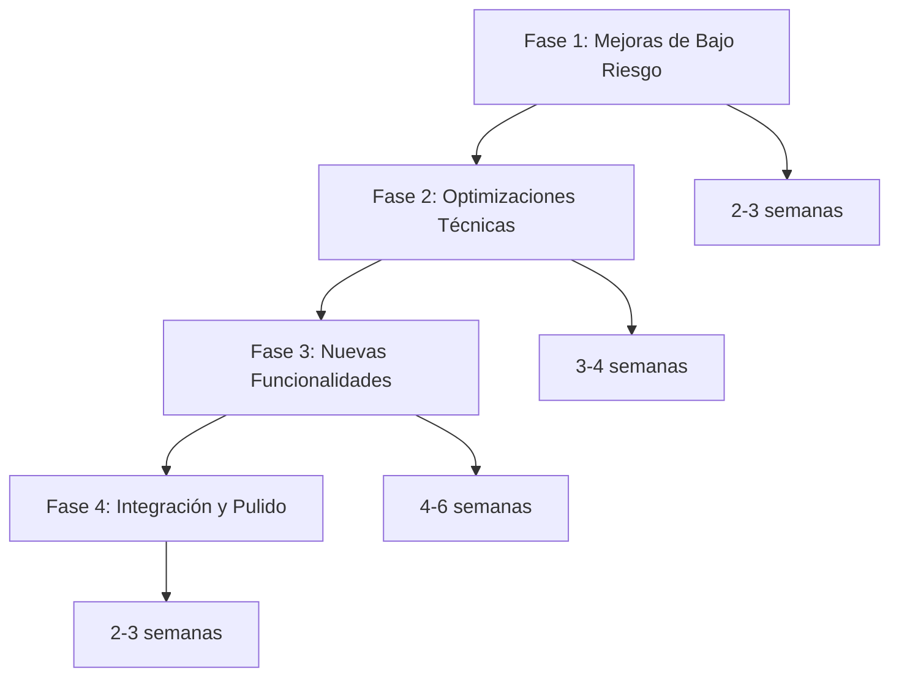
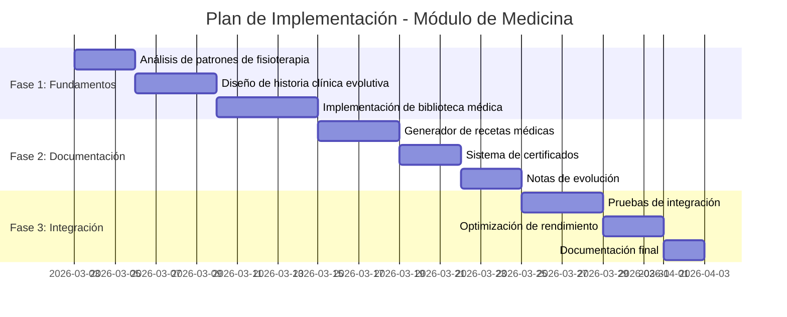
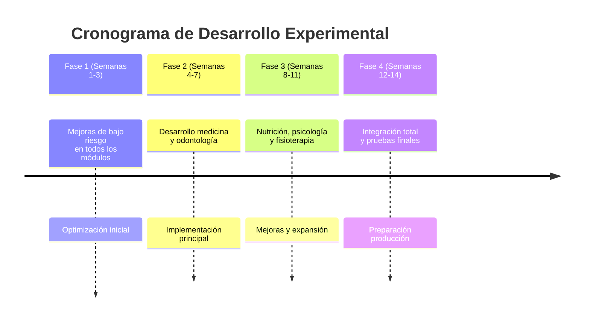

# Workflow Integral para Rama Experimental de Módulos - SaludValpa App

## 1. Resumen Ejecutivo

### Objetivo General
Establecer un flujo de trabajo estructurado para el desarrollo de módulos de especialidad en la rama experimental `experimental-modules`, manteniendo la estabilidad de la versión de producción y respetando el principio fundamental: **"sin modificar lo que ven los demás"**.

### Alcance del Proyecto
- **Rama base**: `experimental-modules` (creada desde `main`)
- **Módulos objetivo**: Medicina, Nutrición, Odontología, Psicología, Fisioterapia
- **Enfoque**: Mejoras internas, optimizaciones técnicas y nuevas funcionalidades no disruptivas
- **Duración estimada**: 12-16 semanas (fases iterativas)

### Logros Iniciales
1. ✅ **Rama experimental creada**: `experimental-modules` establecida como base de desarrollo
2. ✅ **Backup completo**: `backup-experimental-modules-20260302-112128.tar.gz` creado
3. ✅ **Aplicación funcionando**: Servidor de desarrollo activo (`npm run dev`)
4. ✅ **Planes detallados**: Documentación específica por módulo desarrollada
5. ✅ **Estrategia definida**: Enfoque de desarrollo no disruptivo establecido

## 2. Documentación del Estado Actual

### Arquitectura del Sistema
```
saludvalpa-app/
├── src/modules/                    # Módulos de especialidad
│   ├── fisioterapia/              (85% completo)
│   ├── medicina/                  (75% completo)
│   ├── nutricion/                 (90% completo)
│   ├── odontologia/               (70% completo)
│   └── psicologia/                (80% completo)
├── src/components/                # Componentes compartidos
├── src/services/                  # Servicios de negocio
├── src/pages/                     # Páginas de la aplicación
└── plans/                         # Documentación de planificación
```

### Estado de Completitud por Módulo
| Módulo | Completitud | Estado | Características Principales |
|--------|-------------|--------|----------------------------|
| **Fisioterapia** | 85% | Funcional | Sistema de rutinas, biblioteca de ejercicios, generación de PDF |
| **Medicina** | 75% | En desarrollo | Datos CIE10, medicamentos, estudios de laboratorio |
| **Nutrición** | 90% | Avanzado | Base de alimentos, calculadora nutricional, planes personalizados |
| **Odontología** | 70% | En desarrollo | Odontograma SVG, procedimientos dentales, materiales |
| **Psicología** | 80% | Funcional | Escalas psicológicas, intervenciones terapéuticas, diagnósticos DSM-5 |

### Archivos de Planificación Creados
1. **`plans/desarrollo-modulos-especialidad.md`** - Plan maestro para los 5 módulos
2. **`plans/implementacion-modulo-medicina.md`** - Especificación detallada para medicina
3. **`docs/experimental/WORKFLOW_EXPERIMENTAL.md`** - Flujo de trabajo experimental base

### Backup y Seguridad
- **Backup experimental**: `backup-experimental-modules-20260302-112128.tar.gz` (2.1 MB)
- **Backup original**: `backup-valpa-app-original.tar.gz`
- **Estrategia**: Backup completo antes de cada fase mayor de desarrollo

## 3. Flujo de Trabajo de Desarrollo

### Principios Fundamentales
1. **No disruptividad**: Cambios transparentes para usuarios existentes
2. **Mejora incremental**: Desarrollo iterativo con validación continua
3. **Compatibilidad hacia atrás**: Mantener funcionamiento con datos existentes
4. **Pruebas exhaustivas**: Validar que cambios no afecten funcionalidad

### Fases de Implementación



#### Fase 1: Mejoras de Bajo Riesgo (2-3 semanas)
- Optimización de rendimiento en componentes existentes
- Mejora de sistemas de PDF y generación de documentos
- Enriquecimiento de datos precargados
- Refactorización de código con deuda técnica

#### Fase 2: Optimizaciones Técnicas (3-4 semanas)
- Implementación de virtualización para listas largas
- Mejora de caché y reducción de re-renderizados
- Optimización de bundle size y tiempos de carga
- Implementación de tests unitarios

#### Fase 3: Nuevas Funcionalidades (4-6 semanas)
- Desarrollo de características avanzadas por módulo
- Integración de sistemas multimedia
- Implementación de análisis y reportes
- Desarrollo de funcionalidades de colaboración

#### Fase 4: Integración y Pulido (2-3 semanas)
- Pruebas de integración entre módulos
- Optimización de experiencia de usuario
- Documentación final
- Preparación para despliegue

## 4. Estrategia de Desarrollo de Módulos

### Enfoque "Sin Modificar lo que Ven los Demás"

#### Técnicas de Implementación No Disruptiva
1. **Componentes condicionales**: Mostrar nuevas funcionalidades solo cuando sean relevantes
2. **Rutas separadas**: Nuevas páginas/rutas para funcionalidades avanzadas
3. **Configuración por usuario**: Habilitación basada en preferencias del profesional
4. **Datos enriquecidos**: Mejora de datos existentes sin cambiar estructuras
5. **Optimizaciones de rendimiento**: Mejoras técnicas invisibles al usuario

#### Patrón de Desarrollo por Módulo
```typescript
// Ejemplo: Patrón para medicina basado en fisioterapia
interface ModuloDesarrollo {
  analisis: {
    patronesExistentes: string[];
    adaptacionesNecesarias: string[];
    restricciones: string[];
  };
  diseño: {
    flujoDeTrabajo: Workflow[];
    componentes: ComponentSpec[];
    integraciones: Integration[];
  };
  implementacion: {
    fases: Phase[];
    criteriosAceptacion: AcceptanceCriteria[];
    pruebas: TestPlan[];
  };
}
```

### Estrategia por Módulo Específico

#### Medicina (Basado en `plans/implementacion-modulo-medicina.md`)
- **Inspiración**: Sistema de rutinas de fisioterapia
- **Adaptación**: Reemplazar ejercicios por elementos médicos
- **Nuevo flujo**: Historia clínica evolutiva, biblioteca médica inteligente
- **Documentos**: Recetas médicas, certificados, notas de evolución

#### Nutrición (90% completo)
- **Enfoque**: Consolidación y optimización
- **Mejoras**: Calculadora nutricional avanzada, planes personalizados
- **Integración**: Sistema de seguimiento y reportes

#### Odontología (70% completo)
- **Componente clave**: Odontograma SVG interactivo
- **Expansión**: Procedimientos dentales, materiales, documentación
- **Optimización**: Rendimiento del odontograma en dispositivos móviles

#### Psicología (80% completo)
- **Consolidación**: Escalas psicológicas, intervenciones terapéuticas
- **Mejoras**: Sistema de evaluación automatizada
- **Documentación**: Informes psicológicos, planes terapéuticos

#### Fisioterapia (85% completo)
- **Optimización**: Rendimiento del editor de rutinas
- **Expansión**: Biblioteca de ejercicios, sistema multimedia
- **Nuevas características**: Análisis biomecánico, tele-rehabilitación

## 5. Flujo de Trabajo Git

### Estructura de Ramas
```
main (producción)
└── experimental-modules (base experimental)
    ├── feature/medicina-historia-clinica
    ├── feature/nutricion-calculadora-avanzada
    ├── feature/odontologia-odontograma-optimizado
    ├── feature/psicologia-evaluacion-automatizada
    └── feature/fisioterapia-tele-rehabilitacion
```

### Proceso de Desarrollo Diario

#### 1. Inicio de Nueva Característica
```bash
# Desde la rama experimental
git checkout experimental-modules
git pull origin experimental-modules

# Crear rama de feature
git checkout -b feature/nombre-modulo-caracteristica

# Desarrollo con commits pequeños y frecuentes
git add .
git commit -m "feat(modulo): descripción concisa"
git push origin feature/nombre-modulo-caracteristica
```

#### 2. Desarrollo Iterativo
- **Commits pequeños**: Cambios atómicos y comprensibles
- **Mensajes descriptivos**: Usar convención conventional commits
- **Sincronización frecuente**: Rebase desde `experimental-modules`
- **Pruebas continuas**: Ejecutar pruebas después de cada cambio significativo

#### 3. Integración con Rama Experimental
```bash
# Volver a la rama experimental
git checkout experimental-modules

# Merge de la feature (preferiblemente squash merge)
git merge --squash feature/nombre-modulo-caracteristica
git commit -m "feat: integración completa de [característica]"

# Eliminar rama de feature (opcional)
git branch -d feature/nombre-modulo-caracteristica
```

#### 4. Sincronización con Main (Producción)
```bash
# Actualizar desde main periódicamente
git fetch origin
git checkout experimental-modules
git rebase origin/main

# Resolver conflictos si existen
# Ejecutar pruebas exhaustivas después del rebase
```

### Convenciones de Commits
```
feat(modulo): nueva funcionalidad para [módulo]
fix(modulo): corrección de bug en [módulo]
refactor(modulo): refactorización sin cambios funcionales
perf(modulo): mejora de rendimiento
docs(modulo): actualización de documentación
test(modulo): adición o modificación de pruebas
chore: tareas de mantenimiento (configuración, dependencias)
```

## 6. Estrategia de Pruebas

### Niveles de Prueba
1. **Pruebas unitarias**: Componentes individuales, hooks, servicios
2. **Pruebas de integración**: Interacción entre módulos
3. **Pruebas de regresión**: Validar que cambios no rompan funcionalidad existente
4. **Pruebas de rendimiento**: Optimización de tiempos de carga y respuesta
5. **Pruebas de compatibilidad**: Dispositivos móviles, diferentes navegadores

### Proceso de Validación

#### Antes de Cada Commit
```bash
# Ejecutar pruebas existentes
npm test

# Verificar build
npm run build

# Pruebas de linting
npm run lint
```

#### Después de Integración en Rama Experimental
```bash
# Pruebas manuales de flujos críticos
1. Navegación entre módulos
2. Generación de documentos PDF
3. Persistencia de datos
4. Responsividad en dispositivos móviles

# Pruebas de regresión
- Verificar que fisioterapia sigue funcionando correctamente
- Validar que cambios no afecten a usuarios existentes
- Confirmar compatibilidad con datos existentes
```

#### Herramientas de Prueba
- **Jest**: Framework de pruebas unitarias
- **Testing Library**: Pruebas de componentes React
- **Cypress**: Pruebas end-to-end (si se implementa)
- **Lighthouse**: Auditoría de rendimiento y accesibilidad

## 7. Estrategia de Despliegue

### Entornos de Despliegue
1. **Desarrollo local**: `npm run dev` (rama experimental)
2. **Preview experimental**: Despliegue en Vercel desde `experimental-modules`
3. **Staging**: Rama separada para pruebas de integración
4. **Producción**: Solo desde `main` después de validación exhaustiva

### Proceso de Promoción a Producción

#### Criterios para Promoción
1. ✅ Todas las pruebas pasan (unitarias, integración, regresión)
2. ✅ Build exitoso sin warnings críticos
3. ✅ Pruebas manuales de flujos críticos completadas
4. ✅ Documentación actualizada
5. ✅ Backup completo del estado actual
6. ✅ Aprobación de revisión de código (si aplica)

#### Proceso de Merge a Main
```bash
# 1. Actualizar experimental-modules con main
git checkout experimental-modules
git rebase origin/main

# 2. Ejecutar pruebas exhaustivas
npm test
npm run build
npm run lint

# 3. Crear PR de experimental-modules a main
# 4. Revisión de código y aprobación
# 5. Merge a main (squash recomendado)
# 6. Tag de versión
git tag -a v1.1.0 -m "Release: módulos de especialidad mejorados"
git push origin v1.1.0

# 7. Despliegue a producción
```

### Rollback Procedures
```bash
# Si se detectan problemas en producción
1. Revertir merge: git revert [commit-hash]
2. Restaurar desde backup: tar -xzf backup-experimental-modules-*.tar.gz
3. Desplegar versión anterior desde tags
4. Investigar causa raíz en rama experimental
```

## 8. Coordinación de Equipo

### Estructura para Múltiples Desarrolladores
```
Equipo Experimental de Módulos
├── Líder técnico
│   ├── Responsable: Coordinación general, revisión de código
│   ├── Tareas: Merge a experimental-modules, resolución de conflictos
├── Desarrollador Medicina
│   ├── Responsable: Módulo de medicina
│   ├── Tareas: Historia clínica, recetas médicas, biblioteca
├── Desarrollador Odontología
│   ├── Responsable: Módulo de odontología
│   ├── Tareas: Odontograma, procedimientos, materiales
├── Desarrollador Nutrición/Psicología
│   ├── Responsable: Módulos de nutrición y psicología
│   ├── Tareas: Optimización, nuevas características
└── Desarrollador Fisioterapia
    ├── Responsable: Módulo de fisioterapia
    ├── Tareas: Tele-rehabilitación, análisis biomecánico
```

### Proceso de Colaboración
1. **Asignación de módulos**: Cada desarrollador se enfoca en un módulo específico
2. **Ramas separadas**: `feature/medicina-*`, `feature/odontologia-*`, etc.
3. **Revisión cruzada**: Code review entre desarrolladores de diferentes módulos
4. **Sincronización diaria**: Merge frecuente a `experimental-modules`
5. **Resolución de conflictos**: Coordinación para conflictos entre módulos

### Comunicación y Documentación
- **Documentación técnica**: Actualizar `plans/` con progreso
- **Decisiones de arquitectura**: Documentar en `docs/experimental/`
- **Problemas conocidos**: Mantener lista en `docs/experimental/KNOWN_ISSUES.md`
- **Lecciones aprendidas**: Documentar en retrospectivas semanales

## 9. Mitigación de Riesgos

### Riesgos Identificados y Contramedidas

#### 1. Riesgo: Cambios que afectan a usuarios existentes
- **Contramedida**: Enfoque "sin modificar lo que ven los demás"
- **Validación**: Pruebas de regresión exhaustivas
- **Monitoreo**: Seguimiento de métricas de uso después de cambios

#### 2. Riesgo: Conflictos entre módulos
- **Contramedida**: Arquitectura modular bien definida
- **Validación**: Pruebas de integración entre módulos
- **Coordinación**: Comunicación constante entre desarrolladores

#### 3. Riesgo: Degradación de rendimiento
- **Contramedida**: Pruebas de rendimiento antes/después
- **Monitoreo**: Lighthouse audits, métricas de carga
- **Optimización**: Enfoque en mejoras de rendimiento en Fase 2

#### 4. Riesgo: Pérdida de datos
- **Contramedida**: Backup antes de cada fase mayor
- **Validación**: Pruebas de persistencia de datos
- **Recuperación**: Procedimientos de rollback documentados

### Procedimientos de Backup
```bash
# Backup completo antes de cambios significativos
tar -czf backup-experimental-modules-$(date +%Y%m%d-%H%M%S).tar.gz saludvalpa-app/

# Backup incremental de datos
cp -r saludvalpa-app/src/data/ backups/data-$(date +%Y%m%d)/
cp -r saludvalpa-app/public/ backups/public-$(date +%Y%m%d)/

# Verificación de backup
tar -tzf backup-experimental-modules-*.tar.gz
```

## 10. Próximos Pasos Concretos

### Acciones Inmediatas (Semana 1)

#### 1. Configuración del Entorno de Desarrollo
```bash
# 1. Verificar estado de la rama experimental
git checkout experimental-modules
git status

# 2. Verificar que la aplicación funciona
cd saludvalpa-app
npm install
npm run dev

# 3. Crear estructura de directorios para documentación
mkdir -p docs/experimental/modules
mkdir -p plans/implementation
```

#### 2. Análisis Detallado por Módulo
- **Medicina**: Revisar `plans/implementacion-modulo-medicina.md` y crear plan de implementación detallado
- **Odontología**: Analizar estado actual del odontograma y crear plan de optimización
- **Nutrición**: Identificar oportunidades de mejora en calculadora nutricional
- **Psicología**: Evaluar sistema de escalas psicológicas y crear plan de expansión
- **Fisioterapia**: Analizar rendimiento del editor de rutinas y crear plan de optimización

#### 3. Establecimiento de Métricas de Éxito
- **Rendimiento**: Tiempos de carga, FPS en odontograma, tamaño de bundle
- **Funcionalidad**: Porcentaje de completitud por módulo, cobertura de pruebas
- **Calidad**: Bugs reportados, satisfacción del usuario (si aplica)
- **Cumplimiento**: Adherencia al principio "sin modificar lo que ven los demás"

### Plan de Implementación por Módulo

#### Módulo de Medicina (Prioridad Alta)


#### Módulo de Odontología (Prioridad Media)
- **Semana 1-2**: Optimización del odontograma SVG (rendimiento móvil)
- **Semana 3-4**: Expansión de procedimientos dentales y materiales
- **Semana 5-6**: Sistema de documentación odontológica
- **Semana 7-8**: Pruebas de integración y optimización final

#### Módulos de Nutrición y Psicología (Prioridad Baja)
- **Nutrición**: Mejoras incrementales en calculadora y planes (2-3 semanas)
- **Psicología**: Expansión de escalas y sistema de evaluación (2-3 semanas)
- **Ambos**: Optimización de rendimiento y pruebas (1-2 semanas)

#### Módulo de Fisioterapia (Mantenimiento)
- **Optimización continua**: Mejoras de rendimiento en editor de rutinas
- **Nuevas características**: Tele-rehabilitación, análisis biomecánico
- **Integración**: Coordinación con otros módulos para patrones compartidos

### Cronograma General


## 11. Checklist de Inicio

### Antes de Comenzar Desarrollo
- [ ] **Rama experimental verificada**: `git status` en `experimental-modules`
- [ ] **Aplicación funcionando**: `npm run dev` sin errores
- [ ] **Backup actual**: Verificar existencia de `backup-experimental-modules-*.tar.gz`
- [ ] **Documentación accesible**: `plans/` y `docs/experimental/` disponibles
- [ ] **Entorno configurado**: Dependencias instaladas, IDE configurado
- [ ] **Métricas base establecidas**: Tiempos de carga, tamaño de bundle, etc.

### Al Iniciar Cada Módulo
- [ ] **Revisar plan específico**: Leer documento correspondiente en `plans/`
- [ ] **Analizar código existente**: Entender arquitectura y patrones
- [ ] **Establecer criterios de aceptación**: Qué define "completado"
- [ ] **Crear rama de feature**: `feature/modulo-caracteristica`
- [ ] **Documentar decisiones**: Actualizar `docs/experimental/decisions.md`

### Al Completar Cada Módulo
- [ ] **Ejecutar pruebas completas**: Unitarias, integración, regresión
- [ ] **Verificar principio no disruptivo**: Confirmar que no afecta usuarios existentes
- [ ] **Optimizar rendimiento**: Lighthouse audit, métricas de carga
- [ ] **Documentar cambios**: Actualizar `CHANGELOG.md` y documentación
- [ ] **Crear PR a experimental**: Revisión de código antes de merge

## 12. Referencias y Recursos

### Documentación Existente
1. **`plans/desarrollo-modulos-especialidad.md`** - Plan maestro para 5 módulos
2. **`plans/implementacion-modulo-medicina.md`** - Especificación detallada de medicina
3. **`docs/experimental/WORKFLOW_EXPERIMENTAL.md`** - Flujo de trabajo experimental base
4. **`DEPLOYMENT_GUIDE_SALUDVALPA.md`** - Guía de despliegue general
5. **`FLUJO_USUARIO_SALUDVALPA_GUIA_DESARROLLADOR.md`** - Flujos de usuario

### Archivos de Backup
- **`backup-experimental-modules-20260302-112128.tar.gz`** - Backup completo inicial
- **`backup-valpa-app-original.tar.gz`** - Backup del estado original

### Estructura de Código Clave
- **`src/modules/`** - Módulos de especialidad
- **`src/components/`** - Componentes compartidos
- **`src/services/`** - Servicios de negocio
- **`src/data/`** - Datos precargados
- **`src/hooks/`** - Hooks personalizados

### Comandos Esenciales
```bash
# Desarrollo
npm run dev          # Servidor de desarrollo
npm run build        # Build de producción
npm run lint         # Verificación de código

# Git
git checkout experimental-modules
git pull origin experimental-modules
git checkout -b feature/nombre-caracteristica

# Backup
tar -czf backup-$(date +%Y%m%d-%H%M%S).tar.gz saludvalpa-app/
```

## Conclusión

Este documento establece un flujo de trabajo integral para el desarrollo de módulos de especialidad en la rama experimental `experimental-modules`. La estrategia se centra en:

1. **Desarrollo no disruptivo**: Respetando el principio "sin modificar lo que ven los demás"
2. **Enfoque iterativo**: Mejoras incrementales con validación continua
3. **Coordinación estructurada**: Procesos claros para múltiples desarrolladores
4. **Gestión de riesgos**: Backup, pruebas y procedimientos de rollback
5. **Preparación para producción**: Criterios claros para promoción a `main`

El éxito del proyecto experimental dependerá de la adherencia a estos procesos, la comunicación constante entre el equipo, y la validación exhaustiva de que los cambios no afectan negativamente a los usuarios existentes.

**Próxima acción recomendada**: Revisar este plan con el equipo, asignar responsables por módulo, y comenzar con las acciones inmediatas de la Semana 1.

---
*Documento creado: 2026-03-02*
*Última actualización: 2026-03-02*
*Rama objetivo: `experimental-modules`*
*Estado: Planificación completada - Listo para implementación*